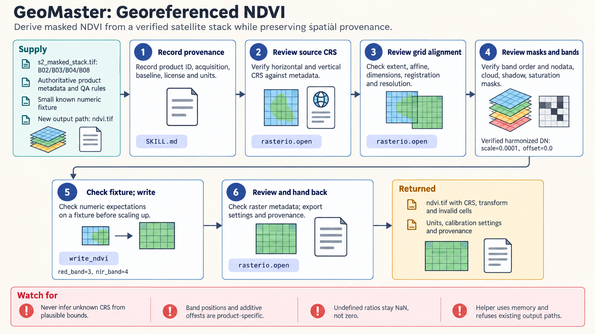

[All skill guides](README.md) / GeoMaster

# GeoMaster

**Connect satellite imagery and geographic data to defensible environmental analyses.**

GeoMaster supports research that combines raster images, vector boundaries, terrain, spatial networks, and Earth-observation time series. It helps an assistant choose the relevant geospatial workflow while preserving the meaning of coordinates, pixels, units, and missing observations. Its references cover several languages and platforms, with local Python recipes for common raster tasks.

*Align the geography and measurement conventions before comparing landscapes or time points. [View the full-size workflow diagram](../images/geomaster.png).*

## Questions this skill can help you explore

- **How does vegetation differ across a study area?** Calculate suitable spectral indices from identified and calibrated image bands.
- **What terrain or spatial patterns are present?** Analyze elevation, geographic features, or networks at a justified resolution.
- **Can imagery support a classification study?** Prepare features and training labels while reserving independent spatial or temporal validation data.

## What you bring

Provide the study area, scientific question, observation dates, and raster or vector datasets. Include the coordinate reference systems, pixel sizes, band identities, calibration factors, elevation units, and quality masks. For classification, supply meaningful labels and a plan for independent evaluation; for remote data, identify the collection and available access credentials.

## How it works

1. **Establish provenance.** Record the product, acquisition time, processing history, licensing, and meaning of each band or attribute.
2. **Align the geography.** Check coordinate systems, grid origins, resolution, and pixel registration before overlaying data.
3. **Handle measurement quality.** Apply scale factors and preserve cloud, shadow, saturation, and missing-data masks.
4. **Run the chosen analysis.** Calculate indices, terrain metrics, spatial summaries, or model features with appropriate units and sampling support.
5. **Check and export.** Inspect a small known example, evaluate models on held-out data where relevant, and preserve coordinates, masks, settings, and provenance in the results.

## What you get

| Output | What it helps you do |
| --- | --- |
| Derived raster layers | Map indices, terrain characteristics, or classification outputs. |
| Spatial summaries and vector results | Relate observations to geographic areas or features. |
| Documented processing choices | Review calibration, alignment, missing-data treatment, and analytical assumptions. |

## Example request

> Use GeoMaster to compare vegetation indices across my study area on two observation dates. Check the satellite products, band calibration, coordinate systems, pixel grids, and cloud masks first. Produce aligned index maps and regional summaries, and explain which apparent changes could reflect data quality or different sampling conditions.

*This is an illustrative request, not a reported research result.*

## Interpreting the results

**Matching image dimensions do not establish geographic alignment.** Images must also agree on location, resolution, and pixel registration. Cloud filtering at the scene level does not replace pixel-level quality masks.

Index changes are not automatically ecological change, and a fitted classifier has not yet demonstrated predictive accuracy. Terrain calculations also depend on horizontal and vertical units, resolution, and missing-data handling.

## Get started

Core examples use Python 3.12+ with GeoPandas, Rasterio, NumPy, and PyProj. Additional analyses may need specialist packages, native GIS software, or GPU runtimes. Local recipes can use local files; cloud catalogs and services need network access and, where applicable, authorized accounts.

[Setup and technical instructions](../../skills/geomaster/SKILL.md)
