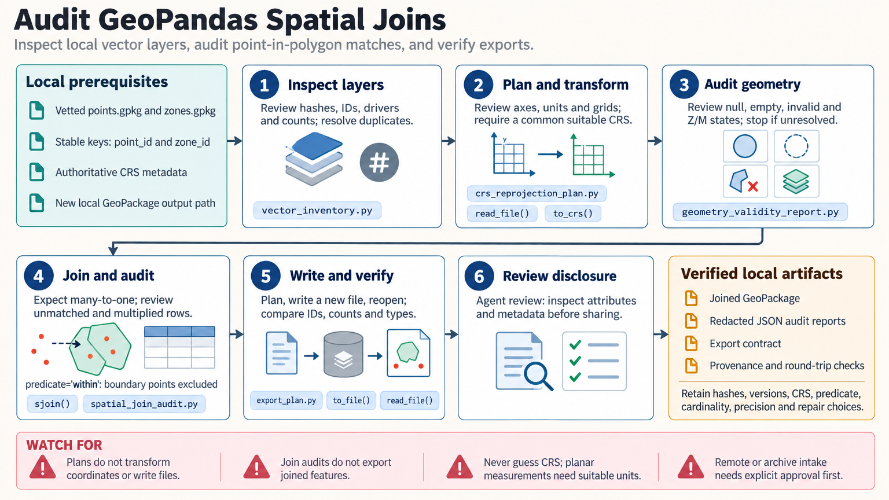

[All skill guides](README.md) / GeoPandas

# GeoPandas

**Analyze geographic features while keeping coordinates, geometry, and joins scientifically meaningful.**

GeoPandas brings points, lines, and polygons into a table-oriented Python workflow. This skill helps an assistant inspect vector datasets, choose coordinate transformations, assess geometry quality, and perform spatial analyses with explicit assumptions. It also includes local audit tools for checking proposed operations and outputs without exposing precise coordinates in their reports.

*Keep spatial measurements and feature relationships traceable from input layer to output. [View the full-size workflow diagram](../images/geopandas.png).*

## Questions this skill can help you explore

- **Which observations fall within each region?** Plan and audit spatial joins, including overlapping boundaries and unmatched points.
- **How large or far apart are these features?** Choose a coordinate system and units appropriate for area, distance, or buffer calculations.
- **Will a transformation or repair change the evidence?** Inspect coordinate assumptions, geometry validity, and feature counts before accepting changes.

## What you bring

Provide vetted local vector files, stable feature identifiers, authoritative coordinate metadata, and the scientific meaning of each attribute. State the desired spatial relationship, measurement units, aggregation rules, and treatment of boundary points. Note any sensitive locations that need generalization before maps or tables are shared.

## How it works

1. **Inventory the input.** Inspect layers, identifiers, counts, geometry types, and source provenance.
2. **Plan coordinates and units.** Distinguish assigning a coordinate label from transforming coordinates, and select an appropriate measurement system.
3. **Review geometry quality.** Count missing, empty, invalid, and collapsed features; inspect the effects of any proposed repair.
4. **Perform and audit the operation.** Use an explicit spatial relationship and check duplicated, multiplied, or unmatched records.
5. **Write and reopen the result.** Execute a reviewed export separately from the planning helper, then compare schema, coordinates, and feature counts.

## What you get

| Output | What it helps you do |
| --- | --- |
| Local inventory and audit reports | Identify data-quality and spatial-operation issues before interpretation. |
| Reprojection or export plans | Review units, transformations, and output requirements. |
| Analyzed vector datasets and maps | Use separately executed GeoPandas operations to support geographic research. |

## Example request

> Use the GeoPandas skill to relate my local sampling points to management regions. Check both datasets' coordinate systems, geometry quality, and identifiers. Explain the treatment of points on boundaries and overlapping regions, audit join multiplicity, and save a reviewed output with counts that I can reconcile with the inputs.

*This is an illustrative request, not a reported research result.*

## Interpreting the results

**GeoPandas measurements are planar and depend on the coordinate system.** Longitude and latitude are angular values; they are not directly suitable for ordinary distance, area, or buffer calculations. A projected system does not automatically use metres or suit every study region.

Successful helper checks do not mean an operation or export has been executed. Geometry repair can alter features, and spatial joins can duplicate observations; both changes need to be considered in the scientific interpretation.

## Get started

The documented environment uses Python 3.12+, uv, GeoPandas, and its numerical and native geospatial dependencies. Bundled audit tools operate on local files and do not require service credentials. Database access, remote data acquisition, and extra plotting features need their own configured dependencies and access.

[Setup and technical instructions](../../skills/geopandas/SKILL.md)
