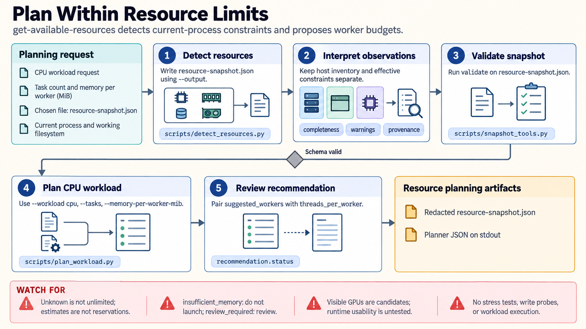

[All skill guides](README.md) / Get Available Resources

# Get Available Resources

**Plan a scientific computation around the resources your process can actually use.**

A workstation or cluster may report more hardware than an individual analysis is allowed to use. This skill inspects CPU, memory, storage, scheduler, container, and accelerator information and turns the observations into a conservative planning snapshot. It helps size workers and memory budgets before a substantial local workload, without running a benchmark or launching the analysis.

*Separate visible hardware from effective limits before choosing how much work to run. [View the full-size workflow diagram](../images/get-available-resources.png).*

## Questions this skill can help you explore

- **How much parallel work is reasonable?** Estimate a worker ceiling from observed CPU and memory constraints.
- **Will the input and intermediates fit?** Review memory and working-filesystem capacity with room for temporary copies.
- **Is an accelerator available to investigate?** Identify candidate devices without assuming a particular framework can use them.

## What you bring

Describe the planned analysis, approximate task count, expected memory per worker, and where inputs, scratch files, and results will live. Run the inspection in the actual local, container, or scheduler context that will perform the work. Supply any explicit worker cap or memory reserve needed by the project.

## How it works

1. **Inspect the execution context.** Gather bounded observations about host hardware, process affinity, container limits, and scheduler allocation.
2. **Keep constraints separate.** Distinguish inventory from enforced limits, and mark unavailable observations as unknown.
3. **Build a conservative plan.** Combine the snapshot with per-worker memory needs, task count, and reserved capacity.
4. **Review unresolved assumptions.** Treat GPU visibility as a candidate for later runtime checks and revisit missing CPU or memory information.
5. **Use and refresh the snapshot.** Save a redacted report when requested, and repeat inspection when the job context or available capacity changes.

## What you get

| Output | What it helps you do |
| --- | --- |
| Redacted JSON resource snapshot | Review observed resources and the limits relevant to the current process. |
| Provisional worker and thread plan | Avoid obvious memory overcommitment and nested parallelism. |
| Warnings and diagnostic plans | Identify missing information or accelerator compatibility checks still needed. |

## Example request

> Use the available-resources skill before I process this microscopy dataset. Inspect the environment where the job will run, consider the expected memory per image worker and temporary output files, and propose conservative worker and thread counts. Report unknown limits and do not run a stress test or start the analysis.

*This is an illustrative request, not a reported research result.*

## Interpreting the results

**A resource snapshot is not a reservation or a performance measurement.** Other workloads can change available capacity. A positive worker recommendation remains an estimate, and an unknown limit must not be treated as unlimited.

Visible accelerators do not establish driver, permission, framework, or operation compatibility. CPU workers can also each create numerical-library threads, multiplying resource demand. On systems with shared CPU/GPU memory, that memory must not be counted twice.

## Get started

The detector runs locally on Linux, macOS, or Windows with Python 3.11+ and the standard library. Optional psutil improves some observations; installed accelerator management tools can provide read-only information. No cloud account or credentials are required for the basic workflow.

[Setup and technical instructions](../../skills/get-available-resources/SKILL.md)
