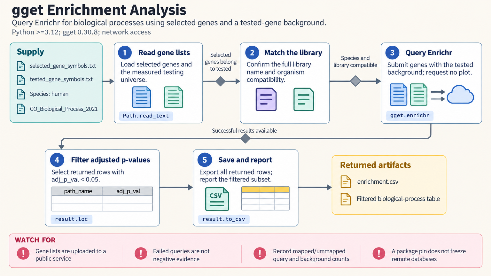

[All skill guides](README.md) / gget

# gget

**Answer focused bioinformatics questions through a common interface to many research resources.**

gget combines gene lookup, sequence retrieval and comparison, structure access, expression queries, and disease-associated information in a Python and command-line toolkit. This skill helps a research assistant select the appropriate module, resolve identifiers, and preserve the context needed to interpret a quick query. It is particularly useful for interactive exploration and modest, well-defined retrieval tasks.

*Move from a gene or sequence question to reviewable database records and analysis outputs. [View the full-size workflow diagram](../images/gget.png).*

## Questions this skill can help you explore

- **What is known about this gene?** Retrieve gene and transcript information, reference sequences, and linked annotations.
- **Where is it expressed or implicated?** Explore expression, disease associations, and enrichment results with their source context.
- **What sequence or structure evidence is available?** Access alignment tools, protein structures, residue annotations, or viral sequence resources.

## What you bring

Provide stable gene, transcript, protein, or structure identifiers where possible, plus the organism and precise research question. Specify relevant database releases, isoforms, filters, and the desired scope. Enrichment analyses also need a justified tested-gene background; sequence comparisons need the query sequence and an appropriate search database.

## How it works

1. **Choose the relevant module.** Match the question to gene information, sequence analysis, structures, expression, or another supported resource.
2. **Resolve biological identity.** Check organism, exact identifiers, isoforms, and ambiguous gene-name matches.
3. **Perform a bounded query.** Apply supported filters and limits, recording database releases and retrieval conditions.
4. **Inspect the response.** Check missing or unmapped identifiers, returned fields, pagination limits, and whether the query covers the intended scope.
5. **Save results and context.** Retain identifiers and source metadata with tables, structured records, sequences, or downloaded files.

## What you get

| Output | What it helps you do |
| --- | --- |
| Gene and resource tables | Collect a focused set of annotations for follow-up research. |
| Sequences and structure records | Prepare biologically identified inputs for downstream analysis. |
| Expression, association, or enrichment summaries | Explore evidence while retaining database and query context. |

## Example request

> Use gget to characterize these human gene identifiers. Retrieve gene and transcript details, check available protein structure records, and summarize relevant expression information. Save the results with exact identifiers, source releases, and query limits, and list ambiguous or missing matches separately.

*This is an illustrative request, not a reported research result.*

## Interpreting the results

**A returned table is not necessarily an exhaustive survey.** Some adapters apply filters after limiting results or retrieve only part of a paginated resource. Database updates and identifier mismatches can change the apparent answer.

Associations, expression correlations, and enrichment findings need biological interpretation. Record the tested-gene background and mapping losses for enrichment. Legacy wrappers marked deprecated in the technical instructions should not be presented as supported prediction workflows.

The source skill's September 2026 review found that the released Ensembl gene-information and sequence adapters failed at their HTTP endpoint. Recheck the transport before relying on those operations; a failed query is not evidence that a gene or sequence is absent.

## Get started

The documented stack requires Python 3.12+ and gget, with network access for remote queries. Some modules need additional setup or separate environments. COSMIC downloads need an account, and local alignment tools may require compatible binaries and native libraries.

[Setup and technical instructions](../../skills/gget/SKILL.md)
