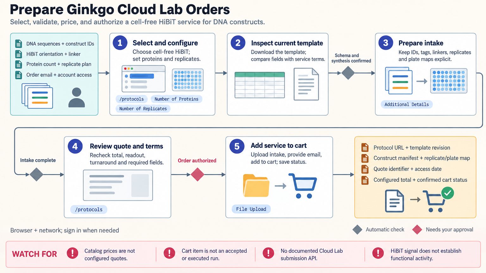

[All skill guides](README.md) / Ginkgo Cloud Lab

# Ginkgo Cloud Lab

**Match a research question to a remote laboratory protocol and prepare the inputs for a reviewed order.**

The Ginkgo Cloud Lab skill guides an assistant through the service's browser storefront, from choosing an assay to checking input templates, configuration, pricing, and order status. It covers documented protein expression and characterization services, RNA synthesis, and assay or target onboarding. Custom-workflow estimates help assess feasibility before a service is ordered.

*Connect the biological question, sample manifest, and requested readout before commissioning laboratory work. [View the full-size workflow diagram](../images/ginkgo-cloud-lab.png).*

## Questions this skill can help you explore

- **Which service provides the readout I need?** Distinguish expression, purification, concentration, purity, thermal stability, and other assay objectives.
- **What must I submit?** Inspect the chosen protocol's actual template, construct requirements, replicates, and plate mapping.
- **What does the proposed order cover?** Review configured pricing, service terms, timing, and the scope of the resulting measurements.

## What you bring

Provide the research objective, sequence or sample information, construct identifiers, tags, replicate requirements, and desired readouts. Include relevant assay constraints and budget expectations. Protocol-specific templates determine the actual intake fields; a generic spreadsheet or a price shown in a catalog is not enough to define the order.

## How it works

1. **Select a suitable protocol.** Compare the scientific readout with the catalog service and identify any required method or target onboarding.
2. **Prepare the actual intake.** Download the selected template and preserve sequence type, construct details, replicate structure, and sample mapping.
3. **Review the configuration.** Confirm sample count, requested measurements, configured total, terms, and unresolved discrepancies.
4. **Track the authorized order.** Distinguish a preliminary estimate, cart item, accepted order, and experiment in progress using the corresponding confirmations.
5. **Interpret the delivered assay.** Retain calibration, controls, quality flags, and the connection between each result and its submitted construct.

## What you get

| Output | What it helps you do |
| --- | --- |
| Protocol choice and input manifest | Prepare the correct samples and configuration for the research question. |
| Estimate or configured order details | Review financial scope and the requested laboratory service. |
| Traceable assay records | Relate delivered measurements to sample identity, conditions, and controls. |

## Example request

> Use the Ginkgo Cloud Lab skill to prepare a protein expression and purification study. Compare the services that provide concentration alone with those that also assess purity and size. Inspect the required construct template, propose the sample and replicate configuration, and present the configured quote and unresolved questions for review before ordering.

*This is an illustrative request, not a reported research result.*

## Interpreting the results

**Different readouts answer different biological questions.** A concentration measurement does not establish purity or activity, a tag-associated signal needs appropriate controls, and thermal stability is not a binding or functional assay.

Catalog availability and prices must be checked when planning real work. An estimate or order acknowledgment is not evidence that an experiment ran or passed quality control. Preserve the selected service's exact scope when reporting results.

## Get started

The documented workflow requires network access and a browser; account access may be needed for ordering and results. It uses the Cloud Lab storefront rather than an assumed public submission SDK. Scientific inputs sent through the service are part of the remote laboratory workflow.

[Setup and technical instructions](../../skills/ginkgo-cloud-lab/SKILL.md)
