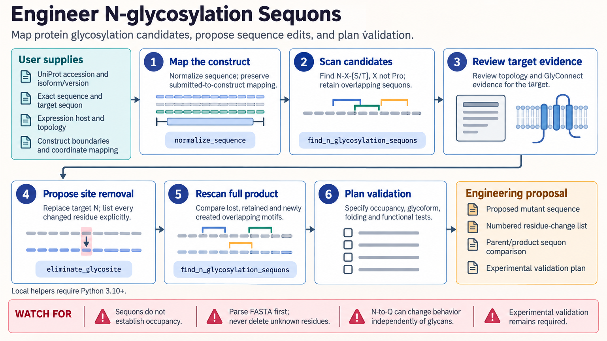

[All skill guides](README.md) / Glycoengineering

# Glycoengineering

**Investigate candidate glycosylation sites and design changes with explicit sequence and structural evidence.**

Glycosylation can affect protein behavior, but a sequence motif, a prediction, an occupied site, and a particular glycan structure are different kinds of evidence. This skill helps an assistant keep those distinctions clear while scanning protein sequences, reviewing glycan records, preparing prediction workflows, and evaluating possible structural shielding. Its main focus is secretory-pathway N-glycosylation and mucin-type O-GalNAc glycosylation.

*Carry residue identity and evidence strength through each glycosylation decision. [View the full-size workflow diagram](../images/glycoengineering.png).*

## Questions this skill can help you explore

- **Which sites are plausible candidates?** Scan canonical N-glycosylation motifs and describe serine/threonine-rich regions in their biological context.
- **What supports a proposed glycan assignment?** Compare curated records, model predictions, and site-specific experimental evidence.
- **How might an engineered sequence change?** Map proposed substitutions, rescan altered motifs, and consider structural effects separately.

## What you bring

Provide an exact protein sequence and accession or isoform, expression host, construct boundaries, and signal-peptide or membrane-topology information. Include structures or glycoproteomics evidence where available. Antibody studies also need an explicit residue-numbering scheme and a mapping to the actual submitted construct.

## How it works

1. **Establish sequence identity.** Preserve the mapping between construct positions, mature protein, structural residues, and any antibody numbering.
2. **Find candidate regions.** Scan canonical N-linked motifs and describe serine/threonine density without treating either as proof of occupancy.
3. **Review biological support.** Check extracellular or luminal context, curated evidence, and the scope of suitable prediction services.
4. **Evaluate a proposed change.** List every altered residue and rescan the full sequence for lost or newly created overlapping motifs.
5. **Plan validation.** Separate measurements of occupancy, glycan composition or structure, and the functional endpoint of the engineering study.

## What you get

| Output | What it helps you do |
| --- | --- |
| Candidate-site and sequence-change records | Track exact residue positions and affected motifs. |
| Prediction and evidence summaries | Compare distinct levels of support for glycosylation hypotheses. |
| Optional glycan-shielding ensembles | Explore steric coverage under stated structural and glycan assumptions. |

## Example request

> Use the glycoengineering skill to review this secreted protein construct. Identify canonical N-glycosylation candidates, map them to the mature sequence, and distinguish motifs from experimentally supported occupancy. Evaluate my proposed substitutions for newly created sites and outline the measurements needed to test their effect on glycosylation and protein function.

*This is an illustrative request, not a reported research result.*

## Interpreting the results

**A motif or prediction does not establish an occupied glycosylation site.** Protein topology, host biology, and local sequence context matter. Serine/threonine enrichment alone does not identify a particular O-linked modification.

A monosaccharide composition does not resolve glycan linkage or branching. Structural shielding calculations assume supplied sites and glycan ensembles; they do not determine occupancy. Mutations can alter folding or activity independently of glycosylation.

## Get started

Local sequence helpers require Python 3.10+ and the standard library. Public glycan lookup needs requests and network access; the documented DTU predictors use browser forms. Optional GlycoSHIELD work needs a separate installation and glycan libraries, with GROMACS for solvent-accessibility analysis.

[Setup and technical instructions](../../skills/glycoengineering/SKILL.md)
