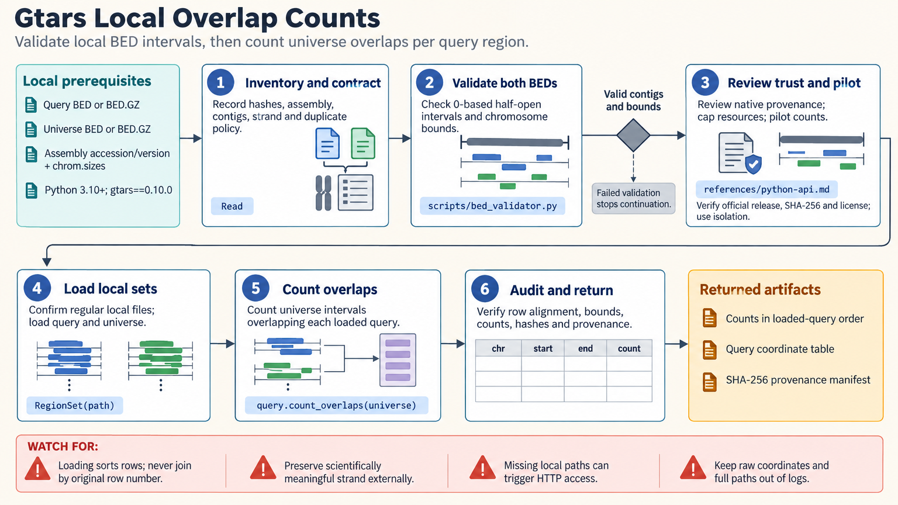

[All skill guides](README.md) / Gtars

# Gtars

**Work with genomic intervals while preserving the coordinate and overlap rules that determine the answer.**

Gtars provides genomic interval operations, overlap counts, coverage measures, tokenization, and reference-sequence tooling through Python, Rust, and command-line interfaces. This skill helps an assistant prepare the data contract, select the appropriate interface, and inspect results. Its bundled local helpers validate inputs and prepare bounded execution plans before heavier work is run.

*Make interval semantics explicit before interpreting overlaps or replicate support. [View the full-size workflow diagram](../images/gtars.png).*

## Questions this skill can help you explore

- **Which genomic regions overlap?** Calculate overlaps and set relationships using a declared assembly and interval convention.
- **How much of each region is covered?** Distinguish base-pair coverage, interval counts, and signal tracks.
- **Can these regions become model inputs?** Prepare interval tokenization against a defined and traceable genomic vocabulary.

## What you bring

Provide local interval or fragment files, the exact genome assembly, chromosome sizes, and the intended coordinate convention. State how to handle strand, duplicate records, adjacent intervals, sample groups, and replication. For tokenization or reference-store work, identify the vocabulary or reference collection and any relevant storage limits.

## How it works

1. **Validate the genomic contract.** Check contig names, bounds, coordinate conventions, sorting requirements, and source hashes.
2. **Define the scientific operation.** Choose overlap counting, interval intersection, consensus, coverage, or tokenization without conflating their outputs.
3. **Select an execution interface.** Use the documented Python, Rust, or command-line surface and review the plan before running it.
4. **Bound resource use.** Account for input size, threads, temporary storage, output size, and runtime; inspect a small pilot first.
5. **Audit the result.** Recheck coordinates, sorting, counts, provenance, and any information lost during transformations.

## What you get

| Output | What it helps you do |
| --- | --- |
| Interval and overlap results | Relate genomic features under an explicit definition of overlap. |
| Coverage or tokenization products | Prepare the specific representation needed for the downstream question. |
| Validation reports and execution plans | Review data assumptions and resources before a separate execution step. |

## Example request

> Use Gtars to compare peak intervals from my biological replicates. Verify the shared assembly and chromosome sizes, define the treatment of adjacent intervals, and calculate the requested overlaps. Explain whether the resulting consensus measures whole merged components or support at each base, and retain sample provenance with the output.

*This is an illustrative request, not a reported research result.*

## Interpreting the results

**An interval consensus count is not necessarily support at every base.** The documented consensus procedure counts sets touching a merged component, including areas where fewer sets overlap. A different method is needed when the question requires basewise agreement.

Contig aliases, assembly mismatches, and strand loss can silently change the interpretation. A base-pair coverage fraction is different from a continuous coverage track. The bundled planning helpers do not execute the upstream computation or produce its scientific results.

## Get started

Python use requires Python 3.10+ and the documented gtars bindings. Rust and command-line routes need their own compatible toolchain or installation. Local audit helpers use the standard library without network access; remote reference retrieval and pretrained tokenizers need separately scoped network and storage access.

[Setup and technical instructions](../../skills/gtars/SKILL.md)
