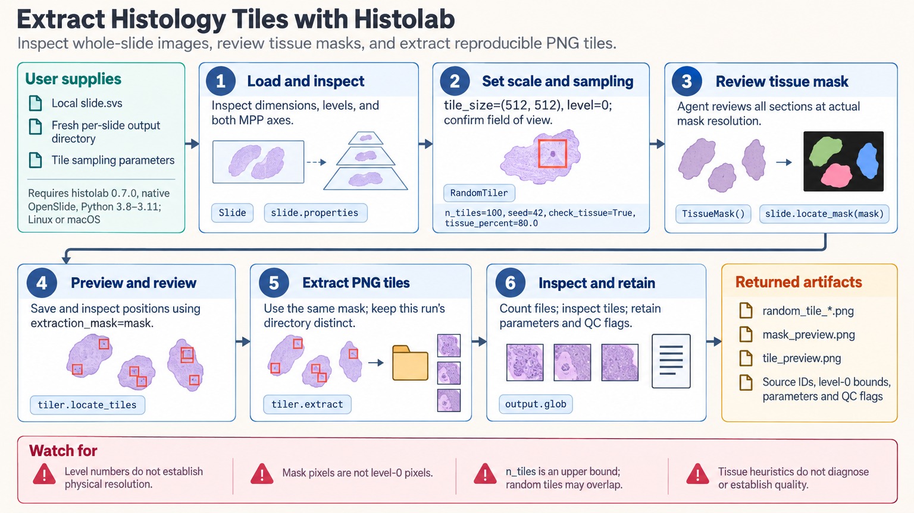

[All skill guides](README.md) / Histolab

# Histolab

**Prepare reviewable image tiles from whole-slide histology scans.**

Whole-slide images are too large for many analyses to process at once. Histolab helps extract smaller image tiles after inspecting slide metadata and selecting tissue regions. This skill guides an assistant through tissue masks, random or grid sampling, score-based selection, and H&E stain preprocessing, while retaining the physical scale and slide identity needed for downstream research.

*Turn a large histology scan into traceable tiles with visible sampling choices. [View the full-size workflow diagram](../images/histolab.png).*

## Questions this skill can help you explore

- **Which parts of the slide should be sampled?** Inspect tissue masks and choose whether to include all sections or a selected region.
- **What tile size and resolution fit the study?** Define the physical field of view and preserve coordinates in the original slide.
- **How should a tile dataset be prepared?** Compare sampling strategies and review stain preprocessing without leaking information across study partitions.

## What you bring

Provide local whole-slide images and a research objective, along with slide and patient identifiers suitable for the project. Specify the physical field of view, image resolution, regions of interest, and sampling strategy. For machine learning, define patient-level training, validation, and test groups before assigning tiles.

## How it works

1. **Inspect the slide.** Check image dimensions, pyramid levels, and physical pixel-size metadata rather than assuming scanner levels are interchangeable.
2. **Choose and review a tissue mask.** Inspect the mask at its actual resolution and confirm that all relevant tissue sections are included.
3. **Configure sampling.** Select random, grid, or score-based tiling, including overlap, thresholds, and reproducibility settings.
4. **Preview and extract consistently.** Use the same mask for preview and extraction, save to a distinct output directory, and count the tiles actually written.
5. **Review the dataset.** Inspect representative tiles, retain coordinates and settings, and fit stain-normalization targets using training data only.

## What you get

| Output | What it helps you do |
| --- | --- |
| Extracted image tiles | Provide smaller inputs for downstream histology research. |
| Mask and tile-location previews | Review tissue coverage and the sampling strategy. |
| Selection records and preprocessing settings | Trace tiles to their slides, physical scale, and quality decisions. |

## Example request

> Use Histolab to prepare tiles from my H&E whole-slide images. Inspect physical resolution and all tissue sections, preview a grid extraction with the same tissue mask used for saving, and retain original-slide coordinates. Review representative tiles and keep patients separated across the training and evaluation datasets.

*This is an illustrative request, not a reported research result.*

## Interpreting the results

**Tissue masks and image scores are heuristics, not diagnoses.** Stain-derived cellularity scores do not measure tumor probability or establish focus quality. Random sampling may miss rare structures, and a requested tile count is an upper bound rather than a guarantee.

A fixed random seed does not prevent patient leakage or align sampling across different image scales. Stain normalization can introduce artifacts and needs inspection, especially on blank or nearly uniform tiles and scanners not represented in training.

## Get started

The documented Histolab release needs an isolated Python 3.8–3.11 environment on Linux or macOS and native OpenSlide; Python 3.10 is the tested setup. Sample downloads and exact physical-resolution extraction have optional dependencies. Local slides can be processed without service credentials.

[Setup and technical instructions](../../skills/histolab/SKILL.md)
