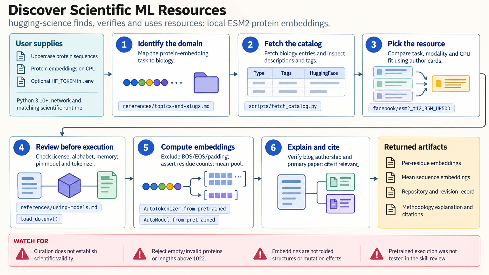

[All skill guides](README.md) / Hugging Science

# Hugging Science

**Find scientific datasets and models, then check whether they fit your research question and computing environment.**

Hugging Science is a curated catalog of scientific machine-learning datasets, models, methodology posts, and interactive demonstrations. This skill helps an assistant discover candidates across scientific domains and inspect the underlying resources before using them. It connects discovery to practical questions about data modality, licensing, access, model interfaces, and reproducible evaluation.

*Move from a curated pointer to an independently assessed scientific resource. [View the full-size workflow diagram](../images/hugging-science.png).*

## Questions this skill can help you explore

- **Is there a model or dataset for this task?** Search relevant scientific topics and compare candidate resources.
- **Can I actually run or load it?** Check the author's documented interface, file formats, runtime, and hardware requirements.
- **What should I record for reproducibility?** Identify the exact resource revision, preprocessing, data split, license, and methodology.

## What you bring

Describe the scientific task, input modality, desired outputs, and evaluation criteria. Include available hardware, dataset-size limits, access restrictions, and any licensing requirements. State whether the objective is exploration, a benchmark, fine-tuning, or reproducing a particular research method.

## How it works

1. **Locate the relevant catalog topics.** Use domain-specific listings and include multiple topics when the question crosses disciplines.
2. **Compare candidate resources.** Assess modality, scientific relevance, scale, license, and access rather than choosing on a name or tag alone.
3. **Inspect the underlying documentation.** Read the dataset or model card and primary methodology, and verify the loader or service the authors actually support.
4. **Prepare a bounded use plan.** Check schemas, computational needs, download scope, and authentication before attempting a small representative operation.
5. **Preserve the selected version.** Record an immutable resource revision, configuration, split, preprocessing choices, and the evidence supporting selection.

## What you get

| Output | What it helps you do |
| --- | --- |
| A justified resource shortlist | Compare scientific and practical tradeoffs between plausible candidates. |
| Access and runtime requirements | Identify what is needed to load data, run a model, or use a demo. |
| A reproducible starting plan | Retain resource versions and evaluation assumptions for subsequent work. |

## Example request

> Use Hugging Science to find candidate protein sequence models for my classification study. Compare their input requirements, licenses, model sizes, and available evaluation evidence. Verify the actual runtime for the strongest candidates and prepare a small reproducible trial using fixed resource revisions and a held-out evaluation split.

*This is an illustrative request, not a reported research result.*

## Interpreting the results

**Catalog inclusion does not establish scientific quality or compatibility.** Resources still need independent assessment, and an unlisted resource may exist elsewhere. A model's popularity does not show that it generalizes to your organism, measurement process, or study population.

A catalog entry is a pointer rather than a universal inference endpoint. Some resources need specialized runtimes, large downloads, gated access, or unavailable demo services. A successful download or API call also does not establish useful predictive performance.

## Get started

The catalog fetcher uses Python 3.10+ and the standard library with network access. Actual resource use requires its documented scientific runtime and may need substantial memory or a GPU. Some Hugging Face resources require approved access and an HF_TOKEN; public catalog discovery does not require running those models.

[Setup and technical instructions](../../skills/hugging-science/SKILL.md)
