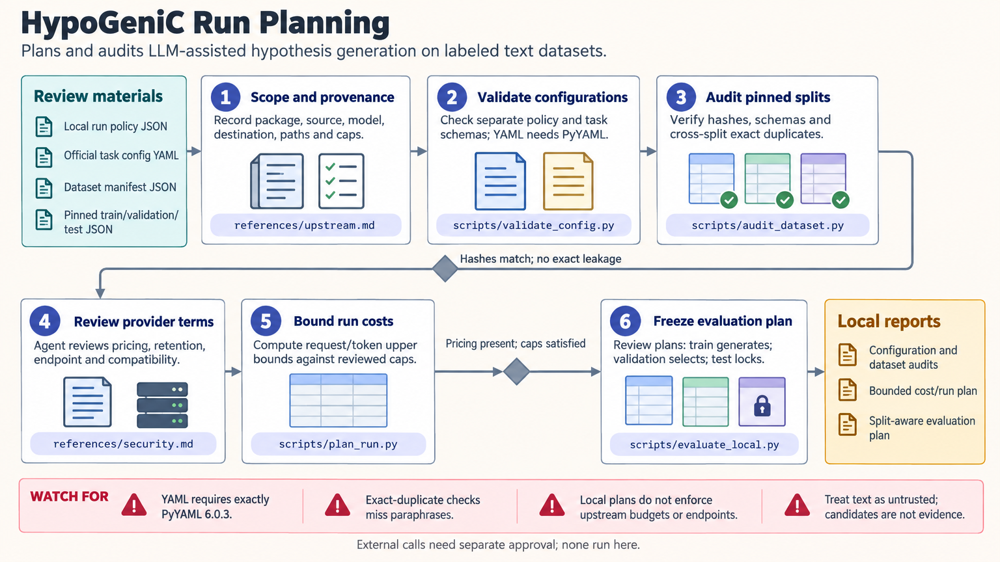

[All skill guides](README.md) / HypoGeniC

# HypoGeniC

**Explore patterns in labeled text with an auditable plan for language-model-assisted hypothesis generation.**

HypoGeniC proposes written explanations for patterns in labeled text and evaluates how useful those explanations are for predicting labels. This skill guides the preparation, inspection, and evaluation of a HypoGeniC or HypoRefine project. Its bundled tools first check local data and configuration, so a researcher can examine split leakage, budget assumptions, and the planned model destination before running a model.

The resulting “hypotheses” are candidate textual patterns. They can help organize further investigation, but they do not establish scientific mechanisms.

*From labeled text and checked data splits to a reviewed hypothesis bank and held-out prediction evaluation.
[View the full-size workflow diagram](../images/hypogenic.png).*

## Questions this skill can help you explore

- **Are my data suitable for a fair evaluation?** Check schemas, file identities, duplicate records, and separation between training and test examples.
- **Which proposed patterns help on unseen examples?** Evaluate saved predictions without regenerating hypotheses against the test set.
- **What would a model run involve?** Make model choice, data destination, request limits, and cost assumptions explicit.

## What you bring

Provide a labeled text dataset, a task definition, and the intended training, validation, and test assignments. Include immutable dataset versions or file checksums and the meaning of each label. For a planned run, specify the model or local model path, provider, budget, and where outputs should be saved. Existing hypothesis banks and prediction files can be inspected locally.

## How it works

1. **Define the task and boundary.** Separate prediction of dataset labels from any scientific claim the project hopes to investigate.
2. **Audit the dataset.** Check files and labels, identify exact or identity duplicates, and preserve the held-out test split.
3. **Review the run plan.** Validate task configuration and bound requests and tokens using declared pricing assumptions.
4. **Inspect generated material.** After a separately authorized run, check hypothesis-bank structure and numerical summaries without exposing raw text unnecessarily.
5. **Evaluate and document.** Calculate accuracy, coverage, macro-F1, and confusion matrices from saved predictions; record dataset, bank, split, and seed provenance.

## What you get

| Output | What it helps you do |
| --- | --- |
| Dataset audit | Identify leakage and malformed inputs before model use. |
| Run and cost plan | Review the scale and destination of a proposed run. |
| Hypothesis-bank inspection | Check saved output structure and aggregate statistics. |
| Prediction evaluation | Measure task performance on the declared split. |

## Example request

> Use the HypoGeniC skill to audit my labeled collection of non-sensitive research abstracts. Check the train, validation, and test files for duplicates and inconsistent labels, then prepare a bounded run plan. If saved predictions are available, report macro-F1 and coverage without making new model calls. Keep predictive findings separate from proposed scientific explanations.

*This is an illustrative research request, not a reported result.*

## Interpreting the results

**Prediction is not scientific confirmation.** Good performance may reflect dataset artifacts or shortcuts. Hypothesis-bank selection must not use the final test results. A literature-enhanced explanation still needs independent scrutiny and appropriate experiments.

Repeated runs that reuse identical cached model responses are not independent samples. Report cache use and missing predictions alongside performance.

## Get started

The local JSON audit tools use Python 3.10+ and the standard library; YAML input needs the pinned PyYAML dependency. Actual HypoGeniC work uses its pinned upstream package and may need provider credentials, Redis, local model resources, and network access. Local preflight tools make no model calls.

[Setup and technical instructions](../../skills/hypogenic/SKILL.md)
