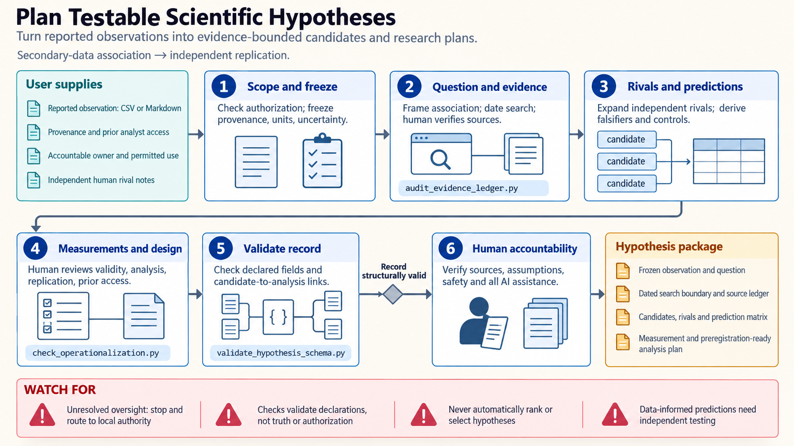

[All skill guides](README.md) / Scientific Hypothesis Generation

# Scientific Hypothesis Generation

**Turn an observation into explicit rival explanations and a research plan that could distinguish them.**

An interesting pattern becomes scientifically useful when its explanation can be challenged. This skill helps a research assistant separate what was observed from what is being proposed, identify competing accounts, and specify measurements that would favor one account over another.

It combines a structured reasoning workflow with local templates and checks for hypothesis records, evidence ledgers, prediction matrices, and preregistration scaffolds. The researcher retains responsibility for the hypotheses, study design, and substantive judgments.

*From a documented observation to rival explanations, discriminating predictions, measurements, and a reviewable analysis plan.
[View the full-size workflow diagram](../images/hypothesis-generation.png).*

## Questions this skill can help you explore

- **What could explain this observation?** Develop multiple accounts, including bias, confounding, and measurement artifacts.
- **What would distinguish the explanations?** Specify outcomes that differ between rivals before examining the target results.
- **What must be measured and planned?** Define variables, controls, uncertainty, and the appropriate unit of analysis.

## What you bring

Bring the observation or preliminary finding, its provenance, and the uncertainty around it. Describe the study population or system, available measurements, constraints, and relevant evidence. State whether the goal is descriptive, predictive, associational, or causal. Existing protocols and analysis plans help distinguish decisions made before seeing results from later exploratory changes.

## How it works

1. **Record the observation.** Preserve the original measurements and separate them from interpretation or a mechanistic story.
2. **Frame the question and evidence boundary.** Specify the population, comparison, outcome, and limits of the sources consulted.
3. **Develop rival hypotheses.** Include plausible non-causal and technical explanations rather than selecting a preferred story immediately.
4. **Derive discriminating tests.** Connect each proposed explanation to observable predictions, controls, and measurements with known limitations.
5. **Prepare the study record.** Draft the analysis and replication plan, identify unresolved decisions, and document deviations for accountable human review.

## What you get

| Output | What it helps you do |
| --- | --- |
| Hypothesis record | Keep observations, proposed mechanisms, and claim types distinct. |
| Prediction and rival matrix | See which measurements would separate competing explanations. |
| Evidence ledger | Trace statements to sources and acknowledge coverage gaps. |
| Analysis-plan scaffold | Prepare material for review and possible preregistration. |

## Example request

> Use the hypothesis-generation skill to help plan a study of why growth varies between otherwise similar plant batches. Start from my measurements and handling notes, propose biological and technical rival explanations, and identify observations that could discriminate among them. Draft a measurement and analysis plan that treats trays as the experimental units and clearly labels exploratory decisions.

*This is an illustrative research request, not a reported result.*

## Interpreting the results

**A complete template does not validate a hypothesis.** The bundled tools check declared structure and internal consistency; they do not choose a scientifically correct explanation or rank hypotheses automatically.

Association, temporal order, and successful prediction do not by themselves establish causation. Null-hypothesis rejection does not uniquely confirm a mechanism, and a limited literature search cannot establish novelty. Preserve independent validation and relevant ethics or institutional review as part of the research plan.

## Get started

The bundled checks run locally with Python 3.11+ and the standard library. They need no credentials, external models, or network connection. Provide bounded JSON, CSV, or Markdown records using the supplied templates, then review the scientific content with the relevant domain experts.

[Setup and technical instructions](../../skills/hypothesis-generation/SKILL.md)
