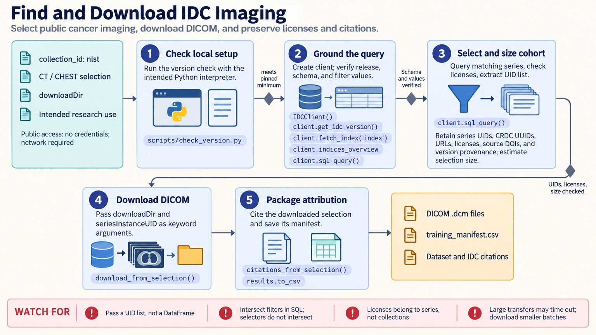

[All skill guides](README.md) / Imaging Data Commons

# Imaging Data Commons

**Find, describe, and obtain public cancer imaging datasets with traceable cohort definitions.**

The National Cancer Institute Imaging Data Commons provides public imaging collections that can support radiology, pathology, and imaging-method research. This skill helps a research assistant discover collections, examine their metadata, define a cohort, and obtain the corresponding DICOM files or viewer links.

It covers lightweight hosted metadata queries as well as reproducible Python workflows. Attention to the collection, patient, study, series, and instance hierarchy helps prevent a count of image files from being mistaken for a count of independent patients.

*From public collection discovery and metadata filtering to a documented imaging cohort, downloads, viewers, and citations.
[View the full-size workflow diagram](../images/imaging-data-commons.png).*

## Questions this skill can help you explore

- **Which collections contain suitable images?** Search by modality, anatomy, collection, and available metadata.
- **How large and consistent is the candidate cohort?** Inspect patient and series counts, acquisition attributes, and missing fields.
- **How can I reuse the data responsibly?** Preserve download selections, collection licenses, and required citations.

## What you bring

Describe the disease or imaging question, modalities of interest, inclusion and exclusion criteria, and intended unit of analysis. Specify whether you need metadata only, interactive viewing, or local files. Storage capacity, desired DICOM attributes, and any need to join clinical information affect the access path and cohort design.

## How it works

1. **Choose an access route.** Use an available IDC connection, hosted metadata API, or the documented Python index according to the task.
2. **Inspect available values.** Discover collection names and attribute values before constructing filters, and review warnings about ignored predicates.
3. **Define and inspect the cohort.** Count at the relevant hierarchy level, check metadata completeness, and document joins and exclusions.
4. **Retrieve only the needed material.** Create viewer links or download selected series and verify that the selection matches the research question.
5. **Preserve provenance.** Save identifiers, selection rules, data-version information, licenses, and citations alongside the downloaded data.

## What you get

| Output | What it helps you do |
| --- | --- |
| Cohort metadata table | Review included patients, studies, and imaging series. |
| Download selection and DICOM files | Recreate the chosen subset for local analysis. |
| Viewer links | Inspect candidate images before substantial downloads. |
| License and citation record | Carry collection-specific obligations into downstream work. |

## Example request

> Use the Imaging Data Commons skill to identify public chest CT collections suitable for evaluating an image-quality method. Summarize patient and series counts, available acquisition metadata, and missing fields. Prepare a documented cohort selection and viewer links first, then estimate the download volume and list the collection licenses and citations.

*This is an illustrative research request, not a reported result.*

## Interpreting the results

**Metadata selection does not guarantee a scientifically comparable cohort.** Acquisition settings, reconstruction methods, clinical selection, and repeated scans can affect downstream analysis. Review images and patient-level grouping before defining train and test sets.

A successfully parsed DICOM file is not evidence of complete or correct acquisition metadata. Query warnings, joined-table coverage, and collection-specific reuse terms need explicit review.

## Get started

Hosted public metadata, downloads, and the IDC DICOMweb proxy can be used without credentials, with network access. Local Python workflows use the documented idc-index version; extra imaging packages depend on the analysis. Optional BigQuery and Google Healthcare routes require Google credentials and appropriate project configuration.

[Setup and technical instructions](../../skills/imaging-data-commons/SKILL.md)
