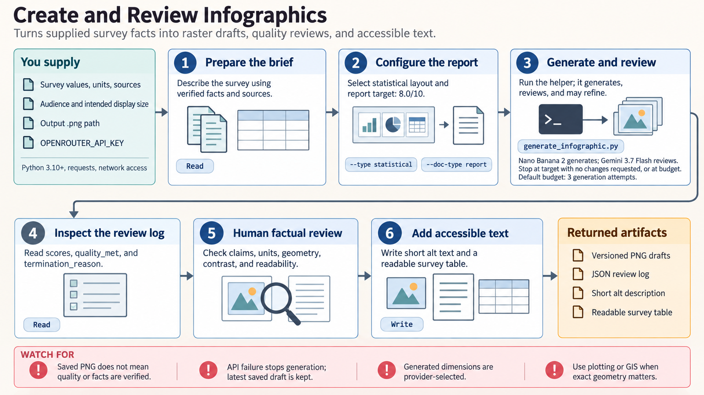

[All skill guides](README.md) / Infographics

# Infographics

**Present a verified research message as a compact visual explanation.**

This skill creates raster infographics from a written brief, supplied facts, and optional reference images. It can organize a comparison, timeline, process, or concise statistical summary for a presentation, report, teaching resource, or public-facing explanation.

The workflow combines image generation with model-assisted visual review and a bounded number of revisions. For a scientist, its main value is communication: the factual content should come from reviewed evidence, and the finished image still needs close inspection.

*From a sourced communication brief to generated visual drafts, review notes, and a checked infographic.
[View the full-size workflow diagram](../images/infographics.png).*

## Questions this skill can help you explore

- **How can I explain this finding to a wider audience?** Select a clear message and a visual sequence with limited text.
- **Which format suits the material?** Compare timelines, process diagrams, side-by-side comparisons, and other supported layouts.
- **Is the finished image faithful to the evidence?** Check every value, label, unit, and relationship against the supplied sources.

## What you bring

Provide the audience, intended display size, main message, and verified content. For numbers, include dates, units, denominators, populations, and sources. Add brand or style preferences, accessible color requirements, and any reference images you have permission to reuse. Distinguish measured results from conceptual illustrations and state whether external research is wanted.

## How it works

1. **Prepare the content brief.** Identify the few facts or relationships the audience should understand and retain their source records.
2. **Choose layout and visual style.** Match the information to a timeline, comparison, process, or another supported structure.
3. **Generate a draft.** Submit the reviewed brief and any approved references to the configured image service.
4. **Review and revise.** Use the visual critique to improve clarity within the chosen iteration budget, then inspect the actual saved image.
5. **Check and package.** Compare all labels and values with the evidence and provide an accessible description or accompanying data table.

## What you get

| Output | What it helps you do |
| --- | --- |
| Versioned PNG drafts | Compare visual alternatives and retain the iteration history. |
| Review log | See model feedback, stopping reason, and whether the configured quality threshold was met. |
| Optional research records | Trace candidate facts returned by the research step. |
| Checked final infographic | Communicate a concise message at its intended viewing size. |

## Example request

> Use the infographics skill to explain our field-sampling workflow to new collaborators. I will supply the verified steps, sample counts, and a glossary. Create a landscape process infographic with accessible colors, keep collection and laboratory stages distinct, and include a readable companion description. Flag any labels or numerical details that need manual correction.

*This is an illustrative research request, not a reported result.*

## Interpreting the results

**A visual quality score is not a factual accuracy check.** An image can look polished while changing a number, misspelling a label, or implying a relationship that the sources do not support. A saved draft can also be unreviewed or below the chosen threshold.

Use code-based plotting or GIS when exact numerical geometry, reproducibility, or map boundaries matter. Optional research produces candidate facts and source annotations, which need primary-source verification before scientific publication.

## Get started

The bundled workflow requires Python 3.10+, requests, network access, and an OPENROUTER_API_KEY for generation, review, or research. These operations use external services and can incur charges. The checked-in scripts save PNG images; final accessibility and factual review remain human responsibilities.

[Setup and technical instructions](../../skills/infographics/SKILL.md)
