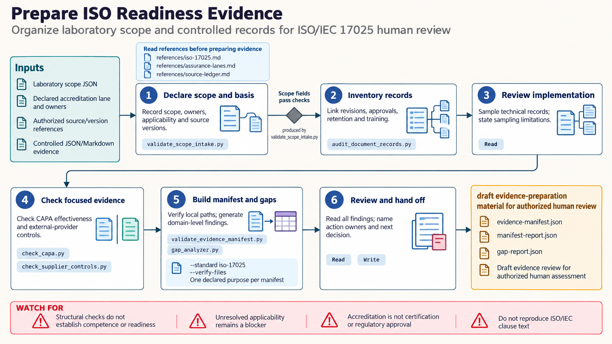

[All skill guides](README.md) / ISO Standards Readiness

# ISO Standards Readiness

**Organize laboratory and quality-system evidence for a clearly scoped human review.**

Preparing for an assessment often means locating the right records and making their relationships understandable. This skill supports that preparation for ISO 13485, ISO 14971, ISO/IEC 17025, and ISO 15189. It helps describe scope, organize controlled documents and implementation records, and expose missing evidence or unresolved ownership.

Its local tools check the structure of declared evidence. They do not audit an organization, establish compliance, or make certification or accreditation decisions.

*From declared scope and controlled records to a traceable evidence manifest, structural findings, and assigned review actions.
[View the full-size workflow diagram](../images/iso-standards-readiness.png).*

## Questions this skill can help you explore

- **What evidence supports the declared scope?** Link activities, responsible owners, controlled documents, and actual implementation records.
- **Where are the unresolved gaps?** Identify missing records, incomplete approvals, and unassessed domains without converting them into a compliance score.
- **Which assessment is being prepared for?** Keep management-system certification, laboratory accreditation, and regulatory processes distinct.

## What you bring

Provide the named standard, purpose, organization or laboratory scope, and authorized reviewers. Bring an inventory of controlled documents and sampled implementation records, including versions, approval states, owners, and source locations. Identify the applicable assessment process yourself with the responsible specialists; the skill does not determine legal applicability.

## How it works

1. **Declare the scope.** Select the supported standard and intended assessment purpose, and name the people responsible for decisions.
2. **Organize controlled evidence.** Separate procedures describing work from records showing that work occurred, retaining dates and versions.
3. **Review relevant evidence chains.** Examine applicable risk, design, corrective-action, or supplier-control records without conflating design traceability with metrological traceability.
4. **Check the manifest.** Validate local evidence entries, file references, and requested hashes; report missing or malformed material.
5. **Prepare the human handoff.** Summarize sampled evidence, structural findings, unassessed domains, open decisions, action owners, and approval status.

## What you get

| Output | What it helps you do |
| --- | --- |
| Scope and ownership record | Make the review purpose and decision responsibilities explicit. |
| Evidence manifest | Trace declared evidence to controlled local records. |
| Structural gap report | Identify missing fields and incomplete evidence links. |
| Draft review package | Support substantive assessment by authorized quality and technical staff. |

## Example request

> Use the ISO standards readiness skill to organize a draft evidence review for our testing laboratory under ISO/IEC 17025. I will supply the declared scope, controlled-document inventory, and selected implementation records. Build a traceable manifest, identify unresolved approvals and unassessed areas, and assign follow-up questions to our quality and technical owners.

*This is an illustrative research request, not a reported result.*

## Interpreting the results

**Evidence present is not evidence adequate.** A filename, completed checklist, or passing structural check cannot establish competence, implementation, readiness, or conformity. An unassessed domain is not automatically outside the applicable scope.

The skill does not supply copyrighted standard clauses or replace the controlled authorized standard. It also does not validate methods, approve uncertainty estimates, establish traceability, or decide risk acceptability. All outputs remain draft evidence-preparation material for authorized human review.

## Get started

The bundled tools use Python 3.11+ and the standard library with bounded local JSON and Markdown files. They require no network or credentials. Start with the reference and template for the selected standard, and have authorized staff confirm the source basis and applicability before substantive use.

[Setup and technical instructions](../../skills/iso-standards-readiness/SKILL.md)
