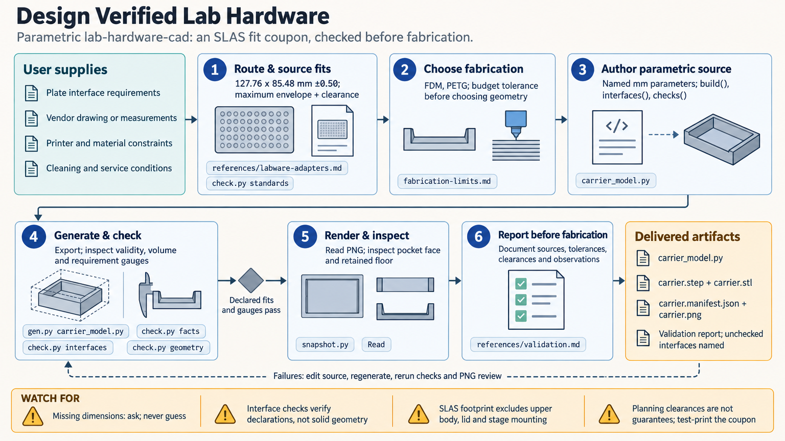

[All skill guides](README.md) / Laboratory Hardware CAD

# Laboratory Hardware CAD

**Design a laboratory part around measured interfaces and reviewable fabrication geometry.**

Custom holders, mounts, adapters, and fixtures succeed only when they fit the equipment around them. This skill guides a research assistant through building parametric CAD models whose critical dimensions come from standards, vendor drawings, or supplied measurements.

It covers microfluidic hardware, optomechanics, labware adapters, and behavioral rigs. The deliverable includes editable source, fabrication files, dimensional evidence, and a visual review, so another researcher can understand and revise the design.

*From interface dimensions and fabrication constraints to parametric geometry, measured checks, visual inspection, and fabrication files.
[View the full-size workflow diagram](../images/lab-hardware-cad.png).*

## Questions this skill can help you explore

- **Will this part fit the intended equipment?** Track mating dimensions, tolerance limits, and deliberate clearances.
- **Can the chosen process make the required features?** Consider wall thickness, minimum features, printing or machining limits, and material compatibility.
- **What evidence supports the design?** Combine measured geometry checks with visual inspection and a provenance manifest.

## What you bring

Provide the part's purpose, mating equipment, dimensioned drawings or measurements, and the intended fabrication process. Include dimensional tolerances, loads or handling conditions, cleaning methods, solvent or biological contact, and space constraints. Existing STEP files can help describe the starting geometry. Identify which dimensions are fixed interfaces and which are adjustable design choices.

## How it works

1. **Identify the critical interface.** Select the appropriate hardware family and record every mating dimension with its source.
2. **Choose process and material.** Use manufacturing limits and the experimental environment to set clearances and feature sizes.
3. **Create a parametric model.** Keep dimensions editable and define checks for required openings, retained material, and overall size.
4. **Measure and inspect.** Evaluate the built solid and exported geometry, then inspect multiple rendered views; probe features too small to judge visually.
5. **Prepare fabrication handoff.** Export suitable files with the source, parameters, check results, and explicit unresolved assumptions.

## What you get

| Output | What it helps you do |
| --- | --- |
| Editable parametric model | Change dimensions and regenerate a consistent design. |
| STEP and STL files | Provide solid geometry and a mesh for downstream fabrication workflows. |
| Optional DXF profile | Support suitable two-dimensional cutting operations. |
| Manifest and review images | Retain source identity, parameters, measurements, and inspection evidence. |

## Example request

> Use the lab hardware CAD skill to design a removable holder for our supplied cuvette drawing and optical-stage measurements. Use our stated fabrication process and material, document every interface and clearance, and preserve access to the optical path. Deliver editable source, STEP and STL files, measured geometry checks, and images showing the fit-critical features.

*This is an illustrative research request, not a reported result.*

## Interpreting the results

**Geometric validity does not guarantee a working laboratory component.** A solid can be mathematically valid while a pocket sits on the wrong face or a feature disappears during modeling. Declared interface numbers and measurements of the actual solid answer different questions.

Material behavior, autofluorescence, sterilization, solvent resistance, and biological compatibility need application-specific evidence. Fabrication tolerances are starting assumptions; a first article or fit coupon helps establish whether they work on the actual equipment.

## Get started

The geometry workflow requires Python 3.11–3.14, build123d, and matplotlib for snapshots. Standards lookup and declared-interface checks can run with the standard library. Installation and vendor-source verification need network access; local modeling runs offline. Review externally supplied Python model files before execution.

[Setup and technical instructions](../../skills/lab-hardware-cad/SKILL.md)
