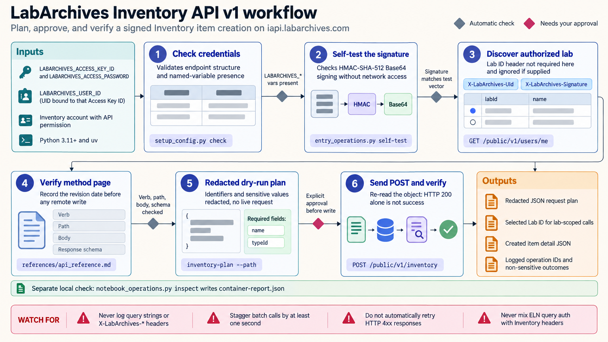

[All skill guides](README.md) / LabArchives Integration

# LabArchives Integration

**Connect laboratory records and inventory through the correct LabArchives interface.**

This skill helps a research assistant plan and implement LabArchives integrations while preserving the distinction between the electronic laboratory notebook and the Inventory service. It supports notebook entries, attachments, searches, exports, inventory records, and related authorized workflows using the documented API surface.

It also provides local helpers for constructing request plans and inspecting LabArchives containers. This is useful when a laboratory wants a reproducible bridge between its existing tools and its record system without relying on guessed endpoints or authentication conventions.

*From the selected notebook or inventory interface to local request planning, authorized operations, and verified record handling.
[View the full-size workflow diagram](../images/labarchive-integration.png).*

## Questions this skill can help you explore

- **How can analysis outputs connect to the notebook?** Identify supported entry, attachment, or export operations for the relevant regional service.
- **Can inventory records be integrated safely?** Confirm Inventory-specific permissions, identifiers, and signed-header requirements.
- **What can be checked before contacting the service?** Inspect local containers and review the intended request scope.

## What you bring

State whether the task concerns the ELN, Inventory, or a named product integration. Provide the institution's approved regional endpoint, relevant record identifiers, and the desired read or write scope. API access must be arranged through the institution or vendor, including the issued access credentials and any user or laboratory identifiers required for the chosen operation.

## How it works

1. **Select the correct interface.** Separate legacy ELN requests, Inventory API calls, and product-specific UI or file integrations.
2. **Verify the method and access.** Consult the official documentation for the exact operation and confirm account permissions and regional routing.
3. **Prepare locally.** Construct and inspect the request plan or validate a local LabArchives container without silently contacting the service.
4. **Perform the authorized operation.** Use institution-reviewed integration code with the correct signature and response format, preserving identifiers and avoiding credential exposure.
5. **Verify the result.** Confirm the intended records and attachments were read or changed, and retain a concise integration record for reproducibility.

## What you get

| Output | What it helps you do |
| --- | --- |
| Integration or request plan | Review destination, method, identifiers, and intended scope. |
| Local container inspection | Identify structural problems before import or further processing. |
| Retrieved or updated records | Connect approved notebook or inventory workflows to other tools. |
| Verification summary | Distinguish completed operations from planned or untested steps. |

## Example request

> Use the LabArchives integration skill to plan an export of selected notebook entries and their attachments for a methods archive. We have institution-approved ELN API access and a defined notebook scope. Verify the regional interface and official methods, prepare the request plan, and describe how record completeness and attachment identities will be checked.

*This is an illustrative research request, not a reported result.*

## Interpreting the results

**A product integration is not evidence of a general-purpose API.** The ELN and Inventory have different request paths, signatures, and response formats; mixing them can produce misleading failures or operate on the wrong scope.

API access and permissions depend on the institution's license and account configuration. A successful response also does not establish that an export contains every relevant scientific record. Check pagination, identifiers, attachments, and completeness against the intended scope.

## Get started

The bundled helpers use Python 3.11+ and the standard library with uv; they are local-only and never send requests or perform remote writes. Remote integration needs network access and LabArchives-issued Access Key ID and Access Password. User-scoped calls need a UID; Inventory requires its own permission and sometimes a Lab ID. No official Python SDK is assumed.

[Setup and technical instructions](../../skills/labarchive-integration/SKILL.md)
