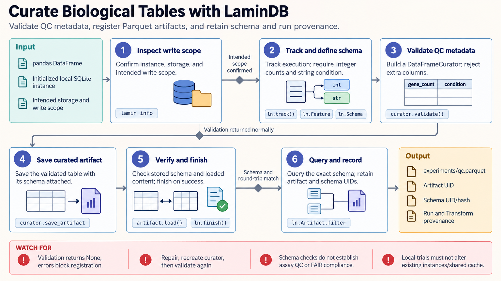

[All skill guides](README.md) / LaminDB

# LaminDB

**Keep biological datasets, metadata, and analysis lineage connected in a searchable record.**

LaminDB organizes scientific files and the metadata that describe them. This skill helps a research assistant register datasets and models, define metadata rules, connect annotations to biological vocabularies, and record which tracked analysis produced each output.

It is particularly useful when a project has many versions of tables or AnnData files and needs to answer both “which dataset is this?” and “how was it produced?” The workflow emphasizes validation and stable identifiers rather than relying on filenames alone.

*From biological files and typed metadata to validated artifacts, ontology annotations, tracked runs, and searchable lineage.
[View the full-size workflow diagram](../images/lamindb.png).*

## Questions this skill can help you explore

- **Which dataset version matches my question?** Search annotated artifacts before loading their contents.
- **Are annotations consistent enough to combine?** Validate typed features and review organism-specific ontology mappings.
- **Can I trace an output to its inputs and code?** Track registered inputs, transformations, and saved results.

## What you bring

Bring the data files or tables, the metadata fields that should be required, and a description of permissible values. Include the organism, relevant ontology sources, and unresolved labels. Specify the intended LaminDB instance and storage, and whether the task is a local experiment or an authorized write to a shared collection.

## How it works

1. **Confirm the destination.** Identify the intended instance and storage so a trial does not modify a shared project accidentally.
2. **Define the metadata contract.** Create typed features and a schema, including controlled vocabulary requirements where appropriate.
3. **Review biological annotations.** Standardize justified synonyms using the chosen ontology source and retain unresolved values for review.
4. **Validate and register.** Curate the data, save schema-aware artifacts, and check that the saved content can be read back correctly.
5. **Track and retrieve.** Record analysis inputs and outputs, finish the tracked run, and use stable artifact identifiers when reporting provenance.

## What you get

| Output | What it helps you do |
| --- | --- |
| Validated artifacts | Keep files together with the schema and metadata used to curate them. |
| Ontology-linked annotations | Improve consistency while exposing unresolved biological labels. |
| Run and transformation records | Trace tracked output files to their inputs and code. |
| Searchable collections | Find relevant datasets without opening every file. |

## Example request

> Use the LaminDB skill to organize our annotated single-cell datasets in a new local project. Define required donor, tissue, and assay fields, review tissue terms against a declared ontology source, and preserve unresolved annotations. Register validated files and track a small quality-control analysis so that every output can be traced to the exact input artifact.

*This is an illustrative research request, not a reported result.*

## Interpreting the results

**Registration does not establish scientific validity or FAIR compliance.** A schema can detect missing or disallowed metadata without determining whether an annotation is biologically correct. Assigning a schema identifier is not a substitute for actually running curation.

Lineage captures accesses performed through the tracking system, not arbitrary file reads elsewhere. Ontology mappings can omit unresolved values, so compare the full input vocabulary with the reviewed result. A file key may later resolve to a newer revision; retain artifact identifiers.

## Get started

The documented workflow uses Python and LaminDB with Bionty for biological vocabularies; some synonym helpers also need IPython. A local SQLite project needs no login. Public ontology downloads and remote storage need network access, while private instances require credentials. Follow the skill’s tested dependency constraints for AnnData and related packages.

[Setup and technical instructions](../../skills/lamindb/SKILL.md)
