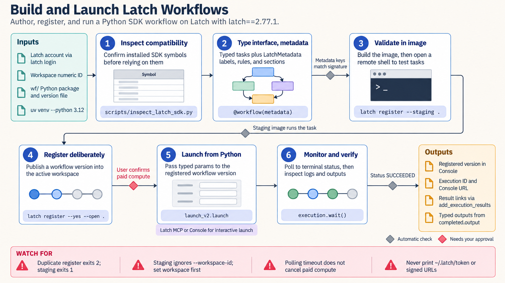

[All skill guides](README.md) / LatchBio Integration

# LatchBio Integration

**Package and run a bioinformatics workflow with explicit inputs, resources, and result checks.**

Latch supports bioinformatics workflows that colleagues can launch through a managed interface. This skill helps a research assistant develop Python task graphs, package Nextflow or Snakemake pipelines, connect project data and Registry records, and inspect execution results.

The goal is to turn an analysis into a repeatable workflow whose inputs, compute requirements, and outputs are understandable. It covers deployment mechanics and scientific result checking as separate responsibilities.

*From typed workflow inputs and staged code to configured cloud tasks, monitored execution, and reviewed scientific outputs.
[View the full-size workflow diagram](../images/latchbio-integration.png).*

## Questions this skill can help you explore

- **Can collaborators run this analysis consistently?** Package the workflow with a clear form, samplesheet, and output locations.
- **What resources should each task receive?** Make CPU, memory, storage, GPU, retries, and timeouts explicit.
- **How will I know a run produced usable results?** Review task status and logs alongside the expected scientific artifacts.

## What you bring

Provide the analysis code or existing pipeline, representative inputs, expected outputs, and any tool or container version requirements. Describe the intended Latch workspace, data locations, Registry relationships, and authorized deployment scope. Include resource expectations and a small example suitable for staging before a full production run.

## How it works

1. **Identify the workflow track.** Choose the documented Python SDK, Nextflow, or relevant Snakemake integration and compatible dependencies.
2. **Describe data and tasks.** Type workflow inputs and outputs, organize task dependencies, and select appropriate data-staging behavior.
3. **Configure execution and interface.** Set resource limits, retries, caching, samplesheets, and user-facing explanations.
4. **Stage and debug.** Build or register the workflow in the intended environment and inspect imports, containers, and representative task behavior.
5. **Launch and review.** Monitor an authorized run, inspect terminal status and logs, and check the actual result files against the analysis expectations.

## What you get

| Output | What it helps you do |
| --- | --- |
| Packaged workflow | Reuse a defined analysis through Latch. |
| Input form and samplesheet design | Help collaborators supply correct parameters and data. |
| Resource configuration | Make compute needs and operational limits reviewable. |
| Run and output review | Connect execution evidence with scientific result checks. |

## Example request

> Use the LatchBio integration skill to package our existing RNA-seq quality-control pipeline for collaborators. Define a samplesheet with explicit sample identifiers, configure modest resources for a staging run, and expose the expected reports in the workflow interface. Document how task failures, missing outputs, and unexpected sample counts will be detected.

*This is an illustrative research request, not a reported result.*

## Interpreting the results

**A successful workflow status does not validate the science.** The pipeline can complete while processing the wrong samples or producing empty, inconsistent, or biologically implausible output. Compare results with the study design and expected artifacts.

The checked-in skill distinguishes local SDK and graph checks from authenticated cloud execution. Registration, uploads, Registry changes, and launches need live verification in the intended workspace. Mixing examples from incompatible SDK or pipeline tracks can lead to deployment failures.

## Get started

The workflow requires a Latch account, network access, and the Latch SDK and CLI; the documented setup recommends Python 3.12 and uv. Docker is needed for local image builds, while remote registration is supported. SDK/CLI login and Latch MCP OAuth are separate authentication paths.

[Setup and technical instructions](../../skills/latchbio-integration/SKILL.md)
