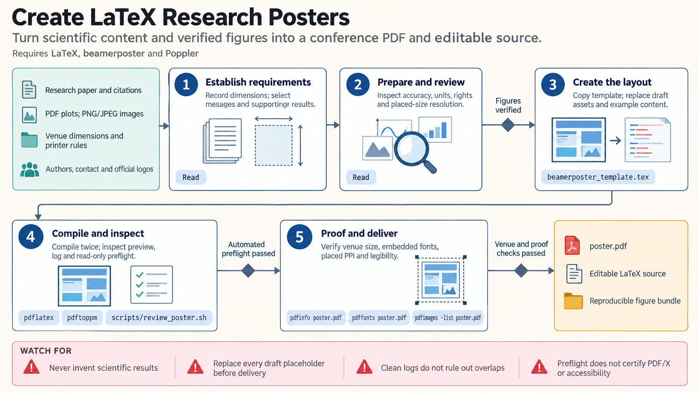

[All skill guides](README.md) / LaTeX Research Posters

# LaTeX Research Posters

**Turn a research story and verified figures into an editable, print-ready poster.**

This skill guides a research assistant through designing and compiling a conference poster in LaTeX. It supports beamerposter, tikzposter, and supplied baposter projects, with attention to the actual venue dimensions, reading order, typography, and figure placement.

It is useful for adapting a manuscript, updating an institutional template, or repairing a poster that compiles but does not print cleanly. The workflow ends with inspection of the rendered PDF, because source code and compiler logs cannot reveal every layout problem.

*From scientific content and venue dimensions to a LaTeX layout, compiled poster, visual inspection, and print preflight.
[View the full-size workflow diagram](../images/latex-posters.png).*

## Questions this skill can help you explore

- **What should the audience remember?** Choose a few messages and the results that directly support them.
- **Will the poster be readable at its intended size?** Review text density, column flow, figure labels, and viewing distance.
- **Can the printer use the final file?** Check page dimensions, embedded fonts, image resolution, and visible layout defects.

## What you bring

Provide the poster dimensions and orientation, conference rules, institutional template if available, and the intended audience. Bring verified results, figure files, captions, citations, author details, and acknowledgments. Identify the main conclusions and limitations that must remain visible when compressing the research into a small number of panels.

## How it works

1. **Define the story and physical format.** Select the main messages and confirm exact paper size and printer requirements.
2. **Prepare scientific figures.** Use real analysis plots and research images, preserving units, sample sizes, uncertainty, and captions.
3. **Build the layout.** Choose a suitable poster class and arrange content with a clear hierarchy and manageable text density.
4. **Compile and inspect.** Render the actual PDF, examine the whole page and detailed crops, and repair overlap, clipping, or unreadable labels.
5. **Preflight and deliver.** Check dimensions, fonts, page count, and image quality; provide the editable source and required assets with the final PDF.

## What you get

| Output | What it helps you do |
| --- | --- |
| Editable LaTeX project | Update content or reuse the layout for another meeting. |
| Compiled poster PDF | Supply the final page for printing or digital distribution. |
| Rendered review images | Inspect the layout at full-page and detail scales. |
| Preflight summary | Record print checks and any remaining limitations. |

## Example request

> Use the LaTeX posters skill to adapt our manuscript into an A0 landscape conference poster. Use the supplied institutional colors and figures, emphasize the two main results, and retain sample sizes and uncertainty. Deliver the editable project and a one-page PDF, with a check of page dimensions, embedded fonts, clipping, and small figure labels.

*This is an illustrative research request, not a reported result.*

## Interpreting the results

**A clean compilation log is not a complete layout check.** Positioned blocks can overlap without generating useful warnings. Numerical plots and microscopy images must come from real analysis or observations; generated artwork is suitable only for clearly conceptual illustration.

Poster compression can also exaggerate certainty by removing study-design details or limitations. Preserve the context needed to interpret the main claims. Ordinary poster classes do not automatically produce an accessible tagged PDF; a text summary may be needed for digital sharing.

## Get started

Use a LaTeX distribution with the chosen poster class and Poppler for PDF inspection. A baposter project needs a separately supplied trusted class file. Optional AI schematic generation requires Python, requests, network access, and an OpenRouter key; the core poster workflow does not require it.

[Setup and technical instructions](../../skills/latex-posters/SKILL.md)
