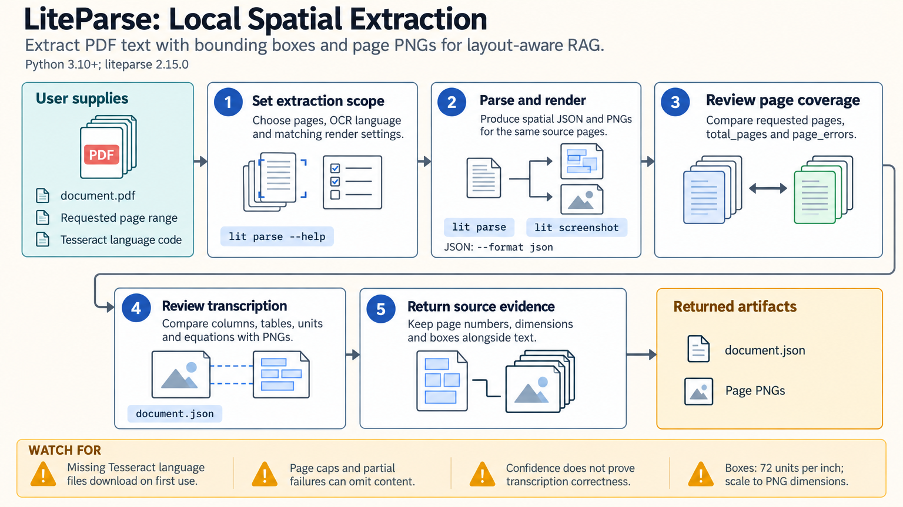

[All skill guides](README.md) / LiteParse

# LiteParse

**Extract document text while retaining where it appeared on the page.**

LiteParse helps turn papers, protocols, and other documents into text that remains connected to page layout. Unlike a plain text dump, its structured output can retain bounding boxes, allowing a research assistant to locate a passage on the original page or connect it with a rendered image.

The skill supports local PDF parsing, OCR of scans, page images, and batch ingestion. It is useful when building a searchable research collection or reviewing documents whose figures and columns matter.

*From source documents to layout-aware text, page coordinates, optional OCR, and rendered pages for extraction checks.
[View the full-size workflow diagram](../images/liteparse.png).*

## Questions this skill can help you explore

- **Where did this passage come from?** Preserve page numbers and spatial text boxes for source grounding.
- **Can scanned material be made searchable?** Apply OCR with an appropriate language configuration.
- **Was the whole collection processed?** Check page selections, errors, and output identities across a batch.

## What you bring

Supply the PDFs, supported Office files, or images, plus the intended output: readable text, Markdown, structured JSON, or page PNGs. State the page range, document languages, and whether files are scanned or born digital. For batch work, keep a source inventory and indicate whether any document content may be sent to an optional OCR service.

## How it works

1. **Inspect the input type.** Select direct PDF parsing, native image conversion, or Office conversion through LibreOffice.
2. **Choose the extraction contract.** Decide which pages, text coordinates, word boxes, and rendered images are needed.
3. **Parse and OCR.** Use native text where possible and the configured OCR method where necessary.
4. **Check completeness and fidelity.** Compare requested pages with processed pages and inspect columns, units, subscripts, tables, and scientific symbols against the rendered source.
5. **Save traceable outputs.** Retain source identity, page dimensions, extraction settings, and errors with the text or JSON.

## What you get

| Output | What it helps you do |
| --- | --- |
| Layout-aware text or Markdown | Read and search document content. |
| Structured text boxes | Locate passages or regions on original pages. |
| Page PNGs | Inspect figures and layouts that text alone cannot represent. |
| Batch output collection | Ingest many files while preserving source identities. |

## Example request

> Use the LiteParse skill to prepare our folder of microscopy protocols for local search. Extract text with page coordinates and render representative pages so I can check tables, reagent units, and multicolumn layouts. Use local OCR for scanned pages, preserve each source filename, and report any omitted pages or parsing errors.

*This is an illustrative research request, not a reported result.*

## Interpreting the results

**Extraction success does not establish transcription accuracy.** Equations, superscripts, table order, and chart values can be lost or changed. Heuristic Markdown is not a faithful reconstruction of every scientific layout.

Bounding boxes use a coordinate system that must be scaled correctly when overlaid on screenshots. Confidence fields are not proof of correctness or OCR provenance. A page cap or an allowed page error can produce a partial document that still appears usable.

## Get started

The documented Python workflow requires Python 3.10+ and LiteParse. Office conversion needs LibreOffice; supported images convert natively. Tesseract is bundled, but missing language files may download on first use, so prepopulate them for offline work. Optional HTTP OCR needs network access and its server’s authentication.

[Setup and technical instructions](../../skills/liteparse/SKILL.md)
