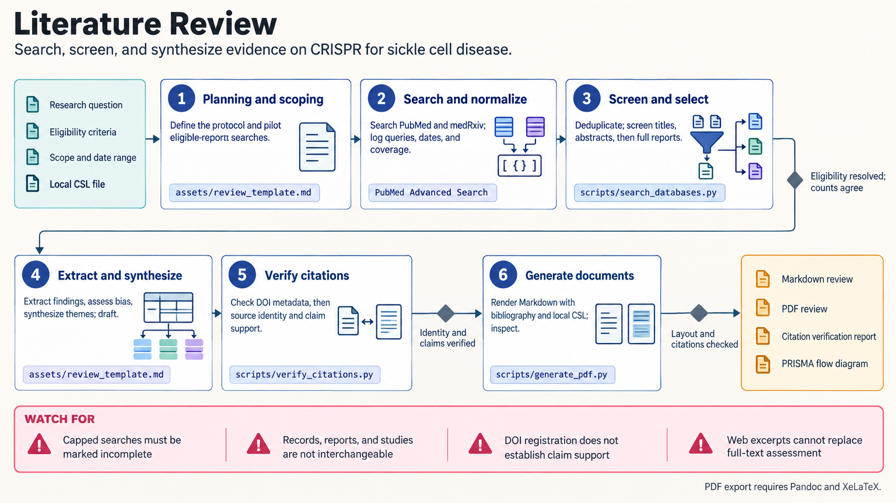

[All skill guides](README.md) / Literature Review

# Literature Review

**Build a transparent synthesis of research with a reproducible search and traceable claims.**

This skill guides systematic, scoping, and narrative literature reviews from question definition through screening, extraction, synthesis, and citation checking. It helps a research assistant organize the evidence around themes and methodological differences rather than produce an unstructured list of paper summaries.

The workflow emphasizes what was searched, what was retrieved, and how decisions were made. Bundled utilities support record processing and document preparation; the scientific assessment remains a research activity requiring review.

*From a defined review question and documented searches to screened studies, extracted evidence, synthesis, and checked citations.
[View the full-size workflow diagram](../images/literature-review.png).*

## Questions this skill can help you explore

- **What does the available evidence support?** Compare findings in the context of design, quality, and limitations.
- **How were the studies selected?** Preserve search strings, eligibility decisions, and reasons for exclusion.
- **Where are the genuine gaps?** Distinguish missing evidence from gaps caused by search coverage or inaccessible reports.

## What you bring

Provide the review question, intended review type, topic boundaries, and any protocol or eligibility criteria. Include databases available through your institution, date and language limits, known relevant studies, and the desired output format. For an update, supply the earlier searches, screening records, included studies, and the date through which evidence was covered.

## How it works

1. **Plan the review.** Define the question, sources, inclusion criteria, extraction fields, and assessment approach before screening.
2. **Search and preserve records.** Use appropriate bibliographic databases, record exact queries and dates, and use supplementary discovery where useful.
3. **Screen and link reports.** Deduplicate search hits, review eligibility, document exclusions, and connect multiple reports of the same study.
4. **Extract and synthesize.** Compare outcomes, study methods, uncertainty, and risk of bias using a suitable narrative or quantitative plan.
5. **Verify and report.** Check claims against the actual sources, reconcile screening counts, and assemble the review and bibliography.

## What you get

| Output | What it helps you do |
| --- | --- |
| Search and screening record | Explain coverage and study-selection decisions. |
| Study-to-report map | Avoid treating multiple papers as independent studies. |
| Evidence extraction tables | Compare methods, outcomes, and limitations consistently. |
| Review manuscript and bibliography | Communicate the synthesis with traceable references. |

## Example request

> Use the literature-review skill to prepare a scoping review of methods for measuring soil microbial activity. Define the search concepts and eligibility criteria, document searches in suitable databases, and organize evidence by measurement principle and validation setting. Keep a study-to-report map and flag unavailable full texts, uncertain eligibility, and claims needing source verification.

*This is an illustrative research request, not a reported result.*

## Interpreting the results

**Search results are not complete evidence coverage.** Ranked web results and extracted snippets cannot replace full-text assessment. A registered DOI establishes neither that the reference is the intended work nor that it supports the cited claim.

Systematic reviews need independent eligibility decisions and documented disagreement resolution. Do not double-count overlapping participants across reports. The skill supports meta-analysis planning but does not provide a meta-analysis engine or make heterogeneous studies automatically comparable.

## Get started

The local utilities use Python 3.10+ and requests; searches and DOI checks require network access. Optional Parallel search needs its authentication. PDF export needs Pandoc and XeLaTeX. Conceptual AI schematics are optional and require an OpenRouter key; exact review counts should come from reconciled records.

[Setup and technical instructions](../../skills/literature-review/SKILL.md)
