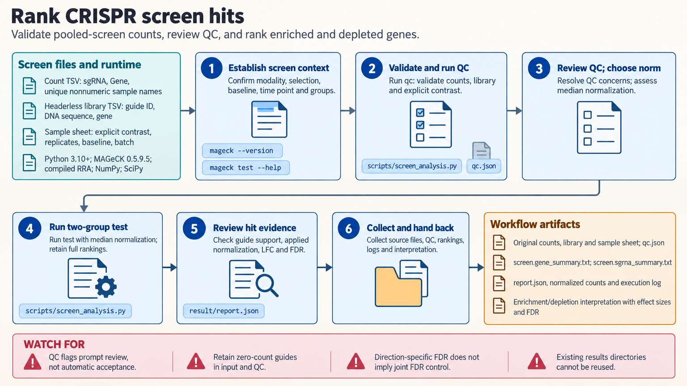

[All skill guides](README.md) / MAGeCK Pooled CRISPR Screens

# MAGeCK Pooled CRISPR Screens

**Turn pooled-screen reads or guide counts into reviewed enrichment and depletion rankings.**

MAGeCK analyzes pooled CRISPR experiments by comparing the abundance of guide RNAs across samples. This skill guides a research assistant through library validation, read counting, quality control, normalization, and two-group testing, retaining the evidence needed to interpret gene rankings.

It supports knockout, CRISPR interference, and CRISPR activation screens. The emphasis is on understanding what the contrast measures and whether the guide-level data support the apparent gene-level signal.

*Analyze a pooled CRISPR screen while keeping guide quality, contrast direction, and false discovery rates visible. [View the full-size workflow diagram](../images/mageck.png).*

## Questions this skill can help you explore

- **Which perturbations become enriched or depleted?** Rank genes with effect sizes and direction-specific false discovery estimates.
- **Is the screen adequately represented?** Review zero-count guides, count distributions, and replicate agreement.
- **Could analysis choices change the hits?** Examine normalization, control-guide selection, and the biological meaning of the baseline.

## What you bring

Provide FASTQ files or a guide-count matrix, the matching library with guide IDs, sequences, and gene assignments, and a sample sheet. State perturbation modality, biological replicates, time points, batches, selection direction, and the exact treatment/control contrast. Include negative-control guide IDs when justified. Sequencing lanes and independent biological samples must remain distinguishable.

## How it works

1. **Define the comparison.** Establish baseline material, sample membership, biological pairing, and the question the screen can answer.
2. **Validate and count.** Check library/count consistency and, for FASTQ input, confirm guide orientation and trimming before mapping.
3. **Review screen quality.** Examine representation, median reads per guide, zero fractions, distribution inequality, and replicate correlations.
4. **Normalize and test.** Choose an appropriate normalization strategy, record the method actually applied, and run the justified contrast.
5. **Review candidate hits.** Compare guide agreement, controls, replicate behavior, and potential copy-number artifacts; retain full rankings and provenance.

## What you get

| Output | What it helps you do |
| --- | --- |
| Count matrix and QC | Evaluate representation and sample consistency. |
| Guide-level results | Inspect agreement among guides targeting the same gene. |
| Gene rankings and effect sizes | Prioritize enrichment and depletion candidates for follow-up. |
| Execution and contrast record | Reproduce inputs, normalization choices, and test settings. |

## Example request

> Use the MAGeCK skill to analyze our replicated CRISPRi screen from a supplied count matrix and guide library. Compare the explicitly named treatment and baseline samples, review library coverage and replicate quality, and justify normalization. Return complete gene and guide rankings, effect sizes, direction-specific FDR, and a review of guide concordance for leading candidates.

*This is an illustrative research request, not a reported result.*

## Interpreting the results

**A screen hit is not a functional mechanism.** Enrichment can reflect resistance, growth advantage, or sampling artifacts; depletion does not establish universal essentiality. Read depth is also different from experimental cell coverage.

Median normalization assumes most guides remain stable, and control-guide choices can affect both scaling and the statistical null. Positive and negative FDR estimates are separate families. Multiple batches or time points may require a design beyond a simple two-group comparison.

## Get started

The workflow runs locally without credentials using the documented MAGeCK release, its compiled RRA executable, NumPy, and SciPy. The standard-library helper requires Python 3.10+. Source installation needs a C++ compiler and package retrieval needs network access; analysis itself does not call a service.

[Setup and technical instructions](../../skills/mageck/SKILL.md)
