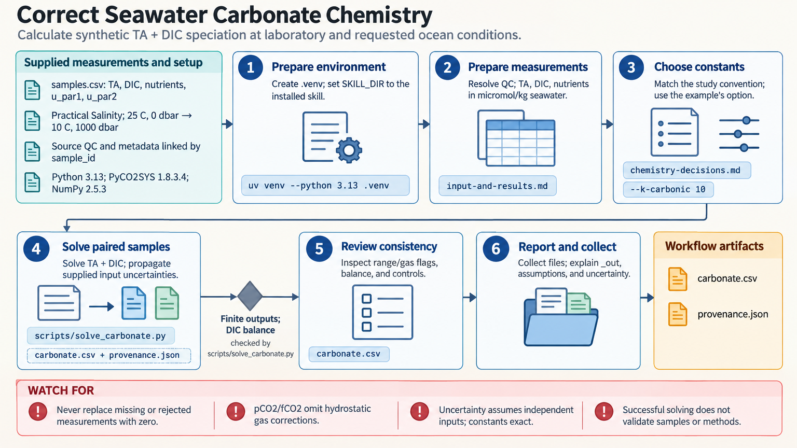

[All skill guides](README.md) / Marine Carbonate Chemistry

# Marine Carbonate Chemistry

**Calculate seawater carbonate speciation with explicit measurement conventions and uncertainty assumptions.**

Two independent carbonate-system measurements can constrain a seawater sample's equilibrium chemistry. This skill uses PyCO2SYS to calculate quantities such as total-scale pH, carbonate ion concentration, seawater carbon dioxide parameters, mineral saturation, and the Revelle factor.

It helps a research assistant keep units, pH scales, equilibrium constants, temperature, and pressure consistent. The result is a reproducible calculation table with its assumptions attached, rather than a set of numbers separated from their measurement context.

*Calculate seawater carbonate properties with explicit units, pH scales, conditions, and uncertainty assumptions. [View the full-size workflow diagram](../images/marine-carbonate-chemistry.png).*

## Questions this skill can help you explore

- **What carbonate chemistry follows from my measured pair?** Calculate unmeasured system properties using documented constants.
- **How do laboratory and in-situ conditions differ?** Convert a closed-sample system to specified temperature and pressure.
- **How sensitive are the results to measurement error?** Propagate the stated input uncertainties within the helper’s supported assumptions.

## What you bring

Supply two independent measured parameters, sample IDs, salinity, temperature, pressure, phosphate, and silicate. Retain methods, quality flags, reference materials, station and depth metadata separately. Declare the pH scale where relevant and the measurement conditions for both inputs. Nutrients and alkalinity use micromoles per kilogram of seawater; missing values must not become zeros.

## How it works

1. **Establish the measurement basis.** Reconcile units, quality flags, pH scale, and temperature/pressure conventions before calculation.
2. **Choose the chemical assumptions.** Select supported equilibrium constants and justify nutrient values and any neglected components.
3. **Solve and check balance.** Validate the table, calculate the system, and inspect finite outputs and dissolved-inorganic-carbon species balance.
4. **Review consistency.** Examine range and gas-pressure flags and compare predicted third parameters with independent measurements when available.
5. **Report both conditions clearly.** Distinguish input-condition and requested output-condition results and preserve assumptions, versions, and uncertainty scope.

## What you get

| Output | What it helps you do |
| --- | --- |
| Carbonate-system table | Compare calculated pH, species, saturation, and other properties. |
| Condition-corrected results | Describe the same closed sample at specified temperature and pressure. |
| Optional propagated uncertainty | Assess the contribution of declared independent measurement errors. |
| Provenance and flags | Retain constants, conventions, exclusions, and calculation limits. |

## Example request

> Use the marine carbonate chemistry skill to analyze our bottle-sample alkalinity and DIC measurements. Check units and quality flags, use the study’s declared constants and nutrient values, and calculate total-scale pH and aragonite saturation at measurement and in-situ conditions. Propagate the supplied standard uncertainties and clearly flag gas-pressure conventions and out-of-range samples.

*This is an illustrative research request, not a reported result.*

## Interpreting the results

**Equilibrium calculations do not validate the sample or establish ecological response.** Undersaturation is a thermodynamic condition, not a dissolution rate. Temperature correction cannot undo gas exchange or biological changes during handling.

The helper treats unlisted errors and constants as exact and assumes independent input errors. Its gas outputs omit specified hydrostatic solubility/fugacity corrections even when pH and saturation include pressure effects. It is not a general freshwater, porewater, gas-flux, or carbon-removal model.

## Get started

The documented local environment uses Python 3.13, PyCO2SYS 1.8.3.4, and NumPy. Network access is needed only for installation or obtaining external data; calculations require no credentials. Use the v1 documentation matching the pinned solver and review the skill’s chemistry decision guide before choosing constants.

[Setup and technical instructions](../../skills/marine-carbonate-chemistry/SKILL.md)
