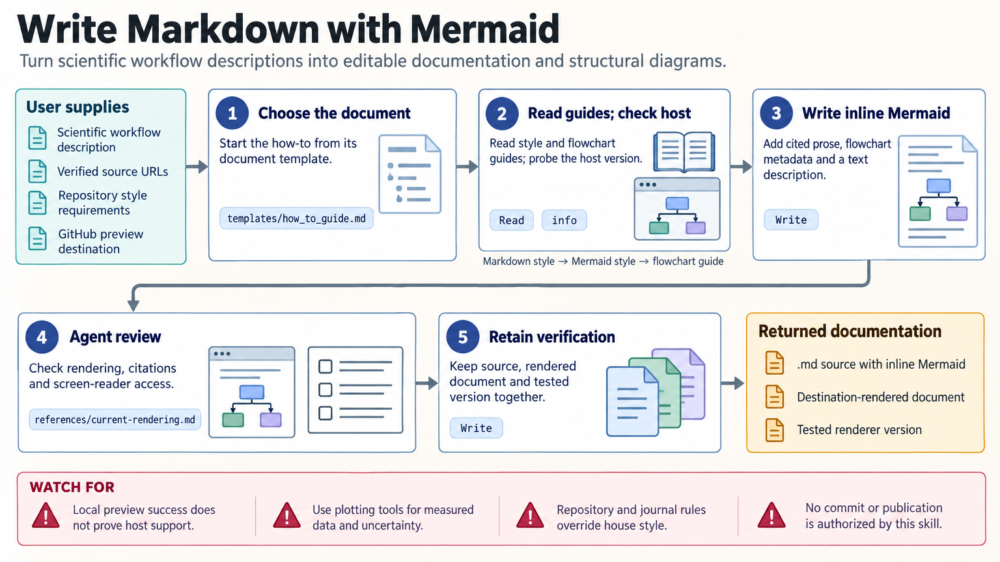

[All skill guides](README.md) / Markdown and Mermaid Writing

# Markdown and Mermaid Writing

**Keep research documentation and structural diagrams readable, editable, and easy to revise.**

This skill helps a research assistant write Markdown documents with Mermaid diagrams for workflows, relationships, timelines, and data structures. Because the diagram is stored as text, its labels and connections can be reviewed alongside the prose and updated in version control.

It provides document templates, syntax references, and rendering guidance. For scientists, it is useful for explaining how samples move through a study, how datasets relate, or how an analysis is organized.

*From a documented research structure to editable Markdown, an appropriate Mermaid diagram, and verified rendered output.
[View the full-size workflow diagram](../images/markdown-mermaid-writing.png).*

## Questions this skill can help you explore

- **How does this workflow fit together?** Show ordered steps, branches, dependencies, or interactions.
- **Which representation communicates the structure best?** Choose a flowchart, timeline, sequence diagram, or another supported type.
- **Will readers see the intended diagram?** Check the actual destination’s renderer and provide an accessible alternative when needed.

## What you bring

Provide the document purpose, audience, repository conventions, and the relationships or process to explain. Identify the final viewing environment, such as a repository page or exported report, and any required figure format. Bring verified labels and source material; distinguish conceptual arrows from measured or causal relationships.

## How it works

1. **Choose the document structure.** Start from a suitable template while following the project’s requested format and existing conventions.
2. **Select a diagram type.** Match the information to its structure rather than forcing every task into a flowchart.
3. **Write concise source.** Keep labels clear, provide relevant explanatory text, and use supported accessibility metadata.
4. **Render where it will be read.** Test the destination’s Mermaid version, layout, themes, and plugin requirements.
5. **Preserve and deliver.** Keep the editable Markdown and diagram source alongside any exported SVG or PNG and a text description.

## What you get

| Output | What it helps you do |
| --- | --- |
| Markdown document | Maintain a readable methods note, report, or project guide. |
| Editable Mermaid source | Review changes to the diagram’s logic and labels. |
| Rendered diagram when needed | Share with readers whose tools do not support Mermaid. |
| Rendering and accessibility checks | Record whether the intended destination displays the material correctly. |

## Example request

> Use the Markdown and Mermaid writing skill to document our sample-processing workflow. Show collection, aliquoting, assay branches, quality checks, and the connection to analysis datasets. Follow the repository’s existing style, include a plain-language description, and verify the diagram in our intended viewer. Retain editable source and supply a rendered image if the viewer needs one.

*This is an illustrative research request, not a reported result.*

## Interpreting the results

**A clear diagram is a representation of the supplied model, not evidence that the model is correct.** Arrows should have an explicit meaning, and a workflow connection should not silently imply causation. Check every label and relationship against the protocol or source material.

Use scientific plotting tools for measured data, uncertainty, and exact numerical geometry. A diagram that renders in one Mermaid version may fail elsewhere, and plain Markdown viewers may display only the source text. Accessibility requires a usable text alternative, not color alone.

## Get started

Markdown authoring needs no runtime or credentials. Local rendering follows the skill’s documented Mermaid and Mermaid CLI versions and needs Node.js plus a supported Chromium browser. Package installation needs network access. Export and inspect the actual destination format rather than assuming local preview guarantees compatibility.

[Setup and technical instructions](../../skills/markdown-mermaid-writing/SKILL.md)
