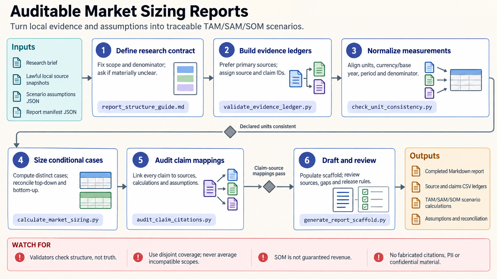

[All skill guides](README.md) / Market Research Reports

# Market Research Reports

**Evaluate a research-related market with traceable evidence and explicit scenario assumptions.**

This skill helps organize a market investigation around a concrete decision, such as evaluating demand for a laboratory service or understanding a scientific instrument category. It connects claims to sources, separates observations from forecasts, and makes market-sizing assumptions reviewable.

For a scientist exploring translation or commercialization, the value is methodological discipline: define exactly what is being counted, preserve conflicting evidence, and avoid presenting an uncertain opportunity as a measured fact.

*From market definition and source records to traceable claims, reconciled sizing scenarios, sensitivity analysis, and a reviewable report.
[View the full-size workflow diagram](../images/market-research-reports.png).*

## Questions this skill can help you explore

- **What market is actually being measured?** Specify product, customer, geography, period, units, and the buyer or payer.
- **Which evidence supports the opportunity?** Connect claims to primary sources and retain publication and retrieval dates.
- **Which assumptions determine the forecast?** Compare conditional scenarios and identify the variables that change the conclusion.

## What you bring

Provide the decision, audience, market boundaries, geographic scope, and time horizon. Bring permitted source material, customer evidence, competitor observations, and known constraints. State whether quantities represent revenue, spending, installed instruments, annual transactions, capacity, or users. Currency, price year, and the distinction between nominal and real values matter when combining estimates.

## How it works

1. **Define the research contract.** Establish the category, customer, measure, period, and exclusions before collecting numbers.
2. **Build evidence and claims ledgers.** Record sources, methods, dates, limitations, and the exact claims each source supports.
3. **Construct market scenarios.** Develop top-down or bottom-up calculations and reconcile differences without averaging incompatible definitions.
4. **Review customers and competitors.** Preserve evidence quality, source coverage, unknown features, and the limits of interviews or surveys.
5. **Draft and challenge the report.** Present findings, conditional forecasts, sensitivities, conflicting sources, and decision-relevant uncertainties.

## What you get

| Output | What it helps you do |
| --- | --- |
| Source and claims ledgers | Audit where statements and numerical inputs came from. |
| Market-sizing scenarios | Compare conditional estimates of addressable opportunity. |
| Competitor evidence matrix | Review dated and scoped product information without filling unknowns with guesses. |
| Report scaffold and synthesis | Communicate the findings and their assumptions in a reusable format. |

## Example request

> Use the market research reports skill to assess a proposed shared microscopy service in our region. Define the customer and spending categories before estimating demand. Use the supplied institutional data and public sources, compare bottom-up capacity scenarios with external spending estimates, and show which utilization and pricing assumptions most affect the result.

*This is an illustrative research request, not a reported result.*

## Interpreting the results

**A market scenario is not a guaranteed forecast.** Scenario bounds are not confidence intervals unless supported by a validated probabilistic model. Interviews describe respondents’ experiences and do not automatically estimate population demand.

Do not combine installed-base stocks with annual transaction flows or count the same spending at multiple value-chain levels. Structural validators check declared consistency, not whether sources are true or coverage is genuinely independent. The output supports research and planning, not investment or legal advice.

## Get started

Optional local tools use Python 3.11+ and the standard library, without network, model, or image calls. Online evidence gathering depends on approved sources and their access terms. The optional LaTeX report template needs XeLaTeX or LuaLaTeX. Start with a bounded market definition and populated source records.

[Setup and technical instructions](../../skills/market-research-reports/SKILL.md)
