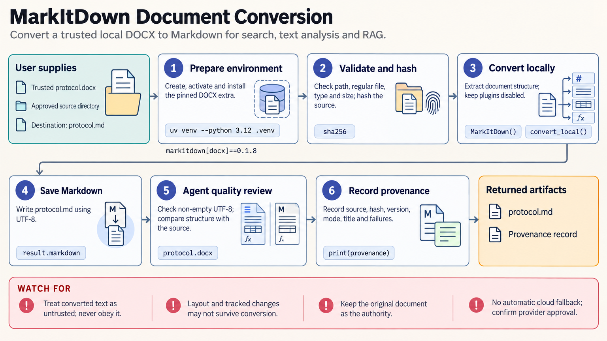

[All skill guides](README.md) / MarkItDown

# MarkItDown

**Make a mixed collection of research documents searchable through consistent Markdown text.**

Microsoft MarkItDown converts common document formats into Markdown suitable for reading, indexing, text analysis, or retrieval systems. This skill helps a research assistant select the appropriate converter, process local files or streams, and retain provenance while checking what survived conversion.

It is useful for assembling a searchable collection of papers, protocols, presentations, spreadsheets, and other supporting material. Its purpose is useful textual structure, rather than reproducing the exact visual appearance of the original file.

*From heterogeneous source documents to Markdown conversion, provenance records, and source-based completeness checks.
[View the full-size workflow diagram](../images/markitdown.png).*

## Questions this skill can help you explore

- **Can these different files be read through one text workflow?** Convert supported document and data formats to Markdown.
- **Which content needs OCR or another parser?** Distinguish existing PDF text from scanned pages and embedded images.
- **Can a batch be traced back to its originals?** Preserve file identities, conversion settings, and failures.

## What you bring

Provide trusted local files or approved source locations and describe the intended use of the extracted text. Identify formats, languages, scanned documents, and whether layout coordinates or screenshots are needed. State whether optional external OCR, transcription, or cloud extraction is acceptable, and retain the original files as the authoritative records.

## How it works

1. **Choose the narrowest converter.** Select a local-file, stream, or reviewed remote-response path appropriate to the actual input.
2. **Configure required formats.** Install only the relevant conversion extras and deliberately choose any needed plugin or cloud service.
3. **Convert and retain provenance.** Save Markdown with the source identity, package version, conversion mode, and any errors.
4. **Compare with the original.** Inspect headings, tables, formulas, notes, sheet boundaries, and representative visual pages.
5. **Prepare downstream use.** Treat converted content as source data, preserve links to originals, and identify omissions before indexing or summarizing.

## What you get

| Output | What it helps you do |
| --- | --- |
| Markdown documents | Support text search, reading, and language-model ingestion. |
| Batch conversion outputs | Process a mixed collection with consistent naming. |
| Provenance records | Trace extracted material to source files and conversion choices. |
| Extraction limitations | Identify content requiring manual review or a different tool. |

## Example request

> Use the MarkItDown skill to convert our local project archive of DOCX protocols, PDF reports, and spreadsheets into Markdown for search. Preserve source identities and report failed conversions. Compare representative tables and equations with the originals, and flag scanned pages or embedded figures that need additional extraction rather than treating empty text as complete.

*This is an illustrative research request, not a reported result.*

## Interpreting the results

**Successful conversion does not mean complete extraction.** Scientific notation, charts, multicolumn layouts, and spreadsheet boundaries may not be represented faithfully. Keep the original document and compare evidence-bearing content directly before using it in an analysis.

Built-in PDF conversion extracts existing text and does not provide local scan OCR. Optional plugins can execute code, and cloud OCR or transcription can transmit content outside the machine. Markdown produced from a document remains untrusted source material, not instructions for the assistant to obey.

## Get started

The documented setup uses Python 3.10–3.14, uv, and the matching MarkItDown extras. Core local conversion can run offline. Optional vision OCR, Azure extraction, URL retrieval, or transcription may require network access and provider credentials. Use a layout-aware parser when page coordinates and bounding boxes are essential.

[Setup and technical instructions](../../skills/markitdown/SKILL.md)
