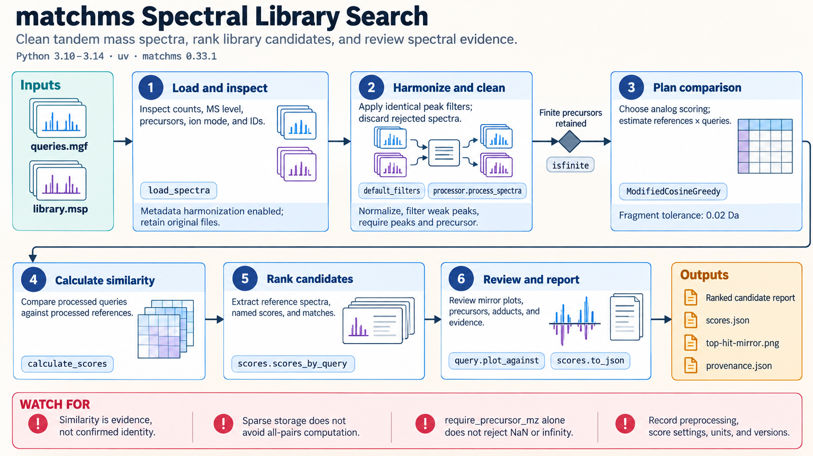

[All skill guides](README.md) / Matchms

# Matchms

**Compare tandem mass spectra with transparent preprocessing and inspectable candidate matches.**

Matchms supports importing, cleaning, and comparing tandem mass spectra. This skill helps a research assistant harmonize metadata, filter peaks, choose an appropriate similarity measure, and search query spectra against a reference library.

It is useful in metabolomics and small-molecule research when spectral similarity is one line of evidence for annotation. The workflow keeps preprocessing and scoring choices visible, so a promising match can be reviewed chemically rather than accepted from a score alone.

*From MS/MS spectra and metadata to consistent preprocessing, similarity scoring, ranked library candidates, and chemical review.
[View the full-size workflow diagram](../images/matchms.png).*

## Questions this skill can help you explore

- **Which library spectra resemble my query?** Rank candidates using a defined spectral similarity method.
- **Do metadata and preprocessing support a fair comparison?** Review precursor values, ion mode, adducts, and peak filtering.
- **What evidence supports the leading match?** Examine matched peaks, mirror plots, and orthogonal information.

## What you bring

Provide query spectra and a reference library in supported formats such as MGF, MSP, mzML, or mzXML. Include spectrum identifiers, precursor mass-to-charge ratios, ion mode, adduct information, and acquisition context when available. State the scientific purpose and acceptable fragment mass tolerance, with units. Preserve unmodified source files.

## How it works

1. **Inspect and harmonize.** Review spectrum counts, MS level, metadata completeness, and peak coverage while retaining original records.
2. **Apply consistent preprocessing.** Use the same peak treatment for query and reference spectra and record any dropped spectra.
3. **Choose the score and comparison set.** Match the scoring method to the question and estimate the number of pairs before a large search.
4. **Score and extract candidates.** Save similarity values, matched-peak counts where available, settings, and reference annotations.
5. **Review the chemistry.** Inspect leading matches against precursor agreement, ion/adduct compatibility, fragmentation, and independent evidence.

## What you get

| Output | What it helps you do |
| --- | --- |
| Processed spectra and report | Review what preprocessing changed or excluded. |
| Similarity scores and top-hit tables | Prioritize library candidates for inspection. |
| Mirror plots | Compare observed and reference peak patterns visually. |
| Optional spectral network | Explore relationships among spectra with explicit edge criteria. |

## Example request

> Use the matchms skill to search our positive-ion MS/MS spectra against the supplied library. Apply documented, consistent peak filtering, use a justified similarity score and fragment tolerance, and report matched peaks alongside each score. Make mirror plots for leading candidates and flag precursor or adduct mismatches before suggesting annotations.

*This is an illustrative research request, not a reported result.*

## Interpreting the results

**Spectral resemblance is evidence, not proof of compound identity.** There is no universal score threshold that validates identification across libraries, instruments, and preprocessing choices. Structure-fingerprint similarity also answers a different question from spectral similarity.

Fragment tolerances in the cosine family are absolute mass-to-charge windows in daltons, not parts per million. A sparse result container does not automatically reduce the number of comparisons. Matchms does not replace chromatographic feature detection, proteomics pipelines, or vendor-file conversion.

## Get started

The documented local workflow uses Python 3.10–3.14, uv, and matchms with its dependencies, including RDKit. Local files need no credentials; retrieving spectra through metabolomics USIs needs network access. Use the APIs matching the skill’s documented release because older similarity and processing names may have changed.

[Setup and technical instructions](../../skills/matchms/SKILL.md)
