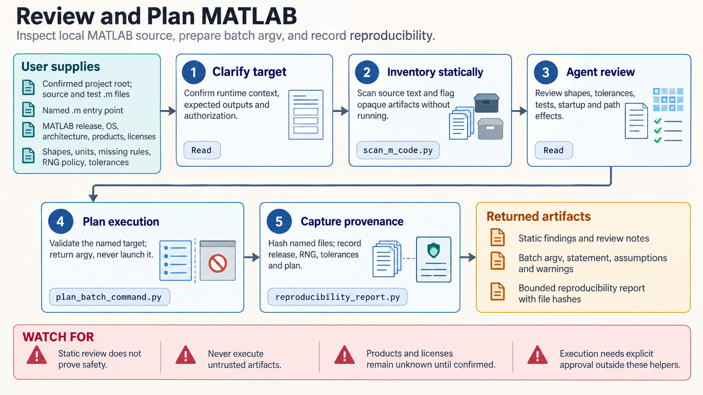

[All skill guides](README.md) / MATLAB and GNU Octave

# MATLAB and GNU Octave

**Prepare numerical workflows with explicit array semantics, runtime requirements, and reproducibility records.**

This skill helps a research assistant review and structure numerical work in MATLAB or GNU Octave. It covers arrays, tables and time data, graphics, MAT-file exchange, projects, tests, release migration, and planned Python interoperability.

The bundled helpers focus on local inspection and planning: they can examine source text, inventory files, validate declared project requirements, and prepare execution arguments. They do not silently run MATLAB or Octave analyses or establish that the required licensed products are available.

*From numerical source and declared runtime requirements to code review, compatibility planning, file inventories, and reproducibility records.
[View the full-size workflow diagram](../images/matlab.png).*

## Questions this skill can help you explore

- **Does the code express the intended mathematics?** Review shapes, indexing, element-wise operations, numerical conditioning, and missing data.
- **What environment does the analysis require?** Distinguish base products, toolboxes, Octave packages, and release-specific interfaces.
- **Can the analysis be handed off reproducibly?** Record inputs, outputs, source identities, and planned verification.

## What you bring

Provide the source code, representative input descriptions, expected numerical behavior, and the runtime you actually have. State the release, operating system, available toolboxes or packages, and license context. For Python integration or MAT exchange, include interpreter versions, array shapes, types, and the intended direction of data transfer.

## How it works

1. **Establish the runtime boundary.** Identify MATLAB or Octave, the release, and required products before assuming compatibility.
2. **Inspect the project.** Review source and manifests, identify opaque artifacts or startup behavior, and inventory relevant MAT files.
3. **Review numerical contracts.** Check dimensions, units, solver choice, tolerances, missing values, random seeds, and time conventions.
4. **Prepare a reproducible plan.** Generate reviewed execution arguments or scaffolds and define meaningful checks for the intended analysis.
5. **Document verification status.** Separate static findings and local helper results from numerical behavior that still needs trusted runtime execution.

## What you get

| Output | What it helps you do |
| --- | --- |
| Code and dependency review | Identify numerical and environment assumptions before execution. |
| MAT-file inventory | Inspect file headers and supported metadata without treating files as arbitrary safe data. |
| Execution or interoperability plan | Make runtime and version requirements explicit. |
| Reproducibility report or scaffold | Retain artifact identities and a structured starting point for further work. |

## Example request

> Use the MATLAB skill to review our time-series analysis project before a release migration. Identify required products, inspect array and timetable assumptions, and flag numerical operations that need targeted checks. Inventory the named MAT files and prepare a reproducibility report and execution plan, clearly separating reviewed source from behavior not yet tested in MATLAB.

*This is an illustrative research request, not a reported result.*

## Interpreting the results

**MATLAB and Octave are only partially compatible.** Similar syntax or package names do not guarantee equivalent numerical results, graphics, APIs, or licensing. MATLAB Runtime cannot execute arbitrary MATLAB source or substitute for a full installation.

A small residual does not establish an accurate solution to an ill-conditioned problem. Static source checks also cannot prove executable artifacts are safe or scientifically correct. The checked-in examples distinguish illustrative numerical code from the locally tested Python helpers.

## Get started

The bundled helpers need Python 3.11+ and run locally without MATLAB, Octave, credentials, or network access. Optional MAT metadata inventory can use SciPy or h5py. Actual numerical execution needs the intended runtime and required products; Python Engine compatibility must match the specific MATLAB release.

[Setup and technical instructions](../../skills/matlab/SKILL.md)
