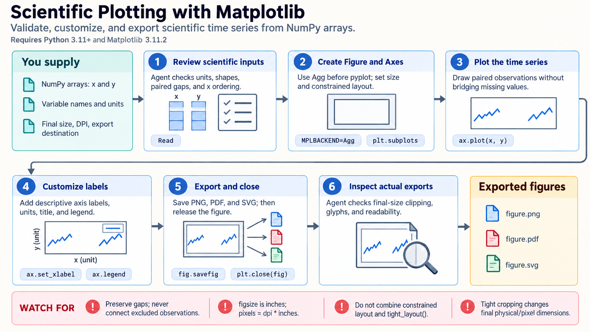

[All skill guides](README.md) / Matplotlib

# Matplotlib

**Create scientific figures with direct control over every axis, label, and visual encoding.**

Matplotlib is a Python plotting library for turning numerical data into figures. This skill helps a research assistant build and customize plots, combine panels, select appropriate color scales, and export graphics in formats suitable for reports and publications.

It is useful when the figure needs precise control beyond a default chart: shared axes, carefully placed annotations, scientific image coordinates, customized legends, or consistent comparisons across panels. The plotting choices remain connected to the meaning of the data.

*From checked numerical data and a defined figure purpose to structured plots, consistent styling, inspected exports, and reusable source.
[View the full-size workflow diagram](../images/matplotlib.png).*

## Questions this skill can help you explore

- **Which visual form best answers the question?** Choose lines, scatter plots, distributions, images, contours, or other supported representations.
- **Are panels directly comparable?** Align units, axis limits, and color normalization where scientifically appropriate.
- **Will readers understand the uncertainty?** Label the error representation, sample size, and experimental unit explicitly.

## What you bring

Provide the data or analysis outputs, variable meanings and units, group definitions, and the intended comparison. Specify what any uncertainty values represent and how they were calculated. Include final figure dimensions, output formats, journal or presentation requirements, and accessibility preferences. Original data and analysis code should remain available independently of the figure.

## How it works

1. **Check the plotting data.** Validate shapes, units, missing-value handling, ordering, and the meaning of each plotted group.
2. **Build the figure structure.** Create explicit figures and axes, select suitable plot types, and arrange panels around the scientific question.
3. **Set meaningful encodings.** Choose labels, scales, color normalization, legends, and uncertainty displays that preserve interpretation.
4. **Export at the intended size.** Save suitable raster or vector files with deliberate dimensions and resolution.
5. **Inspect the result.** Review the actual exported figure for clipping, unreadable labels, misleading limits, and inconsistent panels; retain the plotting source.

## What you get

| Output | What it helps you do |
| --- | --- |
| Scientific plot or multipanel figure | Communicate a defined comparison or pattern. |
| PNG, PDF, or SVG export | Use the figure in the required publication or presentation format. |
| Reusable plotting code | Regenerate the figure when data or layout changes. |
| Documented visual choices | Explain scales, uncertainty, and any excluded values. |

## Example request

> Use the Matplotlib skill to plot our replicated growth curves and endpoint distributions in a two-panel figure. Label units and biological sample sizes, show the supplied uncertainty with its definition, and keep treatment colors consistent. Export a vector PDF and a presentation PNG, then check the files at their final display size.

*This is an illustrative research request, not a reported result.*

## Interpreting the results

**A plotting library does not infer statistical uncertainty.** Error bars must be supplied and labeled correctly, and thousands of measurements do not change the biological unit of replication. Box-plot outliers are not automatically invalid observations.

Shared colors do not guarantee shared numerical meaning unless the normalization is also consistent. Log scales require explicit treatment of zero or negative values. Increasing DPI cannot restore detail absent from the source data, and automatic layout does not replace visual inspection.

## Get started

The documented workflow uses Python 3.11+, Matplotlib, and NumPy; selected examples also need SciPy or pandas. Local file export needs no credentials or GUI. Interactive windows and notebook widgets need suitable backends or ipympl, and optional external LaTeX rendering needs its own installation.

[Setup and technical instructions](../../skills/matplotlib/SKILL.md)
