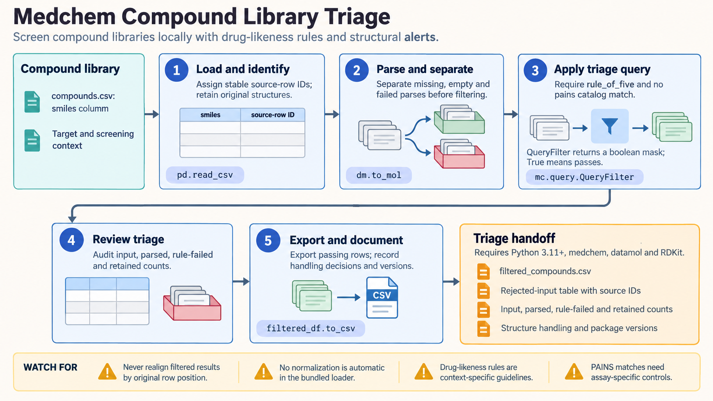

[All skill guides](README.md) / Medchem

# Medchem

**Triage compound libraries with explicit medicinal-chemistry rules and reviewable alerts.**

Medchem applies named chemical rules, structural alert catalogs, and complexity measures to molecular structures. This skill helps a research assistant organize a compound collection for follow-up while keeping the reason for each flag or filtering decision visible.

It can support early library review, hit-to-lead planning, or a comparison of screening subsets. The filters encode useful heuristics, but their relevance depends on the assay, target, intended exposure, and chemistry program.

*From validated molecular structures to rule evaluations, structural alerts, complexity annotations, and a traceable compound triage table.
[View the full-size workflow diagram](../images/medchem.png).*

## Questions this skill can help you explore

- **Which compounds meet the chosen property rules?** Apply declared drug-likeness or lead-like criteria.
- **Which structures deserve assay-specific scrutiny?** Annotate potential interference, reactive motifs, and other catalog alerts.
- **How does a filtering decision change the library?** Preserve compound identities and review why records pass or fail.

## What you bring

Provide structures as SMILES, SDF, or a supported table with stable compound identifiers. Describe the assay and project goals, relevant chemical series, and the filtering rules you want to evaluate. Preserve original structures and separately record parsing failures. Salt handling, stereochemistry, and previous standardization should be documented before comparing molecules.

## How it works

1. **Validate chemical inputs.** Parse structures, preserve identifiers, and retain rejected records so filtering does not silently shift labels.
2. **Choose justified criteria.** Select named property rules, alert catalogs, complexity metrics, and any substructure annotations appropriate to the project.
3. **Evaluate and annotate.** Run the selected filters and keep individual pass/fail results and reasons alongside the input identities.
4. **Inspect boundary cases.** Review non-finite metrics, alert severity, unusual chemistry, and compounds excluded by broad rules.
5. **Prepare the triage handoff.** Export the full annotated collection or a clearly defined subset with the settings and limitations.

## What you get

| Output | What it helps you do |
| --- | --- |
| Annotated compound table | See property rules, alerts, and group annotations per molecule. |
| Filtered subset | Select records meeting the explicitly chosen criteria. |
| Library summary | Understand how each criterion affects the collection. |
| Rejected-input record | Keep invalid structures separate from chemically filtered compounds. |

## Example request

> Use the medchem skill to triage our screening library while retaining the full compound table. Apply the agreed property rules and named alert catalogs, annotate functional groups, and explain the main reasons for exclusion. Keep stable IDs, report invalid structures separately, and identify flagged compounds that need assay-specific controls rather than automatic rejection.

*This is an illustrative research request, not a reported result.*

## Interpreting the results

**An alert is not measured interference or toxicity.** PAINS and reactive-group matches identify structures for review; they cannot replace experimental controls. Likewise, drug-likeness rules are context-dependent and do not establish efficacy, safety, or exposure.

Complexity thresholds are relative to a reference library and are not synthesis-feasibility assessments. Invalid molecules and undefined scores need explicit handling. Some functional filters have different semantics from class-based results, so preserve the exact rule and threshold used.

## Get started

The documented workflow requires Python 3.11+, medchem, datamol, and RDKit. Most filtering runs locally without credentials. Optional Lilly demerits need separately built native tools, a C++ toolchain, make, zlib, and Ruby; installation needs network access. Choose only the dependencies needed for the selected filters.

[Setup and technical instructions](../../skills/medchem/SKILL.md)
