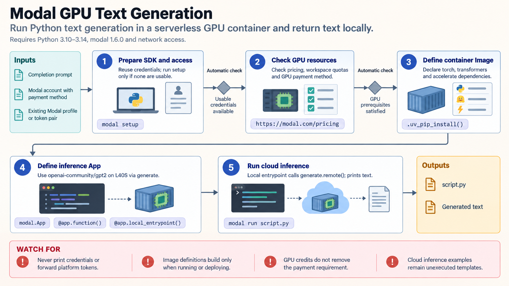

[All skill guides](README.md) / Modal

# Modal

**Run a research computation in a defined cloud environment with explicit resources and saved outputs.**

Modal provides on-demand cloud execution for Python workloads, including GPU tasks, batch processing, and model-serving endpoints. This skill helps a research assistant package code and dependencies, select resources, connect persistent storage, and monitor execution.

For a scientific project, it is useful when local hardware is insufficient or many independent tasks can run in parallel. It organizes the compute environment and execution mechanics; the scientific method and result-validation criteria still come from the analysis itself.

*From Python code and a container environment to configured cloud compute, persistent artifacts, monitored execution, and result verification.
[View the full-size workflow diagram](../images/modal.png).*

## Questions this skill can help you explore

- **Can this workload run on suitable remote hardware?** Define CPU, memory, GPU, storage, and timeout requirements.
- **How can independent tasks be processed together?** Distribute bounded inputs with separate output paths.
- **How will results survive the container?** Store artifacts deliberately and verify producer-to-consumer visibility.

## What you bring

Provide the code, dependency versions, representative inputs, expected outputs, and the intended Modal workspace. State resource needs, an execution budget, and whether the task is a one-off job, batch, scheduled workflow, or endpoint. Identify approved data locations and any workload-specific secrets without embedding credential values in source files.

## How it works

1. **Define the execution contract.** Identify the workload, resources, output checks, budget, and intended cloud destination.
2. **Build the environment.** Declare Python and system dependencies in a Modal image and preserve versions relevant to reproducibility.
3. **Configure data and execution.** Set storage, task boundaries, concurrency, timeouts, and the required secrets.
4. **Run a representative job.** Inspect logs and expected artifacts before expanding to a larger batch or GPU workload.
5. **Verify and retain results.** Check content as well as terminal status, confirm storage visibility, and record the environment and run identifiers.

## What you get

| Output | What it helps you do |
| --- | --- |
| Modal app and image definition | Recreate the intended cloud environment. |
| Configured compute tasks | Run Python jobs with explicit resources and limits. |
| Persistent result files | Retain model weights, analysis outputs, or intermediate data. |
| Execution and validation record | Separate completed cloud work from locally checked setup. |

## Example request

> Use the Modal skill to package our image-analysis script for a bounded batch run. Pin its dependencies, start with a representative input, and choose resources based on that check. Store each sample’s outputs under a unique run path, verify expected files and sample counts, and retain the logs and environment details needed to reproduce the computation.

*This is an illustrative research request, not a reported result.*

## Interpreting the results

**Remote execution does not establish scientific validity.** An analysis may complete while using the wrong inputs or producing incomplete artifacts. Local SDK construction also does not prove that a cloud image, GPU dependency, or authenticated launch works.

Persistent volumes need explicit producer/consumer coordination; returning from a function is not itself a guarantee that another container sees fresh data. Hardware availability, workspace quotas, and costs must be checked when sizing an actual run. Untrusted generated code needs an appropriately restricted sandbox.

## Get started

The documented setup uses Python 3.10–3.14 and the Modal SDK. Cloud execution requires network access, a Modal account, and authentication; GPU use requires a payment method. Workload dependencies belong in the cloud image. Reuse the intended workspace’s supported credential mechanism and review resource limits before launching.

[Setup and technical instructions](../../skills/modal/SKILL.md)
