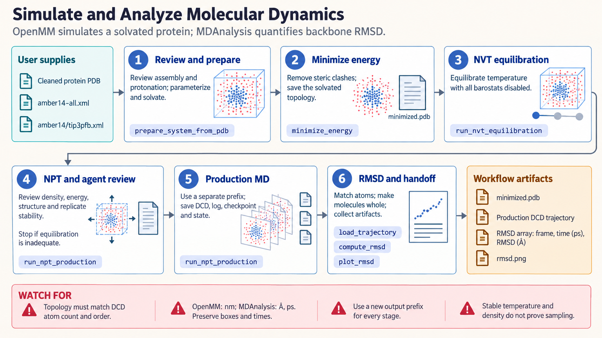

[All skill guides](README.md) / Molecular Dynamics

# Molecular Dynamics

**Simulate molecular motion and analyze trajectories with explicit physical and sampling assumptions.**

This skill combines OpenMM for molecular simulation with MDAnalysis for trajectory analysis. It helps a research assistant prepare a molecular system, minimize energy, equilibrate under chosen conditions, run production dynamics, and examine structural observables such as RMSD, residue fluctuations, and contacts.

It is useful in structural biology and biophysics when a researcher wants to explore the behavior of a defined model over time. The interpretation depends on system preparation, force fields, simulation stability, and whether the relevant behavior has been adequately sampled.

*From prepared molecular structures and force fields to staged dynamics, saved trajectories, structural analysis, and sampling review.
[View the full-size workflow diagram](../images/molecular-dynamics.png).*

## Questions this skill can help you explore

- **How does the modeled structure fluctuate?** Examine aligned deviations and per-residue mobility.
- **Which interactions persist or change?** Track contacts with appropriate periodic-boundary handling.
- **Is the simulation adequate for the question?** Assess equilibration, independent sampling, replicas, and uncertainty rather than duration alone.

## What you bring

Provide the structure and biological assembly, relevant ligands, cofactors, protonation assumptions, and the intended physical conditions. Specify the scientific question, available compute, and any established force-field choices. For existing trajectories, supply the matching topology and atom order, frame timing, box information, and the selections to analyze.

## How it works

1. **Prepare and parameterize the system.** Review missing atoms, termini, protonation, stereochemistry, ligands, and compatible protein/water/ion parameters.
2. **Minimize and equilibrate.** Check energies and structural behavior through staged temperature and pressure equilibration.
3. **Run and record production.** Save trajectories, state information, seeds, platform details, and sufficient metadata for restart and analysis.
4. **Analyze appropriate observables.** Use matching topology, correct timestamps, alignment where needed, and periodic distances based on each frame’s box.
5. **Assess sampling and report.** Review burn-in, autocorrelation, effective samples, replica agreement, and uncertainty before interpreting differences.

## What you get

| Output | What it helps you do |
| --- | --- |
| Prepared and parameterized system | Make the modeled chemistry and physical assumptions explicit. |
| Trajectory and simulation records | Retain positions, timing, conditions, and restart information. |
| RMSD, RMSF, or contact summaries | Describe selected structural behavior over the simulated interval. |
| Sampling and provenance report | Explain convergence limits and reproduce the setup. |

## Example request

> Use the molecular dynamics skill to plan and analyze simulations of our supplied protein structures under the same conditions. Review preparation and force-field compatibility, retain exact topology and simulation metadata, and compare RMSD, residue fluctuations, and selected contacts across independent replicas. Report sampling uncertainty and avoid treating a short stable trajectory as converged behavior.

*This is an illustrative research request, not a reported result.*

## Interpreting the results

**A stable trajectory is not proof of adequate conformational sampling.** Short, well-behaved temperature or density traces do not establish equilibrium for slow structural changes. A trajectory alone does not determine binding free energy or ligand residence time.

Force-field and solvent choices affect the modeled ensemble. Arbitrary ligands need appropriate parameters; a protein force field does not supply them automatically. Alignment, periodic wrapping, and atom selection can change calculated observables, so record these choices and validate restart behavior on the actual platform.

## Get started

The local workflow requires Python 3.11+, OpenMM, MDAnalysis, and matplotlib for plots. Optional PDBFixer and OpenFF routes require separate setup. Installation needs network access, while simulation and analysis can run offline. GPU support depends on the installed platform and hardware; the source skill does not establish GPU performance or scientific convergence.

[Setup and technical instructions](../../skills/molecular-dynamics/SKILL.md)
