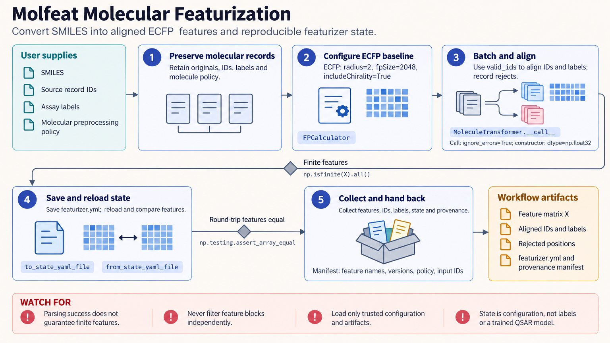

[All skill guides](README.md) / Molfeat

# Molfeat

**Turn small-molecule structures into reproducible features for similarity analysis and molecular machine learning.**

Molfeat generates numerical representations of molecules, including fingerprints, descriptors, pharmacophores, and selected pretrained embeddings. This skill helps a research assistant choose and record a representation while preserving the relationship between every molecular record and its associated label.

It is useful for QSAR/QSPR, similarity searches, and representation comparisons. The workflow emphasizes an explicit baseline and a consistent split, so a more complex representation can be assessed against the actual prediction problem.

*From identified molecular structures to validated feature matrices, preserved label alignment, saved featurizer configuration, and fair representation comparisons.
[View the full-size workflow diagram](../images/molfeat.png).*

## Questions this skill can help you explore

- **Which molecular representation suits my task?** Compare interpretable fingerprints or descriptors with supported embeddings.
- **Are features still aligned to the correct compounds?** Track rejected inputs and maintain stable record identifiers.
- **Does a representation generalize beyond close analogues?** Use a split appropriate to chemical series, time, or the scientific use case.

## What you bring

Provide SMILES or RDKit molecules with stable identifiers, any assay labels, and the endpoint definition. State the molecular preprocessing policy for salts, charges, stereochemistry, tautomers, and duplicates. Include the intended train/test separation and whether large pretrained model downloads, extra dependencies, or remote model stores are appropriate.

## How it works

1. **Preserve molecular identity.** Retain originals, identifiers, labels, and the declared standardization policy.
2. **Establish a baseline.** Start with an explicitly configured fingerprint representation before adding complexity.
3. **Generate and inspect features.** Record failed positions, align associated arrays, and check descriptor values for missing or non-finite entries.
4. **Evaluate without leakage.** Fit imputation, scaling, feature selection, and models only within training folds and compare representations on the same split.
5. **Save reproducible state.** Retain feature order, featurizer configuration, package versions, preprocessing policy, and input identities.

## What you get

| Output | What it helps you do |
| --- | --- |
| Molecular feature matrix | Supply numeric inputs to similarity or predictive analyses. |
| Record alignment and rejection information | Prevent labels from drifting after failed featurization. |
| Saved featurizer configuration | Regenerate the same representation for new molecules. |
| Representation comparison inputs | Support a controlled comparison on a common assay and split. |

## Example request

> Use the Molfeat skill to prepare features for our compound activity dataset. Preserve compound IDs and the supplied standardization policy, build an explicit ECFP baseline, and compare a selected descriptor representation on the same scaffold split. Report failed structures and non-finite features, and save the feature order and configuration for later prediction.

*This is an illustrative research request, not a reported result.*

## Interpreting the results

**A feature vector does not validate a predictive model.** Random splits may share close analogues or repeated measurements across train and test sets, inflating apparent generalization. Feature preprocessing outside the training fold can also leak information.

Chemical standardization changes identity and must be consistent between training and prediction. A saved featurizer state does not include assay labels, all preprocessing decisions, or a trained model. Historical model-store descriptions can name adapters absent from the documented release.

## Get started

The documented workflow uses Python 3.11+ and Molfeat with RDKit, datamol, and PyTorch; macOS Intel has narrower platform constraints. Core fingerprints run offline. Pretrained models and optional representations need selected extras, possible network downloads, sufficient storage, and review of model licensing and device requirements.

[Setup and technical instructions](../../skills/molfeat/SKILL.md)
