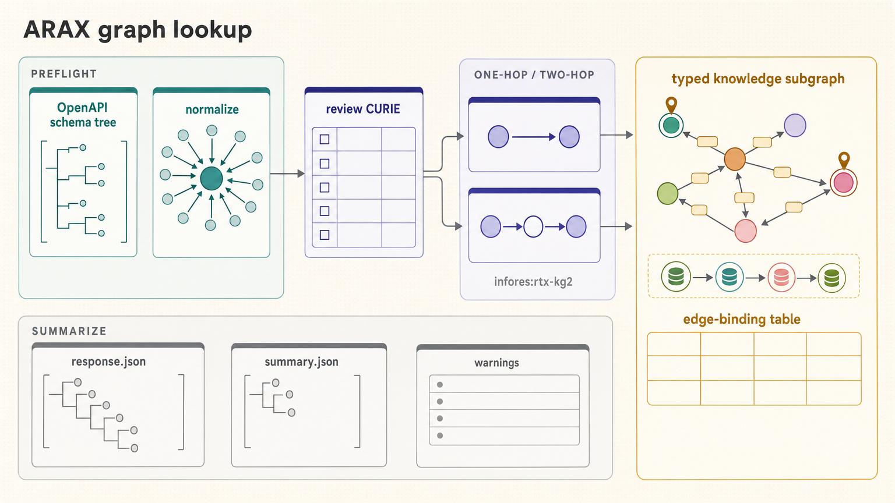

[All skill guides](README.md) / NCATS ARAX

# NCATS ARAX

**Look up bounded biomedical graph relationships while preserving their source evidence.**

ARAX provides access to biomedical knowledge-graph relationships through NCATS Translator. This skill restricts queries to a typed one-step relationship or a two-step path with both endpoints specified, making the returned relationships easier to inspect and document.

It helps a research assistant retrieve candidate connections among public biomedical entities, review identifiers and relationship qualifiers, and follow the evidence back to primary sources. It is a lookup workflow, rather than an open-ended inference or ranking system.

*From reviewed public entity identifiers and typed graph constraints to bounded relationship results, exact responses, and provenance review.
[View the full-size workflow diagram](../images/ncats-arax.png).*

## Questions this skill can help you explore

- **What relationships are returned for this public entity?** Query a defined entity category and predicate.
- **What connects these two named endpoints?** Inspect a constrained two-step path with explicit intermediate types.
- **Where did the relationship come from?** Examine edge bindings, source records, publications, and aggregator provenance.

## What you bring

Provide a public, non-sensitive research question, candidate entity identifiers, and the relationship types of interest. State the allowed intermediate category for a two-step query and review any normalization of free-text names. Do not submit patient details, confidential research questions, unpublished target programs, or proprietary compound information to this service.

## How it works

1. **Normalize separately.** Resolve entity names and review the proposed identifiers and biological categories before querying.
2. **Define the bounded graph.** Choose a typed one-step query or an endpoint-pinned two-step query with explicit constraints.
3. **Select the provider scope.** Use the documented default lookup or an explicitly chosen limited provider set.
4. **Save and inspect the response.** Retain the exact exchange and examine the relationships bound to the requested query edges, including warnings and qualifiers.
5. **Verify important candidates.** Trace primary evidence through aggregators and consult the cited literature or authoritative databases separately.

## What you get

| Output | What it helps you do |
| --- | --- |
| Exact request and response files | Preserve the query and returned graph exchange. |
| Bounded relationship summary | Inspect the paths that actually satisfy the query bindings. |
| Source and publication metadata | Locate evidence behind candidate relationships. |
| Warnings and partial-result record | Distinguish missing information or provider failures from a true empty response. |

## Example request

> Use the NCATS ARAX skill to inspect a public, already published gene–disease relationship. Review the supplied entity identifiers, run a narrowly typed lookup, and preserve the exact request and response. Summarize only the bound relationships, include qualifiers and primary-source provenance, and identify any candidate edges that require literature verification.

*This is an illustrative research request, not a reported result.*

## Interpreting the results

**A returned path is not a validated mechanism.** Position in the response is unscored order, not rank or confidence. Multiple providers may redistribute the same underlying record, so provider count is not independent corroboration.

No result means only that nothing was returned under the chosen constraints. Missing publication metadata does not show that no publications exist. Queries and caller metadata may be publicly visible, including when storage is disabled; use only public, non-sensitive research content.

## Get started

The bundled client uses Python 3.10+ and the standard library. It requires outbound HTTPS access to the ARAX production service and no API key. The supported query shapes deliberately exclude open-ended pathfinding, ranking, inference, and clinical guidance. Saved responses can be inspected locally without another query.

[Setup and technical instructions](../../skills/ncats-arax/SKILL.md)
