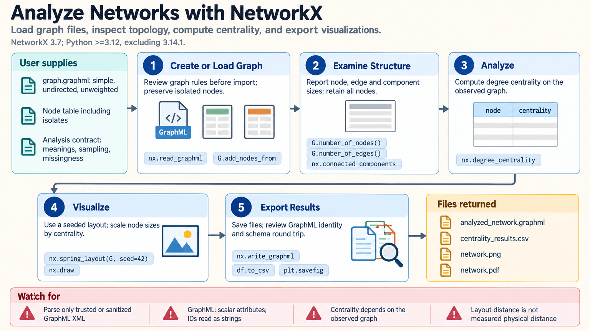

[All skill guides](README.md) / NetworkX

# NetworkX

**Represent scientific relationships as a graph and analyze its structure with explicit assumptions.**

NetworkX creates and analyzes networks in Python. This skill helps a research assistant turn an edge list or adjacency matrix into a well-defined graph, calculate structural measures, explore communities or paths, and export a network for review.

Applications include biological interactions, citation networks, transport systems, and relationships among experimental entities. The central step is deciding what nodes, edges, direction, and weights mean, because those choices determine the interpretation of every algorithm.

*From defined entities and relationships to a checked graph, structural analysis, reproducible visualization, and exported network data.
[View the full-size workflow diagram](../images/networkx.png).*

## Questions this skill can help you explore

- **Which entities occupy important structural positions?** Calculate centrality measures appropriate to the graph and question.
- **How is the network organized?** Examine components, clustering, and candidate communities.
- **Which routes or relationships connect entities?** Analyze paths using a scientifically justified distance or cost model.

## What you bring

Provide node and edge tables or another supported graph format, with identifiers and attribute meanings. State whether relationships are directed, whether repeated observations should be retained or aggregated, and what each weight measures. Describe sampling coverage, missing edges, self-loops, and the scientific comparison or hypothesis to be explored.

## How it works

1. **Define the graph contract.** Choose a directed, undirected, or multigraph representation and document the meaning of observations.
2. **Construct and inspect.** Check identifiers, repeated edges, attributes, component sizes, and missingness before selecting a subset.
3. **Choose valid algorithms.** Match graph type, weight interpretation, and numerical assumptions to the requested measure.
4. **Explore robustness.** Examine seed or resolution sensitivity and compare with a domain-appropriate null model when making structural claims.
5. **Visualize and export.** Save labeled figures, analysis tables, graph data, and the settings needed to reproduce them.

## What you get

| Output | What it helps you do |
| --- | --- |
| Structured graph object or file | Retain relationships and attributes in a reusable form. |
| Network-measure tables | Compare centrality, paths, clustering, or other chosen properties. |
| Community and component summaries | Explore the network’s organization. |
| Reproducible network visualizations | Communicate structure without relying on an unexplained layout. |

## Example request

> Use the NetworkX skill to analyze our curated protein-interaction edge list. Document what repeated interactions and weights mean, report connected-component sizes, and compare appropriate centrality measures. Explore community sensitivity to settings, retain the full graph and node annotations, and explain which conclusions depend on incomplete interaction coverage.

*This is an illustrative research request, not a reported result.*

## Interpreting the results

**Network measures describe the observed graph, not intrinsic biological importance.** Centrality changes with sampling and edge definitions. A community partition optimizes an objective and is not itself a significance test.

For weighted shortest paths, larger weights usually mean greater cost or distance; raw similarity or interaction strength cannot be substituted without a justified transformation. Collapsing parallel edges can change degree sequences, and a visually convincing layout is not evidence of a causal or mechanistic relationship.

## Get started

The documented release requires Python 3.12+ with a specific excluded interpreter patch and NetworkX; consult the source setup for the exact constraint. NumPy, SciPy, pandas, and Matplotlib support selected workflows. Local analysis needs no credentials. Large graphs must fit memory unless a separately reviewed backend or alternative approach is used.

[Setup and technical instructions](../../skills/networkx/SKILL.md)
