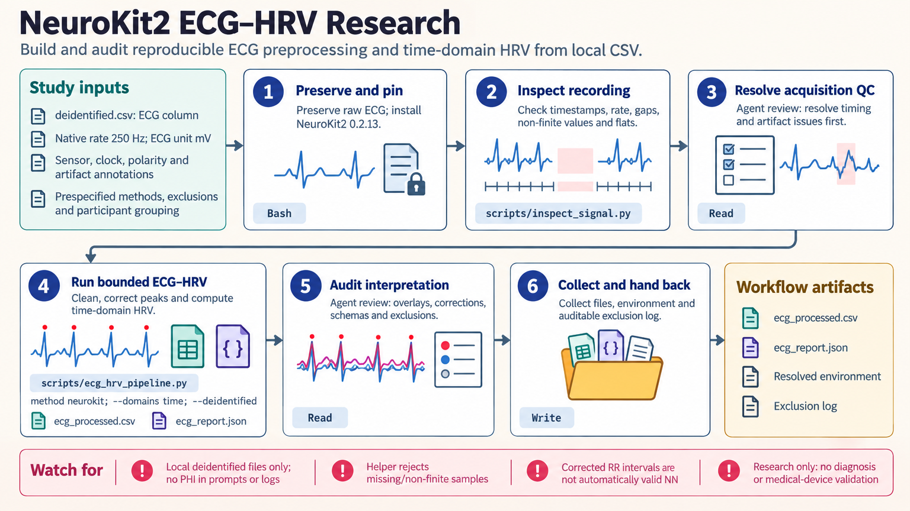

[All skill guides](README.md) / NeuroKit2

# NeuroKit2

**Process physiological signals with an explicit time base, documented methods, and inspectable quality checks.**

NeuroKit2 supports research analysis of physiological time series such as ECG, electrodermal activity, respiration, and related signals. This skill helps a research assistant inspect acquisition metadata, choose modality-specific preprocessing, derive features, and align events or multiple streams.

It focuses on reproducibility and method-aware interpretation. A detected peak or calculated variability measure is useful only when the signal quality, sampling, processing choices, and recording duration support the intended research question.

*From physiological recordings and acquisition metadata to checked time bases, explicit preprocessing, reviewed events or peaks, and research features.
[View the full-size workflow diagram](../images/neurokit2.png).*

## Questions this skill can help you explore

- **Are the recordings suitable for analysis?** Inspect units, timing, gaps, clipping, flat regions, and artifact masks.
- **Which features can this recording support?** Match heart-rate variability, response, or complexity measures to duration and method.
- **Are multiple signals and events correctly aligned?** Check sample grids, clock drift, and event mapping before combining modalities.

## What you bring

Provide deidentified signals with channel definitions, physical units, native sampling rates, timestamps, and event annotations. Describe acquisition hardware, sensor placement, protocol, population, known artifacts, and planned exclusions. State the desired features and analysis windows. Preserve raw data and identify any preprocessing or peak correction already applied.

## How it works

1. **Inspect raw data and time.** Resolve non-monotonic timestamps, gaps, inconsistent rates, units, and polarity before filtering.
2. **Apply declared preprocessing.** Clean each modality at its native rate with a documented order and retain artifact and exclusion masks.
3. **Detect and review features.** Inspect peaks, onsets, or decomposed components against raw traces and log any corrections.
4. **Align and epoch carefully.** Verify common timing and map event timestamps to the chosen grid before baseline or interval analysis.
5. **Report methods and limits.** Save feature tables, observed output schemas, processing settings, quality findings, and recording-duration constraints.

## What you get

| Output | What it helps you do |
| --- | --- |
| Signal-quality inspection | Identify problems affecting later processing. |
| Processed signals and event/peak information | Review the basis for calculated features. |
| Variability or response tables | Support protocol-appropriate physiological comparisons. |
| Alignment and epoch plan | Make timing, boundaries, and baseline choices explicit. |

## Example request

> Use the NeuroKit2 skill to analyze our deidentified ECG and respiration recordings from a controlled task. Check timestamps, units, gaps, and alignment first. Document the ECG cleaning and peak-correction methods, inspect detected beats against the raw signal, and calculate only variability measures supported by the recording duration. Preserve exclusions and event-window definitions.

*This is an illustrative research request, not a reported result.*

## Interpreting the results

**Research features are not diagnoses or device validation.** The validity of a physiological construct depends on the sensor, protocol, population, and method. Synthetic software checks do not establish that validity.

PPG pulse-rate variability is not interchangeable with ECG-derived HRV, and LF/HF is not a direct measure of sympathovagal balance. Multimodal convenience functions do not automatically synchronize clocks or correct drift. Complexity estimates are sensitive to length, stationarity, and parameters and need prespecified sensitivity checks.

## Get started

The documented workflow uses Python 3.10+, uv, and the pinned NeuroKit2 release with its core scientific dependencies, including pandas below version 3. Optional modalities and methods need separately selected packages. The bundled real-data helpers work on local deidentified files; optional data or template downloads require deliberate network access.

[Setup and technical instructions](../../skills/neurokit2/SKILL.md)
