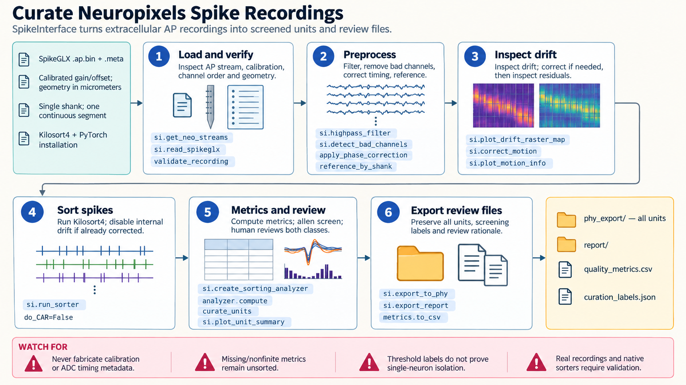

[All skill guides](README.md) / Neuropixels Analysis

# Neuropixels Analysis

**Turn extracellular recordings into reviewed spike-sorted units with preserved acquisition and curation evidence.**

This skill guides Neuropixels analysis with SpikeInterface, from loading recordings through preprocessing, motion assessment, spike sorting, quality metrics, and unit curation. It helps a research assistant keep probe geometry, channel calibration, timing, and sample boundaries connected to the resulting spike trains.

It supports common acquisition formats and multiple sorting approaches. Automated thresholds, optional models, and visual review provide complementary evidence, while uncertain units remain available for researcher judgment.

*From calibrated Neuropixels recordings to preprocessing, motion review, spike sorting, unit metrics, curation, and export.
[View the full-size workflow diagram](../images/neuropixels-analysis.png).*

## Questions this skill can help you explore

- **Are the recordings correctly interpreted?** Verify stream selection, channel order, probe geometry, calibration, and timing metadata.
- **Which units are suitable for the planned analysis?** Review signal quality, refractory-period violations, presence, and other metrics.
- **Could drift or curation choices change the result?** Inspect motion estimates and retain uncertain cases for review.

## What you bring

Provide the complete SpikeGLX, Open Ephys, or NWB recording and acquisition metadata, including probe information and segment boundaries. State the brain region, experimental context, desired sorter, compute availability, and downstream analysis needs. Include any manual annotations, previous preprocessing, or known motion and channel-quality issues.

## How it works

1. **Inspect the recording contract.** Validate the intended signal stream, calibration, channels, probe geometry, and acquisition timing.
2. **Preprocess and assess motion.** Review bad channels, filtering, referencing, timing correction, and any requested drift correction.
3. **Sort spikes.** Run a compatible sorter with recorded versions and settings while preserving logs and source identities.
4. **Compute and inspect unit quality.** Generate waveforms and metrics, apply justified criteria, and review borderline or conflicting evidence.
5. **Curate and export.** Retain labels and unit-ID mappings, save the selected units, and verify metadata in downstream exports.

## What you get

| Output | What it helps you do |
| --- | --- |
| Preprocessing and motion outputs | Inspect the signal preparation and drift evidence. |
| Spike sorting and unit metrics | Review candidate units and their quality characteristics. |
| Curation labels and summary plots | Document why units were retained, rejected, or left uncertain. |
| Phy or optional NWB handoff | Support further review and downstream analysis with stable identities. |

## Example request

> Use the Neuropixels analysis skill to process our supplied recording and metadata. Verify the AP stream, probe geometry, calibration, and timing, inspect motion before sorting, and compute unit-quality metrics. Keep uncertain units for visual review and export curation labels with stable unit IDs. Separate synthetic pipeline checks from validation on this acquisition.

*This is an illustrative research request, not a reported result.*

## Interpreting the results

**An automated curation label is a starting point for review.** Metric thresholds depend on the experiment, and a model trained on other brain regions or datasets may not transfer. Optional AI plot review provides advisory observations rather than a verdict on unit identity.

A spread of unit depths is not a temporal drift estimate. Real acquisition formats, native sorters, GPU behavior, and pretrained models require checks beyond the source skill’s synthetic tests. Preserve mappings when exporting and importing unit IDs, especially nonnumeric identifiers.

## Get started

The core workflow requires Python 3.10+, SpikeInterface, ProbeInterface, Neo, and its scientific dependencies. Sorters, GPUs, model downloads, and NWB conversion have separate requirements. Local review needs no service credentials; optional direct model-assisted curation can require an API key and approved network access.

[Setup and technical instructions](../../skills/neuropixels-analysis/SKILL.md)
