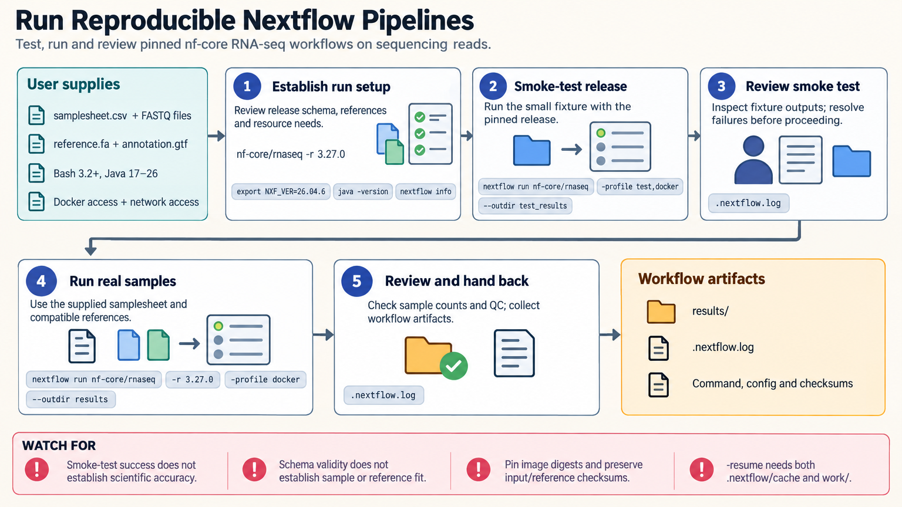

[All skill guides](README.md) / Nextflow

# Nextflow

**Run or develop a scientific pipeline whose data flow, software environment, and execution settings are explicit.**

Nextflow connects analysis steps through data dependencies and can execute them on local machines, clusters, or cloud infrastructure. This skill helps a research assistant run existing nf-core pipelines, develop modular DSL2 workflows, configure resources, and diagnose failed or resumed runs.

It is useful when a study involves many samples and tools that need consistent execution. The workflow keeps sample metadata, pinned software, parameters, and reports together so computational reproducibility can be reviewed independently of scientific validity.

*From versioned inputs and pipeline configuration to connected tasks, an appropriate executor, run reports, and checked scientific outputs.
[View the full-size workflow diagram](../images/nextflow.png).*

## Questions this skill can help you explore

- **Can the same analysis run consistently across samples?** Preserve sample identity through processes and channels.
- **How can the pipeline use the available infrastructure?** Select compatible containers, resource settings, and a local, HPC, or cloud executor.
- **What failed, and can work be resumed appropriately?** Inspect task evidence and understand the conditions under which cached work is reused.

## What you bring

Provide the pipeline and release, input files or samplesheet, compatible reference data, and intended execution environment. State available resources, expected outputs, and container or environment constraints. For development, describe each step’s input/output contract. For debugging, provide the relevant configuration, logs, task details, and what changed since the earlier run.

## How it works

1. **Check versions and input contracts.** Confirm engine compatibility, pipeline release, samplesheet structure, references, and sample identities.
2. **Configure execution.** Select the executor, environment profile, resources, parameters, and output locations.
3. **Test a small case.** Exercise the selected release or changed module using representative fixtures and defined expectations.
4. **Run and diagnose.** Inspect task-level failures, logs, and channels; resume only with a clear understanding of cache and input identity.
5. **Review scientific outputs.** Check sample counts, paired files, expected artifacts, and result plausibility while retaining run reports and provenance.

## What you get

| Output | What it helps you do |
| --- | --- |
| Pipeline or deployment configuration | Describe how the workflow runs on the intended infrastructure. |
| Validated parameters and samplesheet | Make inputs and study identifiers reviewable. |
| Run reports and task evidence | Understand execution, resource use, and failures. |
| Versioned scientific outputs | Hand off analysis artifacts with reproducibility metadata. |

## Example request

> Use the Nextflow skill to run our selected nf-core pipeline release on the institute’s cluster. Check the samplesheet and reference compatibility, configure the supported container and scheduler profiles, and start with the small test case. For the full run, preserve versions and parameters and verify sample counts and expected reports before declaring it complete.

*This is an illustrative research request, not a reported result.*

## Interpreting the results

**Resume is a computational cache, not scientific validation.** A successfully reused task or passing smoke test establishes only the behavior of that configuration and input. The analysis still needs checks of sample identity, reference compatibility, and expected biological outputs.

Portability depends on the environment, storage, and executor being configured correctly. Pin container images or dependencies, reference checksums, and pipeline revisions. A language example without scientific software environments is a useful plumbing test, not a reproducible biological pipeline.

## Get started

The documented setup requires Bash 3.2+, Java 17–26, and Nextflow; nf-core tools needs Python 3.10+. Containers, cluster access, network access, and cloud credentials depend on the selected workflow. Consult the skill’s release-specific guidance before combining examples or enabling preview language features.

[Setup and technical instructions](../../skills/nextflow/SKILL.md)
