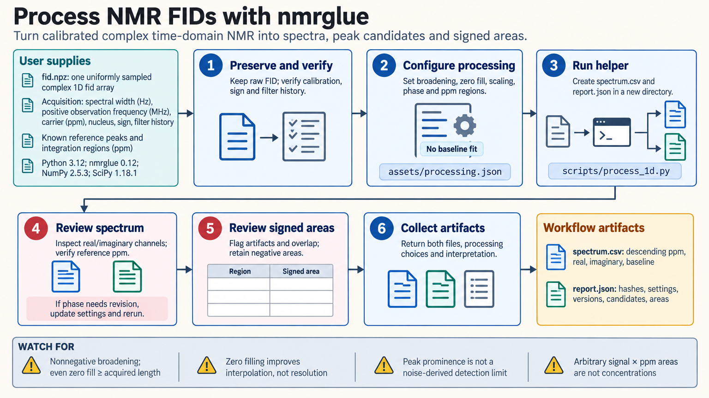

[All skill guides](README.md) / nmrglue: Calibrated 1D NMR

# nmrglue: Calibrated 1D NMR

**Process a one-dimensional NMR free-induction decay into a calibrated spectrum with documented integration choices.**

This skill uses nmrglue to process uniformly sampled complex one-dimensional NMR free-induction decays. It covers line broadening, zero filling, Fourier transformation, manual phasing, optional baseline correction, peak candidates, and signed integration regions.

Its main value is preserving the acquisition and processing conventions that determine the ppm axis and signal shape. It supports reproducible spectral processing, while compound identification, resonance assignment, and concentration determination require additional evidence and methods.

*Process NMR signals into reviewable spectra and integrals while preserving acquisition and processing choices. [View the full-size workflow diagram](../images/nmrglue.png).*

## Questions this skill can help you explore

- **Is the spectrum oriented and calibrated correctly?** Verify the frequency convention and known reference positions.
- **How do processing choices affect peaks and areas?** Inspect broadening, phase, baseline, and integration boundaries.
- **Can another researcher reproduce the spectrum?** Retain raw data, exact settings, and file identities.

## What you bring

Provide a complex FID in the supported NumPy archive or canonical one-dimensional complex time-domain NMRPipe format. Include spectral width, observation frequency, carrier, nucleus, acquisition sign convention, and digital-filter history. Supply reference peaks, intended phase settings, signal-free baseline regions if needed, and explicit integration intervals. Preserve the original acquisition files.

## How it works

1. **Establish calibration.** Confirm acquisition units and frequency convention from metadata or a known reference rather than typical instrument defaults.
2. **Declare processing settings.** Choose broadening, zero-filled size, first-point scaling, and phase angles appropriate to the acquisition.
3. **Transform and inspect.** Produce the real and imaginary spectra, verify the ppm axis, and revise manual phase based on the observed lineshapes.
4. **Correct baseline selectively.** Use only justified signal-free regions and inspect broad or overlapping resonances for distortion.
5. **Integrate and report.** Retain signed areas, flag overlap and artifacts, and save the spectrum with processing and input provenance.

## What you get

| Output | What it helps you do |
| --- | --- |
| Calibrated spectrum table | Plot descending ppm with real, imaginary, and baseline information. |
| Positive peak candidates | Identify features for further review without assigning compounds. |
| Signed regional integrals | Compare specified areas while preserving diagnostic negative values. |
| Processing report | Reproduce settings, calibration, versions, and input identities. |

## Example request

> Use the nmrglue skill to process our calibrated one-dimensional FID. Verify the ppm axis against the supplied reference, inspect real and imaginary spectra after manual phasing, and apply baseline correction only in the regions I identify as signal-free. Return the spectrum, signed integrals for the stated intervals, and all processing settings without inferring concentrations.

*This is an illustrative research request, not a reported result.*

## Interpreting the results

**Processing cannot supply missing acquisition information.** Opening a converted vendor file does not validate the original decoding. Experimental vendor imports and multidimensional or nonuniformly sampled data lie outside the helper’s validated scope.

Zero filling improves interpolation rather than acquired resolution. Peak prominence is relative to the largest positive signal, not a noise-derived detection limit. Quantitative NMR additionally requires appropriate relaxation, pulse, receiver, reference-amount, and uncertainty information; arbitrary integrated areas are not molecule counts.

## Get started

The documented environment uses Python 3.12+, nmrglue, NumPy 2+, and SciPy. Installation needs network access; local processing needs no credentials. Review the acquisition and validation reference before importing other formats, and replace all synthetic configuration values with the actual acquisition parameters.

[Setup and technical instructions](../../skills/nmrglue/SKILL.md)
