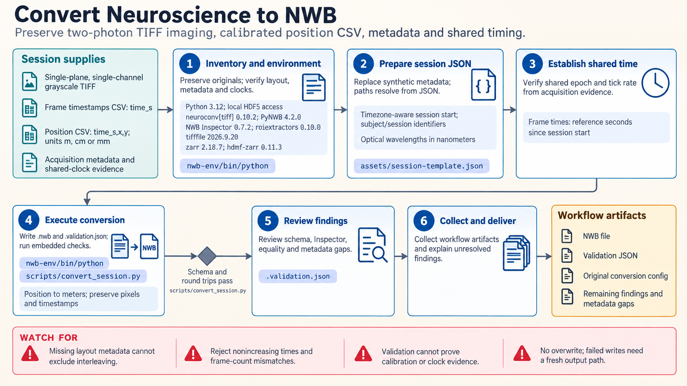

[All skill guides](README.md) / Validated NWB Conversion

# Validated NWB Conversion

**Combine supported imaging and behavioral data in an NWB file while preserving samples, metadata, and timing evidence.**

Neurodata Without Borders provides a common format for neuroscience data. This skill offers a deliberately bounded conversion workflow: planar, single-channel two-photon TIFF images with frame timestamps, plus calibrated behavioral position data in a CSV file.

It uses NeuroConv and PyNWB to build the file, then checks schema compliance, NWB Inspector findings, and the data read back from disk. This helps a research assistant distinguish a valid container from a scientifically faithful conversion.

*Build a neuroscience archive with explicit timing, metadata, schema validation, and checks against the original data. [View the full-size workflow diagram](../images/nwb-conversion.png).*

## Questions this skill can help you explore

- **Can these streams be represented together without changing the samples?** Preserve image pixels and behavior observations with explicit units.
- **Do the timestamps share a defensible time base?** Use a documented common clock or matched synchronization pulses.
- **Did the saved file retain the intended content?** Compare read-back values and metadata with the conversion inputs.

## What you bring

Provide single-plane, single-channel grayscale multipage TIFFs, corresponding frame timestamps, and timestamped position coordinates in meters, centimeters, or millimeters. Include subject and session metadata, a timezone-aware start time, optical settings, coordinate definitions, and acquisition evidence for every clock. Supply matched synchronization pulses if the position stream uses a different clock.

## How it works

1. **Inventory the acquisition.** Confirm the supported image layout, sample counts, metadata, units, and clock sources without filling gaps from example defaults.
2. **Establish synchronization evidence.** Validate a shared time base or fit the supported affine clock mapping within the synchronization-pulse range.
3. **Convert the session.** Preserve acquired image values and position samples while applying documented coordinate and time conversions.
4. **Run complementary checks.** Review schema validation, Inspector findings, and round-trip equality for data and key metadata.
5. **Deliver the complete record.** Save the NWB file, original conversion configuration, validation report, source identities, and unresolved issues together.

## What you get

| Output | What it helps you do |
| --- | --- |
| NWB session file | Store the supported imaging and position streams in a common format. |
| Validation JSON | Review schema, Inspector, and data-preservation findings. |
| Clock-mapping evidence | Explain the supported relationship between stream timestamps. |
| Conversion configuration and provenance | Repeat the conversion without relying on undocumented defaults. |

## Example request

> Use the NWB conversion skill for our single-plane two-photon TIFF sequence and calibrated position CSV. Check frame counts and timestamps, use the supplied synchronization pulse pairs to align behavior, and preserve all original samples. Deliver the NWB file, configuration, and validation report, clearly listing unresolved metadata and any Inspector findings.

*This is an illustrative research request, not a reported result.*

## Interpreting the results

**Schema validity does not establish scientific correctness.** Anatomical labels, calibration, pulse pairing, and acquisition descriptions still depend on reliable source evidence. Similar-looking neural and behavioral traces do not demonstrate synchronization.

The helper does not support arbitrary neuroscience formats, volumetric or multichannel TIFF, spike sorting, or pixel-to-world calibration. A single affine clock model cannot represent resets or nonlinear drift. The workflow does not upload or submit files to an archive.

## Get started

The tested local environment uses Python 3.12 with pinned NeuroConv, PyNWB, NWB Inspector, TIFF, and supporting packages. Retain the documented Zarr compatibility pins even for HDF5 output. Network access is needed for installation only; local conversion requires no service credentials.

[Setup and technical instructions](../../skills/nwb-conversion/SKILL.md)
