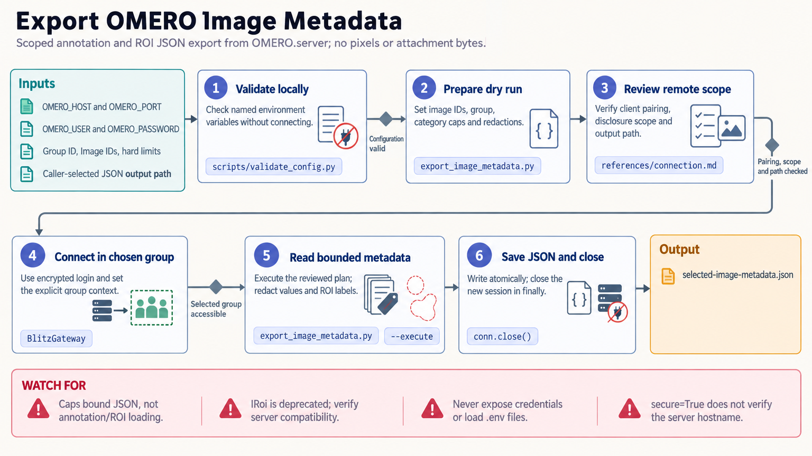

[All skill guides](README.md) / OMERO Integration

# OMERO Integration

**Inspect microscopy records and plan data transfers with a clearly bounded OMERO scope.**

OMERO organizes microscopy images, metadata, annotations, and regions of interest on a shared server. This skill helps a research assistant inspect selected objects, export descriptive metadata, and plan or review supported integration workflows through the appropriate OMERO interface.

Its bundled utilities emphasize explicit object IDs, group context, bounded read-only retrieval, and local planning. That makes it useful for preparing an analysis inventory or reproducible metadata handoff before deciding whether pixels or original files are needed.

*From an explicit server and object scope to validated connection settings, bounded metadata retrieval, transfer plans, and reviewed results.
[View the full-size workflow diagram](../images/omero-integration.png).*

## Questions this skill can help you explore

- **Which images and annotations belong to this project?** Inventory a defined set of server objects.
- **Can image metadata and regions be exported for review?** Retrieve selected annotation and ROI information with clear limits.
- **What would an import or export involve?** Prepare a local plan before moving image data.

## What you bring

Specify the authorized OMERO server, target project, dataset or image IDs, and intended group context. Describe the metadata needed and whether the task requires original files, pixels, ROIs, tables, or only an inventory. Use approved credentials or an existing session, and state output locations and any permitted write scope.

## How it works

1. **Validate the scope locally.** Check named endpoint and authentication settings and identify exactly which objects are relevant.
2. **Choose the interface.** Use the documented client, CLI, or web API appropriate to the operation and server configuration.
3. **Inspect selected records.** Execute bounded read-only inventory or explicit-image metadata export when authorized.
4. **Prepare transfers or changes.** Review destination, object identities, and expected effects using a local plan where available.
5. **Verify and document.** Check completeness and limits, retain relevant IDs and group context, and distinguish planned operations from completed server actions.

## What you get

| Output | What it helps you do |
| --- | --- |
| Scoped object inventory | Identify relevant microscopy records without a broad server crawl. |
| Annotation and ROI metadata JSON | Review selected image-associated information. |
| Import or export plan | Make file scope and destinations reviewable before transfer. |
| Operation summary | Record what was retrieved or changed and any unresolved access limits. |

## Example request

> Use the OMERO integration skill to inventory the explicitly named dataset on our server and export metadata for its selected images. Include relevant annotations and ROIs with documented limits. Prepare a separate plan for obtaining original files if needed, and distinguish metadata export from pixel or file download.

*This is an illustrative research request, not a reported result.*

## Interpreting the results

**An empty result can reflect access or group context.** It is not proof that an object is absent from the server. Likewise, a saved metadata export is not a copy of the image pixels or original acquisition files.

The bundled transfer planner never invokes OMERO, and remote read helpers default to a dry run until explicitly executed. The source skill’s local client checks do not establish compatibility or permissions on a particular live server. Scientific interpretation of ROI statistics still depends on calibration and measurement context.

## Get started

The documented client setup uses Python 3.10–3.12, omero-py, and a compatible IcePy 3.6.5 build. Remote operations need network access to the selected server and account or session credentials. Local configuration and transfer planning require no connection. Keep server/client compatibility and secure connection details explicit.

[Setup and technical instructions](../../skills/omero-integration/SKILL.md)
