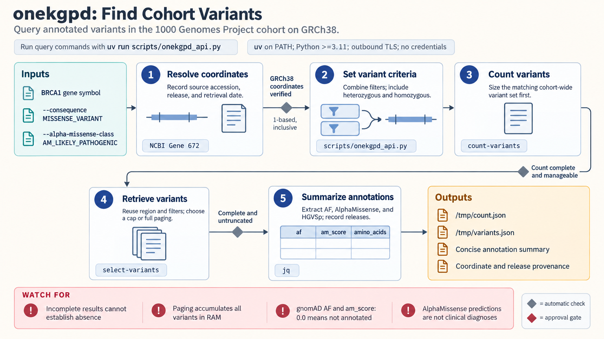

[All skill guides](README.md) / OneKGPd: 1000 Genomes Queries

# OneKGPd: 1000 Genomes Queries

**Explore variants and their carriers within a defined public 1000 Genomes cohort.**

OneKGPd queries the extended high-coverage 1000 Genomes dataset at the individual-participant level. This skill helps a research assistant find variants within a verified genomic region, identify cohort participants carrying selected variants, inspect homozygous-reference queries, or examine relatedness between named participants.

The service supplies variant annotations and allele-frequency information from defined resource snapshots. It is useful for cohort exploration when the distinction between variants, carriers, and population-level inference remains explicit.

*From verified GRCh38 coordinates and cohort constraints to counted queries, variant or carrier records, annotation provenance, and completeness checks.
[View the full-size workflow diagram](../images/onekgpd.png).*

## Questions this skill can help you explore

- **Which cohort participants carry variants meeting these criteria?** Select carriers with declared genotype and annotation filters.
- **Which variants occur in this region or participant subset?** Retrieve bounded results after counting the query.
- **Are chosen participants related?** Review pedigree metadata or pairwise relatedness when defining an analysis set.

## What you bring

Provide the public-cohort question, named sample subset if applicable, and precisely verified GRCh38 coordinates. Record the annotation source used to resolve a gene boundary and its retrieval date. State carrier state, allele-frequency or consequence filters, and the intended treatment of related individuals. The wrapper expects one-based inclusive positions, so convert other interval conventions explicitly.

## How it works

1. **Verify the genomic region.** Confirm assembly, coordinate convention, and the intended gene or feature before querying.
2. **Choose the query type.** Separate variant retrieval, carrier selection, homozygous-reference questions, and relatedness.
3. **Count before selecting.** Estimate result size and narrow the scope when needed.
4. **Retrieve and inspect.** Save full JSON, inspect completeness flags, and retain the exact filter and annotation-release context.
5. **Interpret within the cohort.** Account for participant relatedness, population labels, missing annotations, and limitations of callable reference genotypes.

## What you get

| Output | What it helps you do |
| --- | --- |
| Variant records | Inspect cohort variants with available consequence and frequency annotations. |
| Carrier counts or sample lists | Identify participants meeting the declared selection criteria. |
| Relatedness or offline sample metadata | Support a documented participant-selection policy. |
| Query provenance and completeness information | Repeat the lookup and recognize incomplete results. |

## Example request

> Use the OneKGPd skill to inspect variants in the verified GRCh38 interval I provide. Count results before retrieval, select variants using the stated frequency and consequence criteria, and identify the corresponding cohort carriers. Record annotation releases, check completeness, and explain how related participants affect interpretation of the carrier counts.

*This is an illustrative research request, not a reported result.*

## Interpreting the results

**Cohort allele frequency is not population prevalence.** The 3,202-participant cohort includes relatives, so carrier counts are not counts of independent observations. A predicted damaging annotation is not a clinical classification.

Incorrect assembly coordinates can return plausible results from the wrong location without an error. Missing external-frequency annotations do not establish absence from another resource. An absent variant record does not prove that every participant has a callable homozygous-reference genotype. Incomplete queries cannot support exhaustive claims.

## Get started

The documented wrapper uses Python 3.11+ and dnaerys, with outbound TLS access to the public gRPC service for variant and sample queries. No credentials are required. Bundled population and sample metadata commands run offline. Service annotation versions should be recorded for each analysis rather than assumed to match upstream releases.

[Setup and technical instructions](../../skills/onekgpd/SKILL.md)
