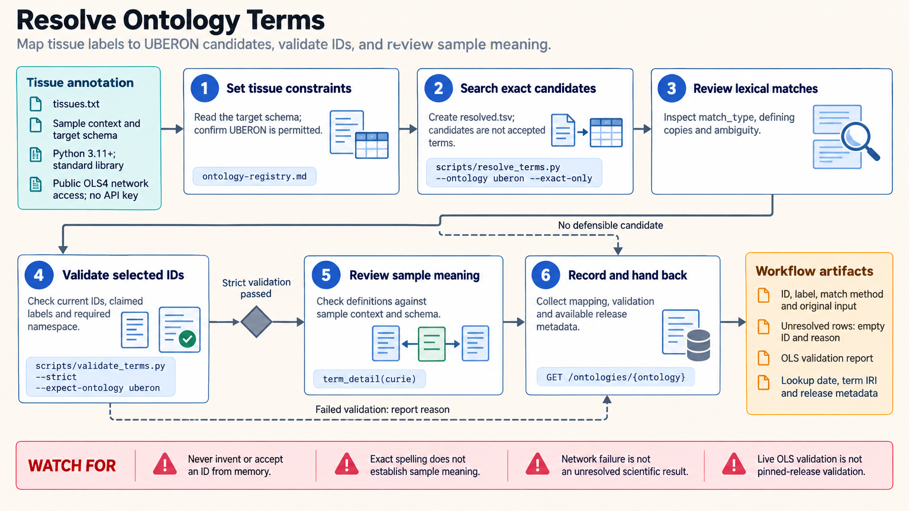

[All skill guides](README.md) / Ontology Term Resolution

# Ontology Term Resolution

**Replace ambiguous scientific labels with reviewed identifiers and retain unresolved meanings.**

Controlled vocabularies make metadata easier to compare and reuse, but a plausible-looking identifier can silently describe the wrong thing. This skill helps a research assistant resolve tissue, cell type, disease, phenotype, assay, chemical, and other labels to ontology terms and check existing identifiers.

It uses public services to search for candidates, inspect definitions and status, verify prefixes, and build appropriate landing-page links. The central task is matching the term’s meaning to the actual sample and the target metadata schema.

*From free-text labels or existing identifiers to candidate terms, definition and status checks, curated mappings, and unresolved records.
[View the full-size workflow diagram](../images/ontology-term-resolution.png).*

## Questions this skill can help you explore

- **Which term best matches this sample label?** Search the appropriate ontology and examine definitions and synonym scope.
- **Is an existing identifier valid for this column?** Check term status, defining ontology, and any required branch.
- **Which labels remain ambiguous?** Preserve unresolved terms rather than substituting the closest search hit.

## What you bring

Provide the metadata table with original labels, sample context, organism, and any existing identifiers. State the target archive or schema, permitted ontologies, and required ontology release if specified. Explain local shorthand and distinguish unknown, missing, and deliberately unspecified values; those states should not become biological annotations by guesswork.

## How it works

1. **Choose the vocabulary.** Match the column’s meaning and target schema to appropriate ontology sources and constraints.
2. **Generate candidates.** Search labels or use shorthand mapping without treating returned order or confidence labels as acceptance.
3. **Validate the selected term.** Retrieve detailed term information, check obsolescence and namespace, and compare the definition with the sample.
4. **Apply justified constraints.** Check required branches and relationship semantics, preserving alternatives or unresolved cases for curation.
5. **Report reviewable mappings.** Return original text, identifier, label, match type, source details, and the lookup date or pinned release.

## What you get

| Output | What it helps you do |
| --- | --- |
| Curated identifier-and-label table | Make annotations readable to humans and usable by software. |
| Validation findings | Identify obsolete, malformed, wrong-namespace, or out-of-scope terms. |
| Candidate and unresolved records | Preserve ambiguity for domain review. |
| Source and release information | Document the vocabulary basis of the annotation. |

## Example request

> Use the ontology term resolution skill to curate our tissue and cell-type metadata for the supplied submission schema. Preserve the original labels, propose terms from the allowed ontologies, validate every selected ID and definition, and flag obsolete or ambiguous entries. Keep unresolved shorthand visible and record the lookup date and ontology-version information where available.

*This is an illustrative research request, not a reported result.*

## Interpreting the results

**Lexical similarity is not semantic agreement.** A search result can match an exact label while still being inappropriate for the sample. Broad, narrow, or related synonyms need contextual review, and an identifier resolver can produce a landing page without establishing term validity.

A control-group label or missing disease field does not prove a sample is healthy. Live ontology checks reflect the lookup date, not necessarily an archive’s pinned ontology release. Use the required release and submission validator when those are specified.

## Get started

The bundled scripts require Python 3.11+ and only the standard library. They need network access to public OLS4, Bioregistry, Identifiers.org, or ZOOMA services and no API keys. Start with the target schema and original labels, then review candidate definitions before accepting mappings.

[Setup and technical instructions](../../skills/ontology-term-resolution/SKILL.md)
