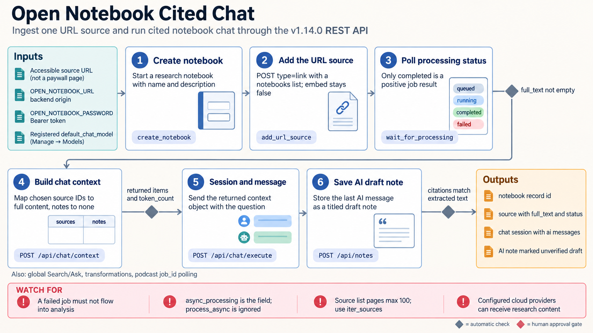

[All skill guides](README.md) / Open Notebook

# Open Notebook

**Organize research sources, notes, and source-grounded conversations in a self-hosted workspace.**

Open Notebook brings documents, notes, search, and model-assisted discussion into research notebooks. This skill helps a research assistant configure the application’s API workflow, ingest sources, verify processing, build explicit conversation context, and use selected transformation or podcast features.

It is useful for working across a collection of papers, protocols, transcripts, and other material. The workflow emphasizes checking extraction and retrieval before trusting an answer that appears to cite the notebook.

*From configured notebooks and ingested sources to checked extraction, explicit context, search or cited discussion, and saved research notes.
[View the full-size workflow diagram](../images/open-notebook.png).*

## Questions this skill can help you explore

- **Can I work across this collection of sources?** Organize documents and notes in a defined notebook.
- **Which material is actually available to the model?** Inspect ingestion status, extracted text, embeddings, and selected context.
- **Can a generated summary be checked against the sources?** Retain citations and separate generated drafts from verified findings.

## What you bring

Provide the running Open Notebook instance, notebook scope, source files or approved links, and intended use. State which model providers and data destinations are acceptable. Identify whether you need full-text search, vector retrieval, selected-source chat, or an output transformation, and preserve original documents for extraction checks.

## How it works

1. **Confirm the deployment and models.** Check the backend, worker, authentication, and required model capabilities.
2. **Ingest the sources.** Upload or link the intended material using the appropriate endpoint and wait for processing to finish.
3. **Verify content availability.** Inspect extracted text and, when vector retrieval is needed, confirm completed embeddings.
4. **Build explicit context.** Select the source and note content for the conversation rather than assuming notebook membership alone controls every search.
5. **Review and preserve outputs.** Verify citations and numerical claims, save useful notes, and label generated summaries or audio as drafts until reviewed.

## What you get

| Output | What it helps you do |
| --- | --- |
| Organized research notebook | Keep sources, notes, and conversations together. |
| Searchable or embedded sources | Support appropriate retrieval from successfully processed content. |
| Cited conversations and transformations | Draft source-linked explanations and summaries. |
| Optional podcast output | Produce an audio discussion from reviewed content and configured speaker profiles. |

## Example request

> Use the Open Notebook skill to organize the supplied open-access methods papers in a dedicated notebook. Check that each source was processed and that tables and equations were extracted adequately. Build a conversation using only the selected sources, summarize differences in study design with citations, and flag claims that the retrieved context cannot support.

*This is an illustrative research request, not a reported result.*

## Interpreting the results

**Self-hosted storage does not make all processing local.** Configured cloud models can receive notebook content. Provider capabilities, authentication, and data handling must match the intended workflow.

A successful source upload does not guarantee successful extraction or embeddings. Search scope can depend on the deployed version, and citations do not establish that an answer accurately represents the cited passage. Generated podcast or transformation content can add unsupported claims and needs review before sharing.

## Get started

The skill requires a running Open Notebook backend and processing worker; its documented deployment uses Docker Compose. Bundled helpers need Python 3.11+ and requests. Network access is needed to the instance and configured providers, with an instance password and provider credentials where applicable. The source skill’s mocked tests are separate from live deployment verification.

[Setup and technical instructions](../../skills/open-notebook/SKILL.md)
