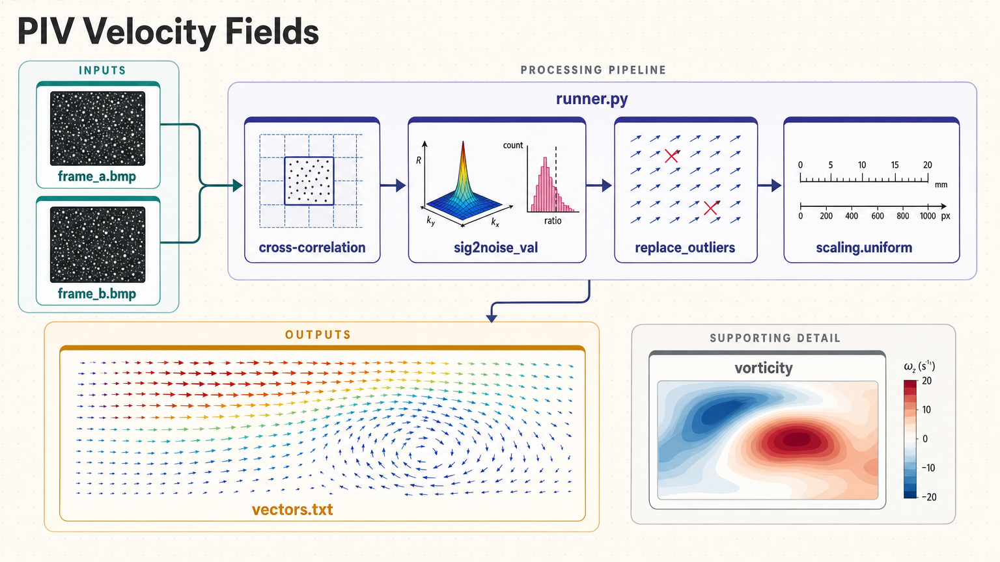

[All skill guides](README.md) / OpenPIV

# OpenPIV

**Measure two-dimensional flow velocities from particle images with explicit calibration and vector-quality checks.**

Particle image velocimetry estimates motion by comparing tracer-particle patterns in two images acquired a known time apart. This skill uses OpenPIV to guide preprocessing, cross-correlation, vector validation, physical scaling, and inspection of the resulting velocity field.

It can also support derived vorticity and strain-rate calculations when the spatial grid and units are correct. The emphasis is on preserving which vectors were measured, rejected, or repaired so later analysis does not treat all output as equally reliable.

*From calibrated image pairs to interrogation-window correlations, validated velocity vectors, physical scaling, and derived flow fields.
[View the full-size workflow diagram](../images/openpiv.png).*

## Questions this skill can help you explore

- **What flow pattern is resolved by these image pairs?** Estimate local displacements and convert them to velocities.
- **Which vectors are unreliable?** Inspect correlation quality, physical limits, local consistency, and masks.
- **How do processing choices affect derived quantities?** Review window size, grid spacing, replacement, and smoothing before calculating gradients.

## What you bring

Provide paired particle images, their time separation, and a spatial calibration in explicit units. Describe image orientation, masks, expected flow direction and displacement range, and acquisition quality. For temporal statistics, supply an appropriate time series rather than a single image pair. Preserve original images and document any preprocessing already performed.

## How it works

1. **Inspect and prepare images.** Review tracer visibility, background, masks, and image-pair correspondence.
2. **Choose interrogation parameters.** Select window, overlap, and search-area settings appropriate to displacement and desired spatial resolution.
3. **Estimate and validate vectors.** Examine correlation signal-to-noise and global or local criteria, including non-finite results.
4. **Scale and retain quality evidence.** Convert displacement with the correct timing and spatial calibration while preserving masks and rejection flags.
5. **Analyze and inspect.** Plot velocity fields and, where justified, calculate spatial derivatives or time-dependent statistics with explicit grid spacing.

## What you get

| Output | What it helps you do |
| --- | --- |
| Velocity vector table | Use positions, velocities, masks, and quality flags in follow-up analysis. |
| Saved processing parameters | Recreate timing, calibration, and interrogation settings. |
| Vector and component plots | Inspect flow structure and problematic regions. |
| Derived vorticity or strain fields | Explore spatial changes in velocity with correct physical units. |

## Example request

> Use the OpenPIV skill to analyze our paired flow images with the supplied spatial calibration and frame separation. Explain the window and validation choices, retain all masks and rejected-vector flags, and show measured versus repaired regions. Calculate vorticity using the saved physical grid spacing and report the limitations imposed by image quality and resolution.

*This is an illustrative research request, not a reported result.*

## Interpreting the results

**Repaired vectors are estimates, not additional measurements.** Replacement, zero filling, and smoothing can make a field look complete while altering gradients. Retain the underlying quality evidence and inspect both measured and processed fields.

Validation limits must match whether values are displacements or velocities. Incorrect scaling or axis conventions can reverse or rescale derivatives. Spatial variation within one frame is not temporal turbulence, and a two-component variance measure is not full turbulent kinetic energy.

## Get started

The documented workflow uses Python 3.10+ and OpenPIV with NumPy, SciPy, scikit-image, and Matplotlib. It runs locally without credentials or network after installation. The source skill’s tested path uses the SciPy backend; other acceleration options need their own runtime verification.

[Setup and technical instructions](../../skills/openpiv/SKILL.md)
