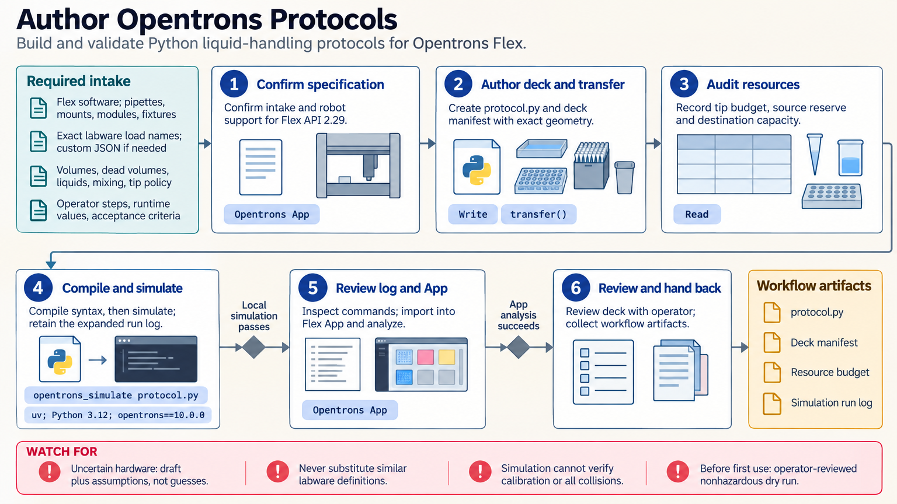

[All skill guides](README.md) / Opentrons Integration

# Opentrons Integration

**Translate a defined liquid-handling procedure into a robot-specific protocol with layered review.**

This skill helps a research assistant author, review, migrate, and simulate protocols for Opentrons Flex and OT-2 robots. It connects liquid transfers with actual pipettes, tips, deck positions, labware, modules, and runtime parameters.

The workflow is useful when a laboratory wants a reproducible robotic procedure or needs to troubleshoot a protocol. It treats software simulation, application analysis, physical setup, and assay performance as different layers of evidence.

*From a specified liquid-handling procedure and robot configuration to a protocol, simulation, deck review, and operator-led physical validation.
[View the full-size workflow diagram](../images/opentrons-integration.png).*

## Questions this skill can help you explore

- **Can the intended transfers be expressed on this robot?** Match volumes, labware, and module use to the hardware.
- **Are tips and source volumes sufficient?** Account for every branch, dead volume, and destination capacity.
- **What must be checked before execution?** Review the protocol, simulated commands, App analysis, and physical deck together.

## What you bring

Provide the robot model and software, pipettes and mounts, tips, modules, adapters, labware definitions, and deck layout. Describe liquid properties, transfer volumes, source locations, starting amounts, contamination controls, mixing, timing, and operator interventions. State acceptance criteria and any new geometry or custom labware requiring a cautious physical check.

## How it works

1. **Choose the robot and API level.** Use a compatible feature set for Flex or OT-2 and the matching local simulator.
2. **Define the physical setup.** Specify deck positions, labware, pipettes, modules, and required fixtures explicitly.
3. **Build the handling sequence.** Select appropriate transfer operations or lower-level steps and define tip policy and runtime bounds.
4. **Budget and simulate.** Review tips, liquid volumes, capacity, and command behavior, then analyze the protocol in the intended Opentrons App.
5. **Prepare operator validation.** Inspect the run preview and deck map and perform appropriate nonhazardous dry runs before a live assay.

## What you get

| Output | What it helps you do |
| --- | --- |
| Python Protocol API file | Describe the robot-specific liquid-handling procedure. |
| Deck and resource plan | Prepare labware, tips, liquids, and operator steps. |
| Simulation and App-analysis evidence | Find software and configuration problems before execution. |
| Physical validation checklist | Identify what the operator must establish on the actual robot. |

## Example request

> Use the Opentrons integration skill to draft a protocol for our specified robot, pipettes, and plate layout. Use the supplied liquid volumes and contamination policy, calculate tip and source requirements, and expose only justified runtime parameters. Simulate with the matching environment and prepare the deck map and operator checks for a nonhazardous trial.

*This is an illustrative research request, not a reported result.*

## Interpreting the results

**Simulation cannot validate physical liquid handling.** It does not establish calibration, viscosity effects, meniscus behavior, manufacturing tolerances, seal removal, or every possible collision. A template is also not a validated assay.

Flex and OT-2 have different API and hardware capabilities; the local package’s advertised maximum is not proof of robot support. Tip policies must match contamination requirements, and minimum reliable volume depends on the actual pipette and liquid. Physical execution remains an operator-controlled step.

## Get started

The skill uses Python 3.10+ and uv for local simulation, with separate documented package/API baselines for Flex and OT-2. Physical work needs compatible hardware, robot software, and the appropriate Opentrons App. Install only the environment matching the target robot and review version compatibility before migration.

[Setup and technical instructions](../../skills/opentrons-integration/SKILL.md)
