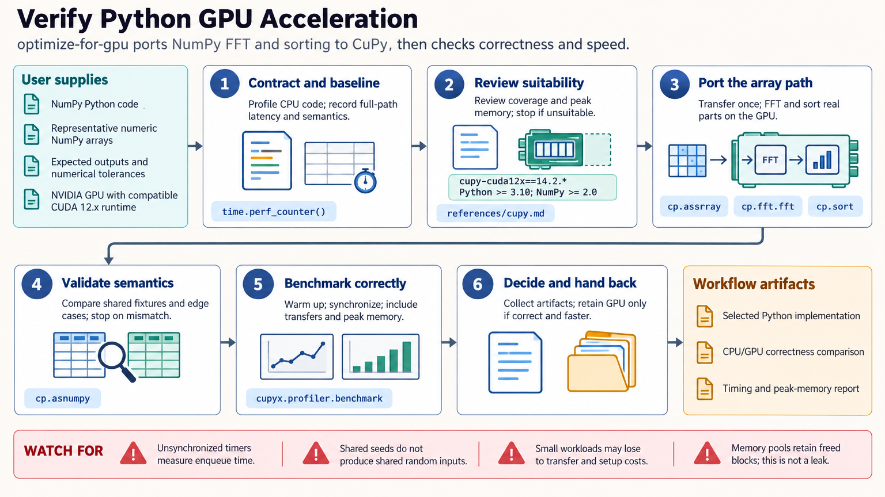

[All skill guides](README.md) / GPU Optimization for Scientific Python

# GPU Optimization for Scientific Python

**Determine whether GPU acceleration preserves your analysis and improves its real execution time.**

This skill helps a research assistant examine a slow scientific Python workload, identify a suitable NVIDIA GPU implementation, and compare it with the original computation. It covers array operations, tables, machine learning, graphs, imaging, vector search, and simulation through appropriate libraries.

The purpose is an evidence-based optimization: keep the scientific and numerical contract intact, measure representative workloads, and retain the GPU path only when it improves the metric that matters.

*From a measured CPU baseline to a suitable GPU implementation, numerical comparison, synchronized benchmarks, and a documented decision.
[View the full-size workflow diagram](../images/optimize-for-gpu.png).*

## Questions this skill can help you explore

- **Is this workload a good GPU candidate?** Identify parallel work, unsupported operations, transfer costs, and memory needs.
- **Does the accelerated result mean the same thing?** Compare algorithms, precision, missing-value behavior, ordering, and output types.
- **Is the entire workflow faster?** Include initialization, transfers, computation, and output in realistic measurements.

## What you bring

Provide the existing code, representative data shapes and sizes, expected outputs, and acceptable numerical tolerances. Describe the target GPU, driver and CUDA environment, available memory, and whether CPU portability is required. State the optimization goal: throughput, end-to-end latency, memory use, or another measurable constraint.

## How it works

1. **Define and measure the baseline.** Profile the real workflow and preserve a trusted reference result.
2. **Select the smallest suitable change.** Prefer a supported library or accelerator mode before custom kernels.
3. **Keep the data path coherent.** Reduce unnecessary host-device transfers and control temporary allocations and batching.
4. **Validate semantics.** Compare deterministic fixtures and representative data, including edge cases and any approximate algorithm’s accuracy.
5. **Benchmark and decide.** Warm up, synchronize correctly, record memory and timing, and retain or reject the port based on measured benefit.

## What you get

| Output | What it helps you do |
| --- | --- |
| Profile and bottleneck assessment | Identify where execution time is actually spent. |
| Candidate GPU implementation | Accelerate supported operations while preserving the intended computation. |
| Correctness comparison | Document tolerances, edge cases, and any algorithmic differences. |
| Timing and memory report | Assess practical benefit on the target hardware. |

## Example request

> Use the GPU optimization skill to evaluate our NumPy image-processing pipeline on the available NVIDIA GPU. Profile the current path, choose a supported implementation, and compare outputs using the stated tolerance. Benchmark end-to-end execution including transfers and record peak memory. Keep a CPU path if the GPU version does not give a useful improvement.

*This is an illustrative research request, not a reported result.*

## Interpreting the results

**Similar APIs do not guarantee equivalent behavior.** GPU libraries can differ in defaults, supported dtypes, random streams, ordering, and numerical precision. An approximate neighbor search must be evaluated for recall, not compared with an exact method as though only speed changed.

GPU operations are asynchronous, so an unsynchronized CPU timer can measure submission rather than completion. Small or transfer-heavy workloads may slow down. Memory retained by an allocator pool is not automatically a leak, but peak usage and headroom still matter.

## Get started

GPU execution requires compatible NVIDIA hardware and a matching CUDA software stack. The documented RAPIDS environment targets Linux or WSL2 with specific Python, NumPy, and CuPy constraints; other libraries have their own requirements. Installation needs network access. Source-reviewed examples must be validated on the actual GPU before claiming correctness or speedup.

[Setup and technical instructions](../../skills/optimize-for-gpu/SKILL.md)
