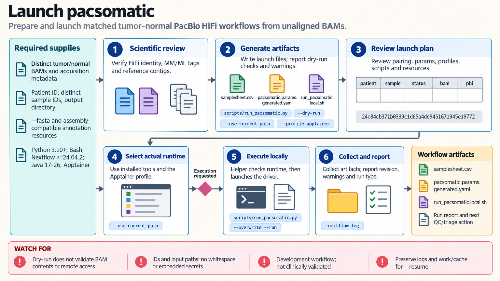

[All skill guides](README.md) / pacsomatic

# pacsomatic

**Prepare a reproducible matched tumor–normal PacBio HiFi workflow with explicit launch and input checks.**

This skill prepares and launches the nf-core/pacsomatic workflow for one matched tumor–normal pair using unaligned PacBio HiFi BAM inputs. It helps a research assistant create the samplesheet, parameters, and launch artifacts, select a reference, and distinguish local execution from submitting the Nextflow driver to a scheduler.

The bundled helper makes the computational setup reviewable. It does not determine whether the samples are correctly matched or whether the resulting variant analysis is clinically valid.

*From a documented HiFi tumor–normal pair and reference choice to launch artifacts, runtime checks, monitored execution, and output review.
[View the full-size workflow diagram](../images/pacsomatic.png).*

## Questions this skill can help you explore

- **Are the intended samples and reference clearly specified?** Keep patient and sample identities, input paths, and reference mode explicit.
- **Can the workflow be launched in this environment?** Prepare the correct runtime, profiles, container support, and scheduler settings.
- **What has actually completed?** Separate artifact preparation, scheduler submission, pipeline startup, and scientific output validation.

## What you bring

Provide distinct tumor and normal unaligned HiFi BAMs, patient and sample identifiers, output location, and either a FASTA reference or supported genome choice. Include acquisition metadata confirming platform and pairing, optional PacBio indexes, and information about retained modification tags if methylation is relevant. Identify the runtime, cluster profile, containers, and available resources.

## How it works

1. **Confirm biological and file assumptions.** Review platform, sample identity, reference compatibility, and relevant acquisition tags.
2. **Generate a dry-run package.** Create the samplesheet, parameter file, launch script, and configuration summary without invoking the pipeline.
3. **Review revision and resources.** Check the pinned source revision, workflow options, reference choice, and task configuration.
4. **Launch in the intended environment.** Use the selected local runtime or submit the Nextflow driver, keeping its resources distinct from per-task resources.
5. **Monitor and verify.** Inspect startup, task progress, terminal status, and expected output files while preserving work state for an appropriate resume.

## What you get

| Output | What it helps you do |
| --- | --- |
| Samplesheet and parameter files | Record the matched pair and managed workflow inputs. |
| Pinned launch script | Repeat the intended pipeline revision and execution options. |
| Local preparation checks | Identify malformed paths, identifiers, or incompatible launch choices. |
| Run and output evidence | Distinguish a submitted job from a completed usable analysis. |

## Example request

> Use the pacsomatic skill to prepare our matched HiFi tumor–normal pair for the institute’s Slurm environment. Generate a dry-run samplesheet and launch package using the supplied reference, review the pinned pipeline revision and task profile, and explain which BAM-content and sample-identity checks remain. After execution, distinguish scheduler submission from pipeline completion.

*This is an illustrative research request, not a reported result.*

## Interpreting the results

**A dry run is a preparation check, not a BAM or scientific validation.** It does not verify remote files, resolve every pipeline option, or establish biological suitability. A BAM filename cannot prove HiFi platform, matched identity, or methylation-tag content.

The source skill pins a development commit rather than claiming a released clinical assay. Submitting the Nextflow driver to a scheduler does not configure every pipeline task’s executor or resource limits. Full containerized performance needs verification on the actual dataset and cluster.

## Get started

The local helper needs Python 3.10+ and the standard library. Execution needs Bash, a compatible Nextflow/Java installation, the chosen container runtime, and optional scheduler access. Network is needed for uncached code, references, plugins, and containers. Remote paths use managed credentials rather than secrets embedded in generated files.

[Setup and technical instructions](../../skills/pacsomatic/SKILL.md)
