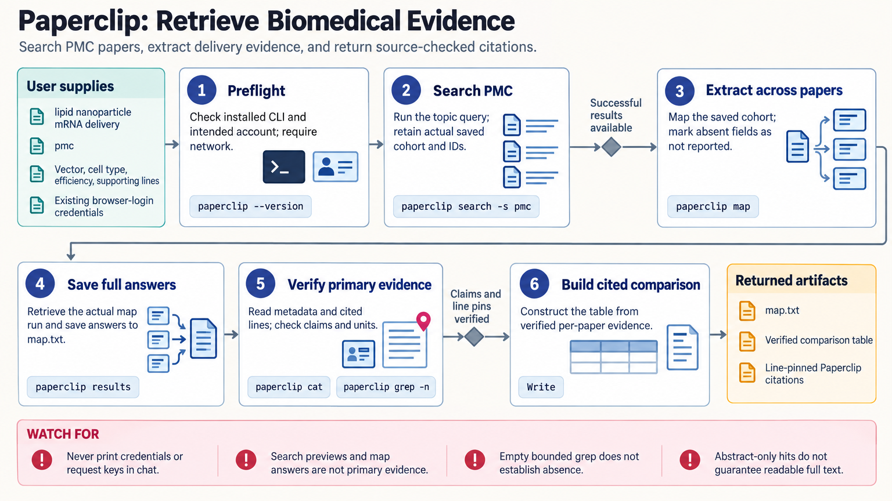

[All skill guides](README.md) / GXL Paperclip

# GXL Paperclip

**Retrieve scientific documents and extract evidence with citations tied to the passages actually read.**

GXL Paperclip provides search and reading tools for biomedical papers and related regulatory, trial, and protein records. This skill helps a research assistant choose a source-scoped search, inspect full text, compare fields across documents, and cite relevant lines.

It is useful when a project explicitly uses Paperclip for literature retrieval or evidence extraction. The workflow separates database retrieval and source reading from model-generated summaries, so important claims can be checked against the underlying document.

*From a source-scoped question to retrieved documents, verified passages, structured extraction, and line-pinned citations.
[View the full-size workflow diagram](../images/paperclip.png).*

## Questions this skill can help you explore

- **Where is this topic discussed in the selected sources?** Use search or full-text matching suited to the question.
- **What did each paper actually report?** Extract comparable fields and verify material details in the source.
- **Can readers inspect the supporting passage?** Attach citations to successful document reads and real line identifiers.

## What you bring

Provide the research question, desired document sources, date or study constraints, and extraction fields. State whether you need metadata, specific passages, full-text review, or a comparison across papers. Use the intended Paperclip account and keep sensitive or unrelated private information out of service queries. Any repository or upload workflow should have its own explicit scope.

## How it works

1. **Check access and scope.** Confirm the intended installation or hosted connection, account, and document collection.
2. **Choose the retrieval operation.** Distinguish semantic search, exact-text matching, metadata queries, and structured extraction.
3. **Read selected sources.** Use returned document identifiers and inspect relevant passages rather than relying on terminal previews.
4. **Extract and compare.** Apply consistent fields across papers, then check numerical claims and quotes against the original lines.
5. **Deliver verifiable evidence.** Preserve source metadata, result identities, exact citation locations, and any retrieval or coverage limits.

## What you get

| Output | What it helps you do |
| --- | --- |
| Source-scoped search results | Identify documents relevant to the defined question. |
| Read passages and document metadata | Inspect the evidence supporting a claim. |
| Structured multi-paper extraction | Compare methods or outcomes with consistent fields. |
| Line-pinned citations | Let a reader return to the passage actually reviewed. |

## Example request

> Use the GXL Paperclip skill to compare measurement-validation methods in the selected biomedical papers. Search the specified sources, read the relevant methods and results sections, and extract sample type, reference method, reported uncertainty, and limitations. Verify each important quantitative statement against the original lines and provide citations that open those passages.

*This is an illustrative research request, not a reported result.*

## Interpreting the results

**Model-assisted extraction is a draft interpretation.** A returned table, summary, or generated citation marker is not primary evidence until the relevant source text has been checked. Metadata SQL and abstracts also do not substitute for body-text review.

A failed read or empty bounded search cannot establish that a scientific statement is absent. Preprints and journal articles should remain distinguishable. The source skill’s local CLI checks and request construction do not prove authenticated retrieval or server-side reader behavior in a particular account.

## Get started

The documented CLI workflow requires network access, the GXL Paperclip CLI, and either an API key or existing browser-login credentials. Its macOS/Linux installer needs Python 3.8+ and curl or wget; hosted MCP can avoid a local installation. This is GXL Paperclip, separate from unrelated applications sharing the name.

[Setup and technical instructions](../../skills/paperclip/SKILL.md)
