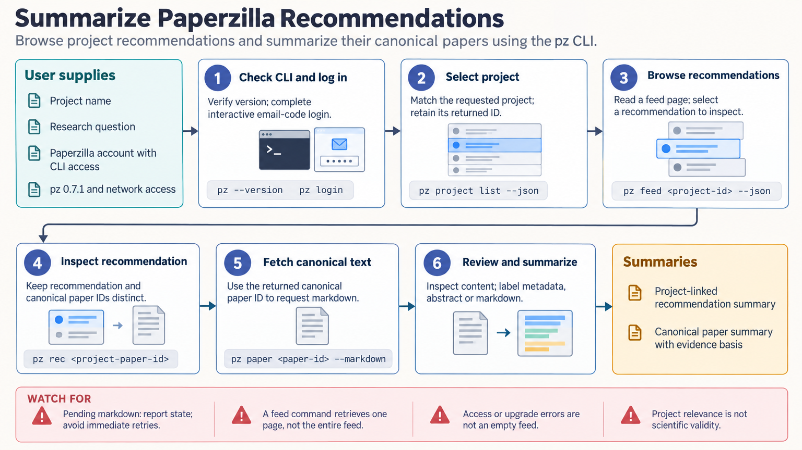

[All skill guides](README.md) / Paperzilla

# Paperzilla

**Review research recommendations in the context of your Paperzilla projects and their underlying papers.**

Paperzilla organizes recommended papers around research projects. This skill helps a research assistant browse or search a project feed, open recommendations, retrieve canonical paper records, and explain their possible relevance using the content actually returned.

It is useful for keeping up with an established project feed or preparing a reading shortlist. The skill preserves the distinction between a recommendation’s project-specific context and the underlying paper’s identity, metadata, and available text.

*From an account project and feed query to selected recommendations, canonical paper review, scoped summaries, and optional exports.
[View the full-size workflow diagram](../images/paperzilla.png).*

## Questions this skill can help you explore

- **Which recommendations should I inspect for this project?** Browse recent feed entries or search the project feed.
- **Why might a paper matter to my work?** Compare its reported question and methods with the project’s focus.
- **Can I retain the selected records?** Export recommendation or paper data with their distinct identifiers.

## What you bring

Provide the Paperzilla project or enough context to select it, the reading question, and any desired recommendation window or search terms. Specify whether you want a brief shortlist, detailed paper summaries, or JSON exports. If feedback is requested, identify the exact recommendation and intended action rather than treating a summary as authorization to change account data.

## How it works

1. **Select the project.** List available projects and confirm the intended feed and account context.
2. **Browse or search.** Retrieve a bounded page of recommendations or search results, keeping pagination and time-filter meanings explicit.
3. **Open recommendations and papers.** Preserve both identities and inspect the canonical paper content that is actually available.
4. **Explain relevance with limits.** Separate the project match from the paper’s scientific findings, quality, and unresolved questions.
5. **Export or record requested feedback.** Save selected JSON records or apply explicitly requested account changes and verify the returned result.

## What you get

| Output | What it helps you do |
| --- | --- |
| Project recommendation shortlist | Focus a reading session on the selected project. |
| Paper and recommendation summaries | Separate source findings from project-specific relevance. |
| JSON exports | Retain structured records for an authorized downstream workflow. |
| Optional feedback update | Record an explicitly requested preference on a recommendation. |

## Example request

> Use the Paperzilla skill to review recommendations in my selected project feed from the specified period. Open the most relevant entries, compare each with our research question, and summarize only the paper content that is available. Preserve canonical paper and recommendation IDs separately, flag missing full text, and export the selected records as JSON.

*This is an illustrative research request, not a reported result.*

## Interpreting the results

**Relevance is not scientific validity.** A matching score describes the service’s relationship to a project, not study quality or evidence strength. A retry message or metadata record must not be presented as full-text evidence.

Feed time filters refer to when recommendations became ready, which differs from paper publication date. A single page does not represent the entire feed, and search results have their own completeness fields. Feed URLs can contain access tokens and should not be placed in public reports or repositories.

## Get started

The skill uses the official pz CLI, network access, and a Paperzilla account with CLI permission. Source builds require Go 1.23+. The checked-in guide’s CLI behavior was tested against a local mock server; live account retrieval still needs verification. Follow the documented installation and authentication path for the intended platform.

[Setup and technical instructions](../../skills/paperzilla/SKILL.md)
